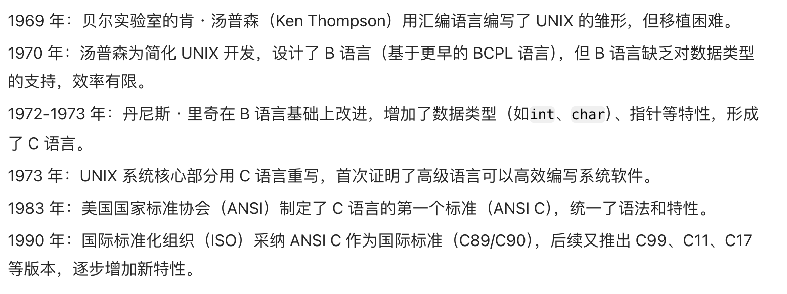

# C语言学习框架

## 一、准备知识

### 1.1 C语言的历史

C 语言是一种**通用的、面向过程式**的计算机程序设计语言。  
1972 年，为了移植与开发 UNIX 操作系统，丹尼斯·里奇在贝尔电话实验室设计开发了 C 语言。



### 1.2 编译和链接相关知识

常见的编译器msvc、clang、gcc  


+ GCC（GNU Compiler Collection）
  + 最广泛使用的开源编译器套件，支持 C、C++、Objective-C 等多种语言，适配几乎所有主流平台（Linux、Windows、macOS、嵌入式系统）。由 GNU 项目开发，是 Linux 系统的默认编译器。

+ Clang
  + 开源编译器（基于 LLVM 架构），以编译速度快、错误提示清晰著称，兼容 GCC 的语法和大部分功能。Apple 的 Xcode 开发工具默认使用 Clang，也是许多开源项目（如 Chrome、LLVM）的首选编译器。

+ MSVC（Microsoft Visual C++）
  + 微软开发的闭源编译器，仅支持 Windows 平台，集成在 Visual Studio 中。对 Windows 系统 API 和 C++ 标准的支持非常及时，适合开发 Windows 应用程序。

+ Intel C++ Compiler
  + 英特尔针对自家 CPU 优化的编译器，在科学计算、高性能计算领域表现优异，兼容 GCC 和 MSVC 的语法。


集成开发环境 如：VS2022、XCode、CodeBlocks、DevC++、Clion


+ VS2022 集成了MSVC（安装报包较⼤⼀些，安装简单，⽆需多余配置，使⽤起来⾮常⽅便）
+ XCode 集成了clang（苹果电脑上的开发⼯具）
+ CodeBlocks 集成了gcc（这个⼯具⽐较⼩众，需要配置环境，不太推荐）
+ DevC++ 集成了gcc（⼩巧，但是⼯具过于简单，对于代码⻛格的养成不好，⼀些竞赛使⽤）
+ Clion 是默认使⽤CMake，编译器是可以配置的（⼯具是收费，所以暂时推荐⼤家使⽤）


### 1.3 ASCLL码相关知识


+ 字符A~Z的ASCII码值从65~90
+ 字符a~z的ASCII码值从97~122
+ 对应的⼤⼩写字符(a和A)的ASCII码值的差值是**32**
+ 数字字符0~9的ASCII码值从48~57
+ 换⾏ \n 的ASCII值是：10
+ 在这些字符中ASCII码值从0~31 这32个字符是不可打印字符，⽆法打印在屏幕上观察


### 1.4 C语言实现过程

C语⾔是⼀⻔**编译型**计算机语⾔，C语⾔源代码都是**文本文件**，⽂本⽂件本⾝⽆法执⾏，必须通过**编译器**翻译和**链接器**的链接，**⽣成⼆进制的可执行文件**，可执⾏⽂件才能执⾏。

C语⾔代码是放在`.c`为后缀的⽂件中的，要得到最终运⾏的可执⾏程序，中间要经过编译和链接2个过程。


注：
1. 每个源⽂件(.c)单独经过编译器处理⽣成对应的⽬标⽂件(.obj为后缀的⽂件)
2. 多个⽬标⽂件和库⽂件经过链接器处理⽣成对应的可执⾏程序(.exe⽂件)


如果不借助IDE，如何把源代码保存在一个文件中，以及如何编译并运行它。下面是简单的步骤：
1. 打开一个文本编辑器，添加以下述代码。

```c
#include <stdio.h>
int main()
{
    printf("hello world"\n);
    return 0;
}
```

1. 保存文件为 hello.c.
2. 打开命令提示符，进入到保存文件所在的目录.
3. 键入 gcc hello.c，输入回车，编译代码.
4. 如果代码中没有错误，命令提示符会跳到下一行，并生成 a.exe可执行文件.
5. 现在，键入 a.exe 来执行程序,可以看到屏幕上显示 "Hello World".

### 1.5 C语言程序结构

C 程序主要包括以下部分：
+ 预处理器指令
+ 函数
+ 变量
+ 语句 & 表达式
+ 注释


## 二、C语言中的main()函数

所有的C语言程序都需要包含 main() 函数。 代码从 main() 函数开始执行.不可以随意更改主函数的名称,即`main`,`main`函数有且只有一个.

```c
//标准主函数的写法
int main()
{
    printf("hello world"\n);
    return 0;
}
```

要点:
1. 其中int表示整型,当是 int main() 时，main() 的返回值是 int 类型，所以是 return 0;  C 标准里规定 main() 返回值必须为 int，所以必须写成是 int main().
2. 当是 void main() 时，main() 的返回值是空，所以可以不写或者是 return; 但这是以前的写法，现在很少用 void main().
3. main后的括号中,可以加上void来明确告诉主函数没有参数,不需要参数.这个void可以省略.  

```c
int main(void)
{
    printf("hello world"\n);
    return 0;
}
```
细节:
1. printf() 用于格式化输出到屏幕。printf() 函数在 "stdio.h" 头文件中声明。
2. 使用printf()这个库函数,需要在代码的最前面加上头文件
3. return的值约定正常运行就输出0,不正常输出就输出非0数

```c
#include <stdio.h>
```

1. stdio.h 是一个头文件 (标准输入输出头文件),表示系统文件库, 也可以声明其他的.
2. #include是一个**预处理命令，用来引入头文件**,即告诉预处理器**将指定头文件**的内容插入到**预处理器命令**的相应位,导入头文件的**预编译指令**.
3. <> 表示系统自带的库，也可以写成" "表示用户自定义的库
如果写成" "并且自定义的库里面没有这个文件系统会自动查找自带的库,如果还是没有报错.
4. `std`代表standard,i和o指数字输入和输出；`.h`是头文件(函数的声明,类型的声明,头文件的包含),因为这些文件都是放在程序各文件的开头；`.c`是源文件(函数的实现).


**其他**:  
当编译器遇到 printf() 函数时，如果没有找到 stdio.h 头文件，会发生编译错误。如下：
> warning: implicitly declaring library function 'printf' with type'int (const char *, ...)' [-Wimplicit-function-declaration]  

1. 以上警告一般发生在没有包含头文件 #include <stdio.h> 就使用 printf 的情况
2. 这句话提示的意思是：用类型“int (const char *,...)”隐式声明了库函数printf。
3. 该提示的背景知识：因为 printf 这一类库函数太常用了，所以编译器在编译的时候，发现源文件中并没有声明 printf 这个函数就直接使用了它，那么编译器就会为 printf 函数隐式生成一个声明。你那个编译器提示你，它为printf生成的隐式声明是：`int printf(const char *, ...)`
4. 该提示后果：通常情况下，这个提示只是一个 warning，而不是 error，编译仍然可以通过。


## 三、C语言的数据类型
在 C 语言中，数据类型指的是用于声明不同类型的变量或函数的一个广泛的系统。变量的类型决定了变量存储占用的空间，以及如何解释存储的位模式。

C 中的类型可分为以下几种：


### 3.1 字符型  
**char**字符数据类型 

#### 3.1.1 char是如何存储的
字符型（char）用于储存字符（character），如英文字母或标点。但是char类型在内存中并不是以字符的形式储存，而是以ASCII码的形式储存，也可以说char类型储存的实际上是整数。所以char类型也被归类为整形家族。
```c
int main()
{
	char c = 'A';
	printf("%d\n", c);//会输出'65'
	printf("%c\n", c);//会输出A
	return 0;
}
```
既然知道char实际上是整形，所以也可以用int类型对char类型赋值
```c
int main()
{
	int c = 65;//这里也可以是char c = 65；
	printf("%d\n", c);
	printf("%c\n", c);
	return 0;
}
```

结果完全一致，都是  
65  
A


#### 3.1.2 char的类型

当听到char的类型这句话时，第一反应应该会是：“char类型不就是char嘛”  
其实不然，char类型实际上分区为有符号的**signed char**和无符号的**unsigned char**

对于char的有无符号位比较特殊的是:  
1. char与signed char不一定等价
2. char默认是signed char还是unsigned char取决于编译器
3. 在常见的编译器里，char类型都默认为signed char


#### 3.1.3 int和char的辨析和比较

在C语言中，int和char是两种不同的数据类型，它们有以下区别：

1. 数据范围：int是整数类型，通常占用4个字节（32位），可以表示较大范围的整数，包括正数、负数和零。而char是字符类型，占用1个字节（8位），用于表示单个字符，包括字母、数字和特殊字符。

2. 存储方式：int类型的变量以二进制补码形式存储，可以进行算术运算。char类型的变量以ASCII码形式存储，可以表示各种字符。

3. 字面值表示：int类型的字面值可以直接写成整数形式，如10、-5等。char类型的字面值需要使用单引号括起来，如'a'、'1'等。

4. 内存占用：int类型通常占用的内存空间比char类型更大。在一些特殊情况下，char类型可以用来节省内存空间。

5. 运算操作：int类型可以进行各种算术运算，如加减乘除、取模等。char类型可以进行一些基本的字符操作，如比较、拼接等。

6. 数据表示：int类型的变量可以表示整数值，如年龄、成绩等。char类型的变量可以表示字符值，如姓名的首字母、键盘输入等。


### （2）整型
+ (char)字符型  
+ short短整型 
```c
short [int]
[signed] short [int]
unsigned short [int]
```
+ int整型  
```c
int
[signed] int
unsigned int
```
+ long长整型
```c
long [int]
[signed] long [int]
unsigned long [int]
```
+ long long更长的整型
```c
long long [int]
[signed] long long [int]
unsigned long long [int]
```
+ _Bool 布尔类型  

C 语⾔原来并没有为布尔值单独设置⼀个类型，⽽是使⽤整数 0 表⽰假，⾮零值表⽰真。在 C99 中也引⼊了 布尔类型 ，是专⻔表⽰真假的。 
布尔类型的使⽤得包含头⽂件 `<stdbool.h>`
布尔类型变量的取值是： `true`或者 `false`.  

代码演示：
```c
_Bool flag = true;
if (flag)
    printf("i like C\n");
```

### （3）浮点型  
float 单精度浮点数  
double 双精度浮点数(精度更高)
long double 

### *各种数据类型的⻓度
每⼀种数据类型都有⾃⼰的⻓度，使⽤不同的数据类型，能够创建出⻓度不同的变量，变量⻓度的不同，存储的数据范围就有所差异。

#### 1.sizeof 操作符
sizeof 是⼀个关键字，也是操作符，专⻔是⽤来计算sizeof的操作符数的类型⻓度的，单位是**字节**。  

```c
sizeof( 类型 )
sizeof 表达式
```
注意点：
+ sizeof 操作符的操作数可以是**类型**，也可是**变量或者表达式**。 
+ sizeof 的操作数如果不是类型，是表达式的时候，可以省略掉后边的括号的。  
+ sizeof 后边的表达式是不真实参与运算的，根据表达式的类型来得出⼤⼩。 

#### 2.sizeof的返回值
sizeof 的计算结果是 size_t 类型的。

> sizeof 运算符的返回值，C 语⾔只规定是**无符号整数**，并没有规定具体的类型，⽽是留给系统⾃⼰去决定， sizeof 到底返回什么类型。不同的系统中，返回值的类型有可能是unsigned int ，也有可能是 unsigned long ，甚⾄是 unsigned long long ，对应的 printf() 占位符分别是 %u 、 %lu 和 %llu 。这样不利于程序的可移植性。C 语⾔提供了⼀个解决⽅法，创造了⼀个类型别名 **size_t** ，⽤来统⼀表⽰ sizeof 的返回值类型。对应当前系统的 sizeof 的返回值类型，可能是 unsigned int ，也可能是unsigned long long 。

```c
#include <stdio.h>
int main()
{
   int a = 10;
   printf("%zd\n", sizeof(a));
   printf("%zd\n", sizeof a);//如果a是变量的名字，可以省略掉sizeof后边的()
   printf("%zd\n", sizeof(int));
   printf("%zd\n", sizeof(3 + 3.5));
   return 0;
}
```
结果是  
4 4 4 8  

#### 3.数据类型长度
打印看看各个数据类型的所占空间
```c
int main()
{
   printf("%zd\n",sizeof(char));
   printf("%zd\n",sizeof(_Bool));
   printf("%zd\n",sizeof(short));
   printf("%zd\n",sizeof(int));
   //在c语言中规定sizeof(long)>=sizeof(int)
   printf("%zd\n",sizeof(long));
   printf("%zd\n",sizeof(long long));
   printf("%zd\n",sizeof(float));
   printf("%zd\n",sizeof(double));
   printf("%zd\n",sizeof(long double));
   return 0;
}
```
结果是:  
1 1 2 4 4 8 4 8 16 (单位:字节B)  

#### 4.表达式中sizeof不计算
```c
#include <stdio.h>
int main()
{
   short s = 2;
   int b = 10;
   printf("%d\n", sizeof(s = b+1));
   printf("s = %d\n", s);
   return 0;
}
```

### *signed 和 unsigned
#### 1.两者区别
C 语⾔使⽤`signed`和`unsigned`关键字修饰**字符型和整型**类型的。

`signed`关键字，表⽰⼀个类型带有正负号，包含负值；  
`unsigned`关键字，表⽰该类型不带有正负号，只能表⽰零和正整数。  

对于int类型，默认是带有正负号的，也就是说int等同于signed int 。

#### 2.unsigned的好处
整数变量声明为 unsigned 的好处是，同样⻓度的内存能够表⽰的最⼤整数值，增⼤了⼀倍。
⽐如，16位的 signed short int 的取值范围是：-32768~32767，最⼤是32767；⽽
unsigned short int 的取值范围是：0~65535，最⼤值增⼤到了65,535。32位的 signed 
int 的取值范围可以参看`limits.h`中给出的定义。

#### 3.省略问题
+ 由于这是默认情况，关键字 signed ⼀般都省略不写，但是写了也不算错。
```c
signed int a;
// 等同于int a;
```
+ unsigned int ⾥⾯的 int 可以省略，所以上⾯的变量声明也可以写成下⾯这样。
```c
unsigned a;
```
#### 4.char类型的signed和unsigned
字符类型 char 也可以设置 signed 和 unsigned 。
```c
signed char c; // 范围为 -128 到 127
unsigned char c; // 范围为 0 到 255
```
注意，C 语⾔规定 char 类型默认是否带有正负号，由当前系统决定。这就是说， char 不等同于 signed char ，它有可能是 signed char ，也有可能是unsigned char 。这⼀点与 int 不同， int 就是等同于 signed int 。


### *数据类型的取值范围
上述的数据类型很多，尤其数整型类型就有short、int、long、long long 四种，为什么呢？  
其实每⼀种数据类型有⾃⼰的取值范围，也就是存储的数值的最⼤值和最⼩值的区间，有了丰富的类型，我们就可以在适当的场景下去选择适合的类型。如果要查看当前系统上不同数据类型的极限值：  

`limits.h`⽂件中说明了整型类型的取值范围。
`float.h`这个头⽂件中说明浮点型类型的取值范围。  
为了代码的可移植性，需要知道某种整数类型的极限值时，应该尽量使⽤这些常量。  
+ `SCHAR_MIN`， `SCHAR_MAX` ：signed char 的最⼩值和最⼤值。
+ `S HRT_MIN` ， `HRT_MAX`S ：short 的最⼩值和最⼤值。
+ `INT_MIN` ， `INT_MAX `：int 的最⼩值和最⼤值。
+ `LONG_MIN` ， `LONG_MAX` ：long 的最⼩值和最⼤值。
+ `LLONG_MIN` ， `LLONG_MAX` ：long long 的最⼩值和最⼤值。
+ `UCHAR_MAX` ：`unsigned char` 的最⼤值。
+ `USHRT_MAX` ：`unsigned short` 的最⼤值。
+ `UINT_MAX` ：`unsigned int` 的最⼤值。
+ `ULONG_MAX` ：`unsigned long` 的最⼤值。
+ `ULLONG_MAX` ：`unsigned long long` 的最⼤值。


## 四、C语言的六种token

C 程序由各种令牌（token）组成,分别是
+ 关键字
+ 标识符
+ 常量
+ 字符串
+ 操作符(运算符)
+ 特殊符号

### （1）关键字
关键字是c语言内置的,关键字不是自己创建出来的,也不能自己创建

#### 1.关键字解读
在定义变量名的时候,不能与关键字冲突
```
auto  break   case  char  const   continue  default  do   double else  enum   extern float  for   goto  if   int   long  register    return   short  signed sizeof   static struct  switch  typedef union  unsigned   void  volatile  while
```

1. `auto`修饰函数变量的,实际上是放在局部变量前面的,是自动变量  
`auto int a = 10;`但是所有的局部变量都是`auto`类型的,所以可以省略  
2. `break`,`continue`是用来跳出循环的,通常是和`for`,`while`,`do while`一起出现的
3. `case`是和`switch`,`default`一起出现的
4. `const`表示的是常属性的意思
5. `enum`-枚举,`struct`-结构体,`union`-联合体
6. `extern`用来声明外部符号的
7. `goto`实现跳转的语句
8. `register`是寄存器的意思
9. `signed`有符号的,`unsigned`无符号的
10. `sizeof`计算大小
11. `static`静态的,修饰函数变量的
12. `typedef`类型重命名
13. `void`无(函数的返回类型,函数的参数)
14. `volatile`

注意:`define`不是关键字,是**预处理指令**.

#### 2.register寄存器关键字
引入:
电脑上的存储设备有哪些?

寄存器(集成到CPU上)
高速缓存(cache)
内存
硬盘

从上到下
1. 访问速度递减
2. 造价降低,空间变大

```c
int main()
{
    register int num = 3;//建议存放在寄存器中,以加快运行速度,但最终还是由编译器决定的是否存入寄存器
    return 0;
}

```

### （2）标识符

#### 1.标识符的含义
标识符就是编程时使用的"名字",给类,接口,方法,变量,常量名,包名等起名字的**字符序列**

#### 2.标识符的组成
英文大小写字母、数字、下划线（ _ ）和美元符号（ $ ）
(可以使用汉字或其他合法字符命名，但是不推荐)

#### 3.定义规则（硬性要求）
+ 不能以数字开头
+ 不能是关键字
+ 严格区分大小写

#### 4.命名规范（非硬性要求）

1. 类和接口
首个字母大写，如果有多个单词，每个单词首字母大写：HelloWorld、Student
2. 变量和方法
首字母小写，如果有多个单词，从第二个单词开始首字母大写：getName、studyJava

#### 5.常量名（自定义常量）
所有字母都大写，多个单词用下划线隔开( _ ) :MAX_VALUE

#### 6.包名
全部小写，如果有多级，用点号（ . ）隔开、遵循域名反写的格式：com.liyahui.demo (demo 指 包的功能)


### （3）常量
在介绍常量的同时，介绍一下变量，注意变量不是c语言的令牌（token）  

不变的值称为**常量**,可变的值称为**变量**

#### *变量

##### 1.初始化变量

**类型**是用来创建变量的。  
data_type + name
```c
char ch = 'w'
int weight = 120
int salary = 20000
double price = 66.6
```

##### 2.局部变量和全局变量

变量分为局部变量和全局变量  
**{}外面的变量称为全局变量,  
{}内部的变量称为局部变量.**  

包括在另一个文件里面的,也算全局变量,但是在使用之前,要声明外部变量,使用`extern+数据类型+名字`来声明变量

```c
int a = 100;
int main()
{
	int a = 10;
	printf("a=%d\n", a);        
	return 0;
}
```
输出结果为10,  
当全局变量与局部变量冲突时,**局部优先**,没有局部,只能全局。不要让局部变量和全局变量取一样的名.  

```c
int main()
{
	int num1 = 0;
	int num2 = 0;
	scanf("%d %d", &num1, &num2);
	int sum = num1 + num2;
	printf("%d\n", sum);
    return 0;
}
```
&表示取地址,scanf表示扫描输入

##### 3.变量的作用域和生命周期
变量的作用域（scope）是程序设计概念，通常来说，一段程序代码中所有用到的名字并不总是有效/可用的,而限定这个名字的可用性的代码范围就是这个名字的**作用域**.

**局部变量**的作用域  
局部变量的作用域是变量所在的局部范围，大包小

```c
//这是一个错误示范
int main()
{
	{
        int a = 12;
		printf("a=%d\n", a);
	}
	printf("a=%d\n", a);//这里错了
	return  0;
}
```
局部变量只能在局部生效,第二个`printf("a=%d\n", a)`无法输出,**会报错**

```c
int main()
{
	int a = 12;
	{
		printf("a=%d\n", a);
	}
	printf("a=%d\n", a);
	return  0;
}

```
两个a都可正常输出,因为`int a = 12;`对外面那个{}以内均适用  

**全局变量**的作用域
全局可用，extern可用于外部，作用域是整个工程

```c
int a = 12;

int main()
{
	{
		printf("a=%d\n", a);
	}
	printf("a=%d\n", a);
   	return  0;
}
```
两个a的值都可以正常输出

演示全局变量的作用域
```c
int a = 10;

void test()
{
	printf("test-->%d\n", a);
}

int main()
{	
	test();
	{
		printf("a=%d\n", a);
	}
	printf("a=%d\n",a);
	return 0;
}

```
三个a的值都可正确输出  
自定义函数中也可使用

声明外部变量
```c
extern int a;
```

**局部变量**的生命周期
进入作用域到出作用域

**全局变量**的生命周期
整个程序的开始到结束


##### 4.全局变量和局部变量在内存中的存储

⼀般我们在学习C/C++语⾔的时候，我们会关注内存中的三个区域：栈区、堆区、静态区。

1. 局部变量是放在内存的栈区
2. 全局变量是放在内存的静态区
3. 堆区是⽤来动态内存管理的（后期会介绍）


#### 常量
c语言中的常量与变量的定义形式有所差异.  
(常量即为不变的量.)  
c语言中的常量可以分为以下几种:
+ 字面常量
+ `const`修饰的常变量
+ #define定义的标识符常量
+ 枚举常量 
  
##### 1.字面常量
数字30,3.14浮点,整型,字符'w',字符串'abc'

##### 2.const修饰的常变量
在int a = 0前面加上const(adj恒定的)  
在c语言中,`const`修饰的a,本质是变量,但是不能直接修改,有常量的属性,也有变量的属性.
```c
const int n = 10
int arr[n] = {0}
```
这么做会报错，因为`arr`中应放常量，而`const int n`具有变量的成分

##### 3.#define定义的标识符常量
`#define MAX 100`
Max的值可以直接拿来使用,甚至可以拿来给另一个变量赋值,全局可用,可视为全局常量  
也可以#define STR "abcd" ,定义为字符串 
```c
#define MAX 100
int main()
{
	printf("%d\n", MAX);
    int a = MAX;
    printf("%d\n", a);
	return 0;
}
```
会输出两个100

##### 4.枚举常量
(未来的所有s可能取值)  
用enum+空格+名字  
```c
enum color
{
    RED
    GREEN
	BULE
}

int main()
{
	int num = 10;
	enum Color c = RED;
}
```
枚举常量的值不可更改


### （4）字符串
#### 1.字符常量,字符变量,字符串的辨析

char字符类型,  
'a'是**字符常量**,(用单引号)
```c
char ch = 'w'
```
char创建的ch是**字符变量**，把字符常量放入字符变量当中去。"abcdef"称为**字符串**，用双引号引起来的一串字符称为字符串字面值，或者简称字符串. 

c语言中没有字符串类型.

0-数字0  
'0'-字符0 - ASCLL值是48  
'\0'-字符-ASCLL值是0  
EOF-end of file文件结束的标志,值是-1


#### 2.如何存储字符串?
字符串的结束标志是一个`\0`的转义字符,在计算字符串长度的时候`\0`是结束标志,不算作字符串内容.  
使用**数组**来存储字符串.  
数组是一组相同类型元素的集合.
  
例如:  
```c
char arr1[10] = "abcdef"  
```
其中10表示可以存10个,可以省略自动分配,实际需要7个字符.
字符串的结束标志是一个`\0`的转译字符,所以实际上需要7个位置,会自动停止.

```c
int main()
{
	char arr1[10] = "abcdef";
    char arr2[ ] = {'a','b','c','d','e','f'};
	printf("%s\n", arr1);
	printf("%s\n", arr2); //一定要遇到\0才会停，这种情况会乱码.
}
```
以上代码的结果:  
abcdef  
abcdefabcdef

解决办法,可以再追加'\0',以防乱码
```c
char arr2[ ] = {'a','b','c','d','e','f','\0'};
printf("%s\n", arr2);
```

#### 3.求字符串的长度
库函数strlen(string length),最佳解决方式,**空格也算**,不包括`\0`,  
注意:需要引入头文件.
```c
#include <string.h>
```

计算长度
```c
int len = strlen("abc");
printf("%d\n", len);
```
或者
```c
printf("%d\n",strlen("abc"));
```

注意点:strlen()里面的数组如果后面没有`\0`"则会输出随机数

```c
int main()
{
    char acX[] = "abcdefg";
    char acY[] = { 'a','b','c','d','e','f','g'};
    printf("%d\n",sizeof(acX));
    printf("%d\n",sizeof(acY));
    printf("%d\n",strlen(acX));
    printf("%d\n",strlen(acY));
    return 0;
}
```
结果是：  
8  
7  
7  
14（会输出随机数）


### （5）操作符（运算符）

c语言是非常灵活的,C语言提供了非常丰富的操作符,使得使用起来就比较灵活.操作符就是平时用起来习以为常,但是不可或缺的符号.


#### *操作符的分类
+ 算术操作符： `+ 、- 、* 、/ 、%`
+ 移位操作符: `<< >>`
+ 位操作符: `& | ^`
+ 赋值操作符:` = 、+= 、 -= 、 *= 、 /= 、%= 、<<= 、>>= 、&= 、|= 、^=`
+ 单⽬操作符:`！、++、--、&、*、+、-、~ 、sizeof、(类型)`
+ 关系操作符:` > 、>= 、< 、<= 、 == 、 !=`
+ 逻辑操作符：`&& 、||`
+ 条件操作符：`? :`
+ 逗号表达式：`,`
+ 下标引⽤：`[]`
+ 函数调⽤：`()`
+ 结构成员访问：`. 、->`

#### 1.算术操作符(双目)
有`+、-、*、/、%`这些  

其中`/`是除运算,`%`是取模(取余数)运算.  

这些操作符都是**双目操作符**。
他们都是有2个操作数的，位于操作符两端的就是它们的操作数，这种操作符也叫双目操作符。

+ \除运算

演示
```c
int main()
{
    int a = 7 / 2;
    //如果是float a =7/2,结果为3.0，原因就在于 C 语⾔⾥⾯的整数除法是整除，只会返回整数部分，丢弃⼩数部分。
    printf("%d\n",a);
    float b =7 / 2.0;
    printf("%f\n",b);//除号两端都是整数的时候,执行的是整数除法,如果两端只要有一个浮点数就执行浮点数的除法.
    printf("%.1f\n",b);//结果保留一位小数,`.2`则表示保留两位,以此类推.
}
```
再看⼀个例子：
```c
#include <stdio.h>
int main()
{
   int score = 5;
   score = (score / 20) * 100;
   return 0;
}
//结果为0
```
上⾯的代码，你可能觉得经过运算， score 会等于 25 ，但是实际上 score 等于 0 。这是因为
score / 20 是整除，会得到⼀个整数值 0 ，所以乘以 100 后得到的也是 0 。
为了得到预想的结果，可以将除数 20 改成 20.0 ，让整除变成浮点数除法。
```c
#include <stdio.h>
int main()
{
   int score = 5;
   score = (score / 20.0) * 100;
   return 0;
}
//结果为0
```


+ %取模运算

运算符 % 表⽰求模运算，即返回两个整数相除的余值。这个运算符只能⽤于整数，不能⽤于浮点数。
```c
int c = 7 % 2;
printf("%d\n",c);//取模是不能写浮点数的
```
负数求模的规则是，结果的正负号由第⼀个运算数的正负号决定。
```c
#include <stdio.h>
int main()
{
   printf("%d\n", 11 % -5); // 1
   printf("%d\n",-11 % -5); // -1
   printf("%d\n",-11 % 5); // -1
   return 0;
}
```
上⾯⽰例中，第⼀个运算数的正负号（ 11 或 -11 ）决定了结果的正负号。


#### 2.移位操作符
`<<` 左移操作符  
`>>`右移操作符  
`>>` `<<` (涉及二进制)  
注：移位操作符的操作数只能是整数。


##### 左移操作符
移位规则：左边抛弃、右边补0
```c
#include <stdio.h>
int main()
{
    int num = 10;
    int n = num<<1;//num的值是不变的
    printf("n= %d\n", n);
    printf("num= %d\n", num);
    return 0;
}
```
##### 右移操作符

移位规则：首先右移运算分两种：
> 1.逻辑右移：左边用0填充，右边丢弃  
> 2.算数右移：左边用原该值的符号位填充，右边丢弃


注意：对于移位运算符，不要移动负数位，这个是标准未定义的。


#### 3.位操作符
`& ^ | ~`
按位与  
按位或  
按位异或  
按位取反  
注：他们的操作数必须是整数。

```c
#include <stdio.h>
int main()
{
    int num1 = -3;
    int num2 = 5;
    printf("%d\n", num1 & num2);
    printf("%d\n", num1 | num2);
    printf("%d\n", num1 ^ num2);
    printf("%d\n", ~0);
    return 0;
}
```
⼀道变态的⾯试题：
不能创建临时变量（第三个变量），实现两个整数的交换。
```c
#include <stdio.h>
int main()
{
    int a = 10;
    int b = 20;
    a = a^b;
    b = a^b;
    a = a^b;
    printf("a = %d b = %d\n", a, b);
    return 0;
}
```

练习1：编写代码实现：求⼀个整数存储在内存中的⼆进制中1的个数。
```c
//⽅法1
#include <stdio.h>
int main()
{
    int num = 10;
    int count= 0;//计数
    while(num)
    {
        if(num%2 == 1)
            count++;
        num = num/2;
    }
    printf("⼆进制中1的个数 = %d\n", count);
    return 0;
}


//⽅法2：
#include <stdio.h>
int main()
{
    int num = -1;
    int i = 0;
    int count = 0;//计数
    for(i=0; i<32; i++)
    {
        if( num & (1 << i) )
            count++; 
    }
    printf("⼆进制中1的个数 = %d\n",count);
    return 0;
}


//⽅法3：
#include <stdio.h>
int main()
{
    int num = -1;
    int i = 0;
    int count = 0;//计数
    while(num)
    {
        count++;
        num = num&(num-1);
    }
    printf("⼆进制中1的个数 = %d\n",count);
    return 0;
}
//这种⽅式是不是很好？达到了优化的效果，但是难以想到。
```

练习2：⼆进制位置0或者置1  

编写代码将13⼆进制序列的第5位修改为1，然后再改回0  
```c
13的2进制序列： 00000000000000000000000000001101
将第5位置为1后：00000000000000000000000000011101
将第5位再置为0：00000000000000000000000000001101
```
参考代码：
```c
#include <stdio.h>
int main()
{
    int a = 13;
    a = a | (1<<4);
    printf("a = %d\n", a);
    a = a & ~(1<<4);
    printf("a = %d\n", a);
    return 0;
}
```


#### 4.赋值操作符
在变量创建的时候给⼀个初始值叫初始化，在变量创建好后，再给⼀个值，这叫赋值。  
```c
int a = 100;//初始化
a = 200;//赋值，这⾥使⽤的就是赋值操作符
```
赋值操作符`=`是⼀个随时可以给变量赋值的操作符。

+ 连续赋值  


赋值操作符也可以连续赋值，如：
```c
int a = 3;
int b = 5;
int c = 0;
c = b = a+3;////连续赋值，从右向左依次赋值的。
```
C语⾔虽然⽀持这种连续赋值，但是写出的代码不容易理解，建议还是拆开来写，这样⽅便观察代码的执⾏细节。

+ 复合操作符  

在写代码时，我们经常可能对⼀个数进⾏⾃增、⾃减的操作，如下代码：
```c
int a = 10;
a += 3;
a -= 2;
```
复合操作符还有
```c
= += -= *= /= &= 

^= |= >>= <<=
```

#### 5.单目操作符
前⾯介绍的操作符都是双⽬操作符，有2个操作数的。C语⾔中还有⼀些操作符只有⼀个操作数，被称为**单⽬操作符**。 ++、--、+(正)、-(负) 就是单⽬操作符的。

+ ++和--

++是⼀种⾃增的操作符，⼜分为前置++和后置++，--是⼀种⾃减的操作符，也分为前置--和后置--.  

前置`++`
```c
int a = 10;
int b = ++a;//++的操作数是a，是放在a的前⾯的，就是前置++
printf("a=%d b=%d\n",a , b);
```
计算⼝诀：先+1，后使⽤；
a原来是10，先+1，后a变成了11，再使⽤就是赋值给b，b得到的也是11，所以计算技术后，a和b都是11，相当于这样的代码：
```c
int a = 10;
a = a+1;
b = a;
printf("a=%d b=%d\n",a , b);
```

后置`++`
```c
int a = 10;
int b = a++;//++的操作数是a，是放在a的后⾯的，就是后置++
printf("a=%d b=%d\n",a , b);
```
计算⼝诀：先使⽤，后+1
a原来是10，先使⽤，就是先赋值给b，b得到了10，然后再+1，然后a变成了11，所以直接结束后a是11，b是10，相当于这样的代码：
```c
int a = 10;
int b = a;
a = a+1;
printf("a=%d b=%d\n",a , b);
```
同理`--`前置、后置

+ `- `负值  
用来改变数字前的符号.  

+ `+ `正值  
实际上没什么意义.


`& `取地址(和指针有关系)
`*`解引用操作符
`sizeof`是单目操作符,求操作数的类型长度（以字节为单位）
`.`在结构体struct中,`.`为结构成员访问操作符
`->`在结构体struct中,`->`用于连接结构体指针变量和成员名称
```c
int main()
{
    int arr[10] = { 0 };//初始化数组
    printf("%d\n",sizeof(arr));
    //结果为40,计算的是整个数组的大小,单位是字节
    printf("%d\n",sizeof(arr[10]));
    //计算的结果为4,是数组中的一个元素的大小,单位是字节
    printf("%d\n",sizeof(arr)/sizeof(arr[0]));
    //输出的结果为10,是数组元素的个数
}
```

`~`  
对一个数的二进制按位取反(后面学)


`*`间接访问操作符(解引用操作符)(后续会解释)

`(类型)`强制类型转换,括号内的类型是想要转换的类型
在c语言中,对于像3.14这样的的字面浮点数,编译器默认理解为double类型
```c
int a = (int)3.14
printf("%d\n",a);
```


#### 6.关系操作符
C 语⾔⽤于⽐较的表达式，称为 “关系表达式”（relational expression），⾥⾯使⽤的运算符就称为“关系运算符”（relational operator），主要有下⾯6个。

+ `>`大于操作符
+ `>=`⼤于等于运算符  
+ `<`⼩于运算符  
+ `<=`⼩于等于运算符  
+ `!=`不相等运算符 
+ `==`相等运算符  

关系表达式通常返回 0 或 1 ，表⽰真假。  
C 语⾔中， 0 表⽰假，所有⾮零值表⽰真。⽐如， 20 > 12 返回 1 ， 12 > 20 返回 0 。 

关系表达式常⽤于 if 或 while 结构。
```c
if (x == 3)
{
   printf("x is 3.\n");
}
```
另⼀个需要避免的错误是：多个关系运算符不宜连⽤。
```c
i < j < k
```
上⾯⽰例中，连续使⽤两个⼩于运算符。这是合法表达式，不会报错，但是通常达不到想要的结果，即不是保证变量j的值在i和 k 之间。因为关系运算符是从左到右计算，所以实际执⾏的是下⾯的表达式。
```c
(i < j) < k
```
上⾯式⼦中， i < j 返回 0 或 1 ，所以最终是 0 或 1 与变量 k 进⾏⽐较。如果想要判断变量j的值是否在 i 和 k 之间，应该使⽤下⾯的写法。
```c
i < j && j < k
```

#### 7.逻辑操作符
+ && 逻辑与  

&& 就是与运算符，也是并且的意思， && 是⼀个双⽬操作符，使⽤的⽅式是 a&&b , && 两边的表达式都是真的时候，整个表达式才为真，只要有⼀个是假，则整个表达式为假。  

+ || 逻辑或  

|| 就是或运算符，也就是或者的意思， || 也是⼀个双⽬操作符，使⽤的⽅式是 a || b ， ||两边的表达式只要有⼀个是真，整个表达式就是真，两边的表达式都为假的时候，才为假。

```c
int main()
{
    int a = 10;
    int b = 4;
    if (a && b)//(a || b)
    {
        printf("hehe\n");
    }
    return 0;
}
```
+ `! `逻辑反操作

c语言中,0表示假  

非0表示真,`!`的作用就是把**假的**变成**真的**,把**真的**变成**假的**
```c
int main()
{
    int flag = 0;//0表示假,非零表示真
    if (!flag)//if语句中默认条件为真时执行
    {
        printf("haha\n");
    }
}
```

练习
闰年的判断
输⼊⼀个年份year，判断year是否是闰年
闰年判断的规则：
1. 能被4整除并且不能被100整除是闰年
2. 能被400整除是闰年
```c
#include <stdio.h>
//代码1
int main()
{
    int year = 0;
    scanf("%d", &year);
    if(year%4==0 && year%100!=0)
        printf("是闰年\n");
    else if(year%400==0)
        printf("是闰年\n");
 
    return 0;
}
//代码2
int main()
{
    int year = 0;
    scanf("%d", &year);
    if((year%4==0 && year%100!=0) ||(year%400==0))
        printf("是闰年\n");
    return 0;
} 
```

##### 短路问题
C语⾔逻辑运算符还有⼀个特点，它总是先对左侧的表达式求值，再对右边的表达式求值，这个顺序是保证的。如果左边的表达式满⾜逻辑运算符的条件，就不再对右边的表达式求值。这种情况称为“短路”。
如前⾯的代码:
```c
if(month >= 3 && month <= 5)
```
表达式中&& 的左操作数是 month >= 3 ，右操作数是 month <= 5 ,当左操作数 month >= 3 的结果是0的时候，即使不判断 month <= 5 ，整个表达式的结果也是0（不是春季）。
所以，对于&&操作符来说，左边操作数的结果是0的时候，右边操作数就不再执⾏。

对于 || 操作符是怎么样呢？我们结合前⾯的代码：
```c
if(month == 12 || month==1 || month == 2)
```
如果month == 12，则不⽤再判断month是否等于1或者2，整个表达式的结果也是1（是冬季）。所以， || 操作符的左操作数的结果不为0时，就⽆需执⾏右操作数。像这种仅仅根据左操作数的结果就能知道整个表达式的结果，不再对右操作数进⾏计算的运算称为**短路求值**。


```c
#include <stdio.h>
int main()
{
    int i = 0,a=0,b=2,c =3,d=4;
    i = a++ && ++b && d++;
    //i = a++||++b||d++;
    printf("a = %d\n b = %d\n c = %d\nd = %d\n", a, b, c, d);
    return 0;
}
```
两种情况结果分别是
a = 1  
b = 2  
c = 3  
d = 4  
和  
a = 1  
b = 3  
c = 3  
d = 4  

#### 8.条件操作符(三目操作符)
三目操作符,有三个操作数  
`exp1 ? exp2 : exp3`  
注意符号依次是：问号，冒号，分号  

条件操作符的计算逻辑是：如果 exp1 为真， exp2 计算，计算的结果是整个表达式的结果；如果exp1 为假， exp3 计算，计算的结果是整个表达式的结果。  

例子
```c
int a = 10;
int b = 20;
int c = (a > b ? a : b);
```

#### 9.逗号表达式
逗号表达式，就是⽤逗号隔开的多个表达式。  
逗号表达式，从左向右依次执⾏。整个表达式的结果是最后⼀个表达式的结果。


下面代码的结果是：
```c
#include <stdio.h>
int main()
{
	int a, b, c;
	a = 5;
	c = ++a;
	b = ++c, c++, ++a, a++;
	b += a++ + c;
	printf("a = %d b = %d c = %d\n:", a, b, c);
	return 0;
}
```
结果是
a = 9 b= 23 c = 8

```c
//代码1
int a = 1;
int b = 2;
int c = (a>b, a=b+10, a, b=a+1);//逗号表达式
c是多少？


//代码2
if (a =b + 1, c=a / 2, d > 0)

//代码3
a = get_val();
count_val(a);
while (a > 0)
{
    //业务处理
    //...
    a = get_val();
    count_val(a);
}

如果使⽤逗号表达式，改写：
while (a = get_val(), count_val(a), a>0)
{
    //业务处理
}
```

#### 10.下标访问操作符`[]`
`arr[3]`中的[]就是下标引用操作符  
`arr`和`3`就是`[]`的操作数  

**操作数：⼀个数组名 + ⼀个索引值(下标)**

```c
int arr[10] = {1,2,3,4,5,6,7,8,9,10};
//创建数组的时候,[]中不能是变量
int n = 3;
arr[n] = 20;//访问元素时,[]中可以是变量
```

#### 11.函数调用操作符`()`
接受⼀个或者多个操作数：第⼀个操作数是函数名，剩余的操作数就是传递给函数的参数。
```c
int Add(int x,int y) 
{
    return x+y;
}
int main()
{
    int sum =Add(2,3);//()就是函数调用操作符
    //Add,2,3都是()的操作数
    return 0;
}
```

#### 12.结构成员访问操作符

##### 什么是结构体
C语⾔已经提供了内置类型，如：char、short、int、long、float、double等，但是只有这些内置类型还是不够的，假设我想描述学⽣，描述⼀本书，这时单⼀的内置类型是不⾏的。描述⼀个学⽣需要名字、年龄、学号、⾝⾼、体重等；描述⼀本书需要作者、出版社、定价等。C语⾔为了解决这个问题，增加了**结构体**这种⾃定义的数据类型，让程序员可以⾃⼰创造适合的类型。


 **结构是⼀些值的集合，这些值称为成员变量。结构的每个成员可以是不同类型的变量，如：标量、数组、指针，甚⾄是其他结构体。**

###### 结构的声明
```c
struct tag
{
    member-list;
}variable-list;
```

```c
描述一个学生：
struct Stu
{
    char name[20];//名字
    int age;//年龄
    char sex[5];//性别
    char id[20];//学号
}; //分号不能丢
```

###### 结构体变量的定义和初始化
```c
//代码1：变量的定义
struct Point
{
    int x;
    int y;
}p1; //声明类型的同时定义变量p1

struct Point p2; //定义结构体变量p2

//代码2:初始化。
struct Point p3 = {10, 20};
struct Stu //类型声明
{
    char name[15];//名字
    int age; //年龄
};
struct Stu s1 = {"zhangsan", 20};//初始化
struct Stu s2 = {.age=20, .name="lisi"};//指定顺序初始化

//代码3
struct Node
{
    int data;
    struct Point p;
    struct Node* next; 
}n1 = {10, {4,5}, NULL}; //结构体嵌套初始化
struct Node n2 = {20, {5, 6}, NULL};//结构体嵌套初始化

```

##### 结构成员访问操作符

###### 结构体成员的直接访问
结构体成员的直接访问是通过点操作符（.）访问的。点操作符接受两个操作数。如下所⽰：
```c
#include <stdio.h>
struct Point
{
    int x;
    int y;
}p = {1,2};

int main()
{
    printf("x: %d y: %d\n", p.x, p.y);
    return 0;
}
```
**使⽤⽅式**：结构体变量.成员名

###### 结构体成员的间接访问
有时候我们得到的不是⼀个结构体变量，⽽是得到了⼀个指向结构体的指针。如下所⽰：
```c
#include <stdio.h>
struct Point
{
    int x;
    int y;
};
int main()
{
    struct Point p = {3, 4};
    struct Point *ptr = &p;
    ptr->x = 10;
    ptr->y = 20;
    printf("x = %d y = %d\n", ptr->x, ptr->y);
    return 0;
}
```
**使⽤⽅式**：结构体指针->成员名


```c
#include <stdio.h>
#include <string.h>
struct Stu
{
    char name[15];//名字
    int age; //年龄
};
void print_stu(struct Stu s)
{
    printf("%s %d\n", s.name, s.age);
}
void set_stu(struct Stu* ps)
{
    strcpy(ps->name, "李四");
    ps->age = 28;
}
int main()
{
    struct Stu s = { "张三", 20 };
    print_stu(s);
    set_stu(&s);
    print_stu(s);
    return 0;
}
```


#### 13.操作符的属性：优先性、结合性
C语⾔的操作符有2个重要的属性：**优先级、结合性**，这两个属性决定了表达式求值的计算顺序。  

##### 优先级
优先级指的是，如果⼀个表达式包含多个运算符，哪个运算符应该优先执⾏。各种运算符的优先级是不⼀样的。

```c
3 + 4 * 5;
```
上⾯⽰例中，表达式 3 + 4 * 5 ⾥⾯既有加法运算符（ + ），⼜有乘法运算符（ * ）。由于乘法的优先级⾼于加法，所以会先计算 4 * 5 ，⽽不是先计算 3 + 4 。


##### 结合性
如果两个运算符优先级相同，优先级没办法确定先计算哪个了，这时候就看结合性了，则根据运算符是左结合，还是右结合，决定执⾏顺序。⼤部分运算符是左结合（从左到右执⾏），少数运算符是右结合（从右到左执⾏），⽐如赋值运算符（ = ）。
```c
5 * 6 / 2;
```
上⾯⽰例中， * 和 / 的优先级相同，它们都是左结合运算符，所以从左到右执⾏，先计算 5 * 6 ，再计算 6 / 2 。
运算符的优先级顺序很多，下⾯是部分运算符的优先级顺序（按照优先级从⾼到低排列），建议⼤概记住这些操作符的优先级就⾏，其他操作符在使⽤的时候查看下⾯表格就可以了。

+ 圆括号（ () ）
+ ⾃增运算符（ ++ ），⾃减运算符（ -- ）
+ 单⽬运算符（ + 和 - ）
+ 乘法（ * ），除法（ / ）
+ 加法（ + ），减法（ - ）
+ 关系运算符（ < 、 > 等）
+ 赋值运算符（ = ）

由于圆括号的优先级最⾼，可以使⽤它改变其他运算符的优先级。


### (6)转义字符

#### 1.转义字符的概念
转义字符就是转变字符的意思
```c
int main()
{
	printf("abcn");
	return 0;
}
```
输出"abcn"
```c
int main()
{
	printf("abc\n");
    printf("abc\0456");
    //会在\0之后刹车，\0是结束标志。
	return 0;
}
```
输出两个abc,因为后面那个没有`\n`,是急停的.

#### 2.c语言中的转义字符


+ `\?`转义防止三字母词(现在不用)  
即早期电脑中  
`??)`-->`]`  
`??(`-->`[`
+ `\'`用于表示字符常量`' `  
```c
printf("%c\n",'\''); 
```
+ `\"`用于表示一个字符内部的双引号,同样根据以上`printf("\"")`输出`"`
```c
printf("%c\n",'\"'); 
```
+ 为了让`printf("abcd\0ef")`中的`\`只是一个普通的`\`,可以`printf("abcd\\0ef")`,防止中途刹车  
```c
printf("c:\\test\\test.c");
```
+ `\n`换行符
```c
printf("abc\nefg")
//输出  
//abc  
//efg 
```
+ `\t`水平制表符，等于按一个tab，算一个字符，体现出来的效果是四个字符  
+ `\ddd`表示1-3个八进制0~7的数字，如：\130  --->八进制的130换算成十进制后的ascall码值对应的字母  
```c
printf("%c\n",'\130');
```
+ `\xdd`表示dd这个16进制的数字，如：\x60--->十六进制的60换算成为十进制后的ascall码值对应的字母  
```c
printf("%c\n",'\x60');
```
> 转义字符长度只算一个长度,如"\t"长度算1


## 五、C语言中的五大语句

### （1）五大语句介绍
什么是语句?
c语言中语句可分为以下5类:  
1. **表达式语句**（表达式语句就是在表达式的后边加上分号。）
```c
#include <stdio.h>
int main()
{
    int a = 20;
    int b = 0;
    b = a + 5; //表达式语句
    return 0;
}
```
2. **函数调用语句**（函数调⽤的时候，也会加上分号，就是函数调⽤语句。）
```c
#include <stdio.h>
int Add(int x, int y)
{
    return x+y;
}
int main()
{
    printf("hehe\n");//函数调⽤语句
    int ret = Add(2, 3);//函数调⽤语句
    return 0;
}
```
3. **空语句**（空语句是最简单的，⼀个分号就是⼀条语句，是空语句）
```c
#include <stdio.h>
int main()
{
    ;//空语句
    return 0;
}
```
4. **复合语句**(其实就是前⾯讲过的代码块，成对括号中的代码就构成⼀个代码块，也被称为复合语句。)
```c
 #include <stdio.h>
void print(int arr[], int sz) //函数的⼤括号中的代码也构成复合语句
{
    int i = 0;
    for(i=0; i<sz; i++)
    {
        printf("%d ", arr[i]);
    }
}
int main()
{
    int i = 0;
    int arr[10] = {0};
    for(i=0; i<10; i++) //for循环的循环体的⼤括号中的就是复合语句
    {
        arr[i] = 10-i;
        printf("%d\n", arr[i]);
    }
    return 0;
}
```
1. 控制语句
控制语句⽤于控制程序的执⾏流程，以实现程序的各种结构⽅式（C语⾔⽀持三种结构：**顺序结构、选择结构、循环结构**），它们由特定的语句定义符组成，C语⾔有九种控制语句。
可分成以下三类：
+  条件判断语句也叫分⽀语句：if语句、switch语句；
+  循环执⾏语句：do while语句、while语句、for语句；
+  转向语句：break语句、goto语句、continue语句、return语句

### （2）控制语句详解
以下具体讲解**控制语句**.
控制语句用于控制程序的执行流程,以实现程序的各种**结构方式**.  
C语言支持三种结构:  
1. 顺序结构
2. 选择结构
3. 循环结构

#### 1.条件判断语句
c语言中实现选择  
+ if else 语句
+ switch 语句

##### **if else语句**
如果表达式中的结果为真,则语句执行.
在C语言中如何表示真假?
0表示假,非0表示真.  

###### 语法结构
```c
//无else
if(表达式)
    语句;
//有else
if(表达式)
    语句1;//无论是if还是else,默认后面只能跟上一条语句,后面跟上多条语句时要加上{},否则会报错.
else//表达式为假则执行else
    语句2;
//多分支
if(表达式1)
    语句1;
else if(表达式2)
    语句2;
else (if)
    语句3;
(else)
```

```c
int main()
{
	int input = 0;
	printf("加入微软亚洲研究院\n");
	printf("要好好学习吗(1/0)?");
	scanf("%d", &input);
	if (input == 1)
	{
		printf("好offer\n");
	}
	else
	{
		printf("卖红薯\n");
	}
	return 0;
}
```
已知一个函数y=f(x),x<0时,y=1,当x=0时,y=0.当x>0时,y=-1.
```c
int main()
{
    int x = 0;
    int y = 0;
    scanf("%d",&x);
    if (x>0)
        y = -1;
    else if (x==0)
        y = 0;
    else 
        y = 1;
    printf("%d\n",y);
    return 0;
}
```
###### else的匹配
else的匹配:**else是和它离的最近的if匹配的**,并不是和谁对齐就和谁匹配.  
当出现以下代码时:
1. 没有加上括号
2. 没有规范缩进
```c
#include <stdio.h>
int main()
{
    int a = 0;
    int b = 2;
    if (a == 1)
        if (b == 2)
            printf("hehe\n");
    else
        printf("haha\n");
    return 0;
}
```
输出结果为空  
应当调整代码格式,适当的使用{}可以使代码的逻辑更加清楚,代码风格很重要.
```c
#include <stdio.h>
int main()
{
    int a = 0;
    int b = 2;
    if (a == 1)
    {
        if (b == 2)
        {
            printf("hehe\n");
        }
    }
    else
    {
        printf("haha\n");
    }       
    return 0;
}
```
###### 需要注意的细节
```c
if(18<= age <28)//不能这么写
if(age>=18 && age<28)//正确写法
```
```c
//代码1
if (condition) 
{
    return x;
}
return y;
//代码2
if (condition)
{
    return x;
}
else
{
    return y;
}
//代码3
int num = 1;
if (num == 5)
{
    printf("hehe\n");
}
//代码4
int num = 1;
if (5 == num)
{
    printf("hehe\n");
}
```
以上代码2和4更好  

##### **switch语句**
switch语句也是一种分支语句.  
常常用于多分支的情况. 

###### 语法结构
```c
switch(整型表达式)
{
    语句项；
}
```
其中语句项是指一些**case语句**
```c
case 整形常量表达式://注意case后面有空格
    语句;
```

上⾯代码中，根据表达式 expression 不同的值，执⾏相应的 case 分⽀。如果找不到对应的值，就执⾏ default 分⽀。  

注：  
1. switch 后的 expression 必须是整型表达式
2. case 后的值，必须是整形常量表达式


###### break的用法
case只是决定了代码的入口,但是并没有设定代码的出口  
在switch语句中的**break**的作用就体现了  
在switch语句中，我们没办法直接实现分支.搭配break使用才能实现真正的分支.
```c
#include <stdio.h>
int main()
{
    int day = 0;
    switch(day)
    {
        case 1：
            printf("星期一\n");
            break;
        case 2:
            printf("星期二\n");
            break;
        case 3:
            printf("星期三\n");
            break;    
        case 4:
            printf("星期四\n");
            break;    
        case 5:
            printf("星期五\n");
            break;
        case 6:
            printf("星期六\n");
            break;
        case 7:
            printf("星期天\n");    
            break;
    }
    return 0;
}
```
多个case匹配同一个执行语句的写法:
```c
#include <stdio.h>
//switch代码演示
int main()
{
    int day = 0;
    switch(day)
    {
        case 1：
        case 2:
        case 3:
        case 4:
        case 5:
            printf("weekday\n");
            break;
        case 6:
        case 7:
            printf("weekend\n");
            break;
    }
    return 0;
}
```
switch语句可以嵌套
```c
#include <stdio.h>
int main()
{
    int n = 1;
    int m = 2;
    switch (n)
    {
        case 1:
            m++;
        case 2:
            n++;
        case 3:
            //switch允许嵌套使用
            switch (n)
            {
                case 1:
                    n++;
                case 2:
                    m++;
                    n++;
                    break;
            }
        case 4:
            m++;
            break;
        default:
            break;
    }
    printf("m = %d, n = %d\n", m, n);
    return 0;
}
```
###### default子句
如果表达的值与所有的case标签的值都不匹配,那么可以在代码中加入default子句,把`default:`写在任意一个`case`标签可以出现的位置,当 switch 表达式的值并不匹配所有 case 标签的值时，这个 default 子句后面的语句就会执行.  
所以，每个switch语句中只能出现一条default子句.  
但是它可以出现在语句列表的任何位置，而且语句流会像执行一个case标签一样执行default子句.   

就⽐如前⾯做的打印星期的练习，如果 day 的输⼊不是1~7的值，如果我们要提⽰：输⼊错误，则可以这样完成代码：

```c
#include <stdio.h>
//switch代码演示
int main()
{
    int day = 0;
    switch(day)
    {
        case 1：
        case 2:
        case 3:
        case 4:
        case 5:
            printf("weekday\n");
            break;
        case 6:
        case 7:
            printf("weekend\n");
            break;
        default:
            printf("输⼊错误\n");
            break;
    }
    return 0;
}
```

#### 2.循环执行语句
+ while循环
+ for语句(后面)
+ do...while语句(后面)


##### **while语句**

###### 语法结构
```c
while(表达式)
    循环语句;
```
```c
int main()
{
	int line = 0;
	printf("加入集训队\n");
	while (line < 20000)
	{
		printf("写代码:%d\n",line);
		line++;
	}
	if (line >= 20000)
		printf("好offer\n");
	return 0;
}
```
练习：

输⼊⼀个正的整数，逆序打印这个整数的每⼀位
例如：
输⼊：1234，输出：4 3 2 1
输⼊：521，输出：1 2 5

题⽬解析
1. 要想得到n的最低位，可以使⽤n%10的运算，得到的余数就是最低位，如：1234%10得到4
2. 要想去掉n的最低位，找出倒数第⼆位，则使⽤ n=n/10 操作就可以去掉最低位的，如：
n=1234/10得到123，123相较于1234就去掉了最低位，123%10就得到倒数第⼆位3。
3. 循环1和2两个步骤，在n变成0之前，就能到所有的位。

```c
#include <stdio.h>
int main()
{
    int n = 0;
    scanf("%d", &n);
    while(n)
    {
        printf("%d ", n%10);
        n /= 10;
    }
    return 0;
}
```


###### while语句中的break
```c
#include <stdio.h>
int main()
{
    int i = 1;
    while(i<=10)
    {

        if (i == 5)
            break;
        printf("%d ", i);
        i++;
    }
    return 0;
}
```
输出结果:1 2 3 4  
总结:  
`break`在while循环中的作用:  
其实在循环中只要遇到`break`，就停止后期的所有的循环，直接终止循环.  
所以:while中的`break`是用于永久终止循环的  


###### while语句中的continue
```c
//continue 代码实例1
#include <stdio.h>
int main()
{
    int i = 1;
    while(i<=10)
    {
        if (i == 5)
        continue;
        printf("%d ",i);
        i = i+1;
    }
    return 0;
}
```
以上代码输出结果为1 2 3 4
```c
//continue 代码实例2
#include <stdio.h>
int main()
{
    int i = 1;
    while(i<=10)
    {
        i = i+1;
        if (i == 5)
            continue;
        printf("%d ", i);
    }
    return 0;
}
```
输出结果为:2 3 4 6 7 8 9 10 11
总结:  
continue在while循环中的作用  
continue是用于**终止本次循环**的,也就是本次循环中continue后边的代码不会再执行,而是直接跳转到while语句的判断部分.进行下一次循环的入口判断.  


##### **for语句**

###### 语法结构
```c
for(表达式1; 表达式2; 表达式3)
    循环语句;
```
+ 表达式1为初始化部分，用于初始化循环变量的.    
+ 表达式2为条件判断部分，用于判断循环时候终止,当判断语句中的条件为真时输出1,则循环继续,否则输出0,则循环结束.  
+ 表达式3为调整部分，用于循环条件的调整.  

例子：使用for循环 在屏幕上打印1-10的数字
```c
#include <stdio.h>
int main()
{
    int i = 0;
    //for(i=1/*初始化*/; i<=10/*判断部分*/; i++/*调整部分*/)
    for(i=1; i<=10; i++)
    {
        printf("%d ", i);
    }
    return 0;
}
```

###### for循环和while循环的对比
```c
int i = 0;
//实现相同的功能，使用while
i=1;//初始化部分
while(i<=10)//判断部分
{
    printf("hehe\n");
    i = i+1;//调整部分
}
//实现相同的功能，使用for
for(i=1; i<=10; i++)
{
    printf("hehe\n");
}
```
可以发现在while循环中依然存在循环的三个必须条件，但是由于风格的问题使得三个部分很可能偏离较远，这样查找修改就不够集中和方便。所以，for循环的风格更胜一筹；**for循环使用的频率也最高。**

###### break和continue在for循环中
for如果有多层嵌套,`break`只能结束当前所在的for循环,而不是所有循环.  
在for循环中也可以出现break和continue，他们的意义和在while循环中是一样的。但是还是有些差异：
```c
//代码1
#include <stdio.h>
int main()
{
    int i = 0;
    for(i=1; i<=10; i++)
    {
        if(i == 5)
            break;
        printf("%d ",i);
    }
    return 0;
}
//代码2
#include <stdio.h>
int main()
{
    int i = 0;
    for(i=1; i<=10; i++)
    {
        if(i == 5)
            continue;
        printf("%d ",i);
    }
    return 0;
}
```

###### for语句的循环控制变量
建议：
1. 不可在for 循环体内修改循环变量，防止 for 循环失去控制.
2. 建议for语句的循环控制变量的取值采用“**前闭后开区间**”写法.(并不绝对,要按照具体情况决定)

```c
int i = 0;
//前闭后开的写法
for(i=0; i<10; i++)
{
    ;
}
//两边都是闭区间
for(i=0; i<=9; i++)
{
    ;
}
```

###### 一些for语句的变种
+ 省略初始化语句
+ 省略判断语句


代码1

```c
#include <stdio.h>
int main()
{

    for(;;)
    {
        printf("hehe\n");
    }

    //for循环中的初始化部分，判断部分，调整部分是可以省略的，但是不建议初学时省略，容易导致问题。
    //省略判断语句会导致程序死循环(判断条件始终为真)
}
```

代码2

```c
#include <stdio.h>
int main()
{
    int i = 0;
    int j = 0;
    for(i=0; i<10; i++)
    {
        for(j=0; j<10; j++)
        {
            printf("hehe\n");
        }
    }
    //这里打印多少个hehe?100个
}
```

代码3

```c
#include <stdio.h>
int main()
{
    int i = 0;
    int j = 0;
    for(; i<10; i++)
    {
        for(; j<10; j++)
        {
            printf("hehe\n");
        }
    }
//如果省略掉初始化部分，这里打印多少个hehe?10个
}

```

代码4  
(使用多余一个变量控制循环)

```c
#include <stdio.h>
int main()
{
    int x, y;
    for (x = 0, y = 0; x<2 && y<5; ++x, y++)
    {
        printf("hehe\n");
    }
    return 0;
}
```
一道笔试题
```c
//请问循环要循环多少次？
#include <stdio.h>
int main()
{
    int i = 0;
    int k = 0;
    for(i =0,k=0; k=0; i++,k++)
        k++;
    return 0;
}//循环0次,因为判断部分其实是赋值,赋值是用一个"=",而0又代表是假,所以for循环条件不成立,不循环.
//如果是两个"=",那么只循环一次.
```

##### **do...while()循环**
do语句的语法
```c

do
    循环语句;
while(表达式);

```

###### do语句的特点
循环**至少执行一次**，使用的场景有限，所以不是经常使用
```c
#include <stdio.h>
int main()
{
    int i = 10;
    do
    {
        printf("%d\n", i);
        i++;
    }
    while(i<10);
    return 0;
}
```

输⼊⼀个正整数，计算这个整数是⼏位数？
例如：
输⼊：1234 输出：4
输⼊：12 输出：2
```c
#include <stdio.h>
int main()
{
    int n = 0;
    scanf("%d", &n);
    int cnt = 0;
    do
    {
        cnt++;
        n = n / 10;
    } while (n);
    printf("%d\n", cnt);
    return 0;
}
```
这⾥并⾮必须使⽤ do while 语句，但是这个代码就⽐较适合使⽤ do while 循环，因为n即使是0，也是1位数，要统计位数的。  

###### do while循环中的break和continue

break的使用

```c
#include <stdio.h>
int main()
{
    int i = 1;
    do
    {
        if(5 == i)
            break;
        printf("%d\n", i);
        i++;
    }
    while(i<10);
    return 0;
}//输出结果1234
```

continue的使用

```c
#include <stdio.h>
int main()
{
    int i = 1;
    do
    {
        if(5 == i)
            continue;
        printf("%d\n", i);
        i++;
    }
    while(i<10);
    return 0;
}//输出结果1234
```

##### 循环综合练习

###### 1.计算n的阶乘

```c
int factorial(int para)
{
    int i = 0;
    int a = 1;
    for(i=1;i<=para;i++)
        a=a*i;
    return a;
}

int main()
{
    int n = 0;
    scanf("%d",&n);
    printf("%d\n",factorial(n));
    return 0;
}
```

###### 2.计算1!+2!+3!+……+10!   

结果:4037913
```c
int main()
{
    int i = 0;
    int a = 1;
    int sum = 0;
    for(i=1;i<=10;i++)
    {
        a *= i;
        sum += a;
    }
    printf("%d",sum);
    return 0;
}
```
```c
int main()
{
    int n = 0;
    int i = 0;
    int a = 1;
    int output = 0;
    for(n=1;n<=10;n++)
    {
        for(i=1;i<=n;i++)
            {
                a=a*i;
            }   
        output = output + a;
        a = 1;
    }
    printf("%d",output);
    return 0;
}
```
###### 3. 在一个有序数组中查找具体的某个数字n。（使用二分查找）

二分查找算法演示
```c
int bin_search(int arr[], int left, int right, int key)
{
    int mid = 0;
    while(left<=right)
    {
        mid = (left+right)>>1;
        if(arr[mid]>key)
        {
            right = mid-1;
        }
        else if(arr[mid] < key)
        {
            left = mid+1;
        }
        else
            return mid;//找到了，返回下标
    }
    retrun -1;//找不到
}
```


```c
int main()
{
    int arr[] ={1,2,3,4,5,6,7,8,9,10};
    int key = 7;
    int sz = sizeof(arr)/sizeof(arr[0]);
    int left = 0;
    int right = sz - 1;
    
    while(left<=right)//注意=不能少
    {
        int mid = (left+right)/2;//这个一定要放在循环里面,否则构不成二分查找,同时这种写法容易导致溢出,所以要换一种写法
        //int mid =left+(right-left)/2;
        if(arr[mid]<key)
        {
            left=mid+1;
        } 
        else if(arr[mid]>key)
        {
            right=mid-1;
        }
        else 
        {
            printf("找到了,下标是%d\n",mid);
            break;
        }
    }
    if(left>right)
    {
        printf("找不到\n");
    }
    return 0;
}
```

###### 4. 编写代码，演示多个字符从两端移动，向中间汇聚。
```c
int main()
{
    char arr1[] = {"Talk is cheap,show me the code"};
    char arr2[] = {"##############################"};
    int len = strlen(arr1);
    int left = 0;
    int right = len - 1;
    while(left<right)
    {
        arr2[left]=arr1[left];
        arr2[right]=arr1[right];
        sleep(1000);
        left++;
        right--;
        printf("%s\n",arr2);
    }
    return 0;
}
```


###### 5. 编写代码实现，模拟用户登录情景，并且只能登录三次。（只允许输入三次密码，如果密码正确则提示登录成，如果三次均输入错误，则退出程序。

```c
int main()
{
    char arr[] ={0};
    char key[] ="abcd123456";
    int chance = 3;
    while(chance>0)
    {
        printf("请输入密码\n");
        scanf("%s",arr);//这里无需取地址
        if(strcmp(arr,key)==0)//比较两个字符串的大小,应当使用strcmp()函数
        {
            printf("登陆成功");
            break;
        }
        else
        {
            printf("密码错误,还有%d次机会",chance);
            chance--;
        }
    }
    if(chance==0)
    {
        printf("机会已用完\n");
    }    
    return 0;
}
```
###### 6. 猜数字游戏
游戏要求：
1. 电脑⾃动⽣成1~100的随机数.
2. 玩家猜数字，猜数字的过程中，根据猜测数据的⼤⼩给出⼤了或⼩了的反馈，直到猜对，游戏结束.

随机数⽣成:  
要想完成猜数字游戏，⾸先得产⽣随机数，那怎么产⽣随机数呢？

C语⾔提供了⼀个函数叫 **rand**，这函数是可以⽣成随机数的
```c
int rand (void);
```
rand函数会返回⼀个**伪随机数**，这个随机数的范围是在0~RAND_MAX之间，这个RAND_MAX的⼤⼩是依赖编译器上实现的，但是⼤部分编译器上是32767。

rand函数的使⽤需要包含⼀个头⽂件是：**stdlib.h**  
那我们就测试⼀下rand函数，这⾥多调⽤⼏次，产⽣5个随机数：
```c
#include <stdio.h>
#include <stdlib.h>
int main()
{
    printf("%d\n", rand());
    printf("%d\n", rand());
    printf("%d\n", rand());
    printf("%d\n", rand());
    printf("%d\n", rand());
    return 0;
}
```
其实rand函数⽣成的随机数是伪随机的，伪随机数不是真正
的随机数，是通过某种算法⽣成的随机数。真正的随机数的是⽆法预测下⼀个值是多少的。⽽rand函数是对⼀个叫“**种子**”的基准值进⾏运算⽣成的随机数。之所以前⾯每次运⾏程序产⽣的随机数序列是⼀样的，那是因为rand函数⽣成随机数的默认种⼦是1。如果要⽣成不同的随机数，就要让种⼦是变化的。

C语⾔中⼜提供了⼀个函数叫**srand**，⽤来初始化随机数的⽣成器的，srand的原型如下：

```c
void srand (unsigned int seed);
```
程序中在调⽤ rand 函数之前先调⽤ srand 函数，通过 srand 函数的参数seed来设置rand函数⽣成随机数的时候的种⼦，只要种⼦在变化，每次⽣成的随机数序列也就变化起来了。那也就是说给srand的种⼦是如果是随机的，rand就能⽣成随机数；在⽣成随机数的时候⼜需要⼀个随机数，这就⽭盾了。

在程序中我们⼀般是使⽤程序运⾏的时间作为种⼦的，因为时间时刻在发⽣变化的。在C语⾔中有⼀个函数叫**time**,就可以获得这个时间,time函数原型如下：

```c
time_t time (time_t* timer);
```
time 函数会返回当前的⽇历时间，其实返回的是1970年1⽉1⽇0时0分0秒到现在程序运⾏时间之间的差值，单位是秒。返回的类型是time_t类型的，**time_t 类型本质上其实就是32位或者64位的整型类型。**  

time函数的参数 timer 如果是⾮NULL的指针的话，函数也会将这个返回的差值放在timer指向的内存中带回去。  

如果 timer 是NULL，就只返回这个时间的差值。time函数返回的这个时间差也被叫做：**时间戳**。  

time函数的时候需要包含头⽂件：**time.h**

如果只是让time函数返回时间戳，我们就可以这样写：

```c
time(NULL);//调⽤time函数返回时间戳，这⾥没有接收返回值
```

那我们就可以让⽣成随机数的代码改写成如下：
```c
#include <stdio.h>
#include <stdlib.h>
#include <time.h>

int main()
{
    //使⽤time函数的返回值设置种⼦
    //因为srand的参数是unsigned int类型，我们将time函数的返回值强制类型转换
    srand((unsigned int)time(NULL));
    printf("%d\n", rand());
    printf("%d\n", rand());
    printf("%d\n", rand());
}
```
应当注重这句代码:
```c
srand((unsigned int)time(NULL));
```
srand函数是不需要频繁调⽤的，⼀次运⾏的程序中调⽤⼀次就够了。


设置随机数的范围:  
+ 如果我们要⽣成0~99之间的随机数，⽅法如下：
```c
rand() % 100;//余数的范围是0~99
```
+ 如果要⽣成1~100之间的随机数，⽅法如下：
```c
rand()%100+1;//%100的余数是0~99,0~99的数字+1,范围是1~100
```
+ 如果要⽣成100~200的随机数，⽅法如下：
```c
100 + rand()%(200-100+1);//余数的范围是0~100，加100后就是100~200
```
+ 所以如果要⽣成a~b的随机数，⽅法如下：
```c
a + rand()%(b-a+1);
```


 猜数字游戏实现:
```c
#include <stdio.h>
#include <stdlib.h>
#include <time.h>
void menu()
{
    printf("**********************************\n");
    printf("*********** 1.play     **********\n");
    printf("*********** 0.exit     **********\n");
    printf("**********************************\n");
}
//RAND_MAX(0-32767)--rand函数能返回随机数的最大值。
void game()
{
    int random_num = rand()%100+1;
    //使用rand()函数生成随机数,但是前提是要用srand函数
    //这里的rand()%100生成的值为0-99之间的数字,加上1之后的数字才是1-100
    int input = 0;
    int count = 5;
    while(count)
    {
        
        printf("请输入猜的数字>:");
        scanf("%d", &input);
        if(input > random_num)
        {
            printf("猜大了\n");
        }
        else if(input < random_num)
        {
            printf("猜小了\n");
        }
        else
        {
            printf("恭喜你，猜对了\n");
            break;
        }
        count--;
        printf("\n你还有%d次机会\n", count);
    }
    if (count == 0)
    {
        printf("你失败了，正确值是:%d\n", r);
    }
}


int main()
{
    int input = 0;
    srand((unsigned int)time(NULL));//时间戳当作随机数,NULL是空指针
    do
    {
        menu();
        printf("请选择>:");
        scanf("%d", &input);
        switch(input)
        {
        case 1:
            game();
            break;
        case 0:
            break;
        default:
            printf("选择错误,请重新输入!\n");
            break;
        }
    }while(input);
    return 0;
}
```

#### 3.转向语句

##### goto
C语言中提供了可以随意滥用的 goto语句和标记跳转的标号.  
从理论上 goto语句是没有必要的，实践中没有goto语句也可以很容易的写出代码.  
但是某些场合下goto语句还是用得着的，最常见的用法就是终止程序在某些深度嵌套的结构的处理过程.  
例如：一次跳出两层或多层循环.  
多层循环这种情况使用break是达不到目的的。它只能从最内层循环退出到上一层的循环.  


```c
for(...)
    for(...)
    {
        for(...)
        {
            if(disaster)
                goto error;
        }
    }
    
error:
 if(disaster)
         // 处理错误情况

```
下面是使用goto语句的一个例子，然后使用循环的实现方式替换goto语句：
一个关机程序
```c
#include <stdio.h>
int main()
{
    char input[10] = {0};
    system("shutdown -s -t 60");


again:
    printf("电脑将在1分钟内关机，如果输入：我是猪，就取消关机!\n请输入:>");
    scanf("%s", input);
    if(0 == strcmp(input, "我是猪"))
    {
        system("shutdown -a");
    }
    else
    {
        goto again;
    }
    return 0;
}
```
而如果不适用goto语句，则可以使用循环;
```c
#include <stdio.h>
#include <stdlib.h>
int main()
{
    char input[10] = {0};
    system("shutdown -s -t 60");
    while(1)
    {
        printf("电脑将在1分钟内关机，如果输入：我是猪，就取消关机!\n请输入:>");
        scanf("%s", input);
        if(0 == strcmp(input, "我是猪"))
        {
            system("shutdown -a");
            break;
        }
    }
    return 0;
}
```


## 六.C语言的注释
c语言的注释有两种方法
### （1）"/**/"法
第⼀种⽅法是将注释放在 /*...*/ 之间，内部可以分⾏。
不能在注释内嵌套注释，注释也不能出现在字符串或字符值中。
```c
/* 单行注释 */
/* 
 多行注释
 多行注释
 多行注释
*/
```
以下这种注释是正确的·
```c
int fopen(char* s /* file name */, int mode);
```
### （2）"//"法

以 // 开始的单行注释，这种注释可以单独占一行。
```c
int x = 1; // 这也是注释
```

不管是哪⼀种注释，都不能放在双引号⾥⾯。  
双引号⾥⾯的注释符号，会成为字符串的⼀部分，解释为普通符号，失去注释作⽤。

```c
printf("// hello /* world */ ");
```
上面示例中，双引号⾥⾯的注释符号，都会被视为普通字符，没有注释作⽤。

### （3）注释编译时会被替换
编译时，注释会被替换成⼀个空格，所以`min/* 这⾥是注释*/Value`会变成`min Value`，⽽不是`minValue`。


## 七、函数

目录
1. 函数是什么
2. 库函数
3. 自定义函数
4. 函数参数
5. 函数调用
6. 函数的嵌套调用和链式访问
7. 函数的声明和定义
8. 函数递归


### *函数是什么
在计算机科学中，子程序（英语：Subroutine, procedure, function, routine, method, subprogram, callable unit），是一个大型程序中的某部分代码，由一个或多个语句块组成。它负责完成某项特定任务，而且相较于其他代码，具备相对的独立性。  

一般会有输入参数并有返回值，提供对过程的封装和细节的隐藏。这些代码通常被集成为**软件库**。


### （1）函数的分类

#### 1.库函数
为了支持可移植性和提高程序的效率，所以C语言的基础库中提供了一系列类似的**库函数**,方便程序员开发软件
简单的总结，C语言常用的库函数都有:  
+ IO函数  <stdio.h>
+ 字符串操作函数
+ 字符操作函数
+ 内存操作函数
+ 时间/日期函数
+ 数学函数
+ 其他库函数
#### 2.自定义函数
自定义函数和库函数一样，有函数名，返回值类型和函数参数。但是不一样的是这些都是我们自己来设计。这给程序员一个很大的发挥空间。 

函数的组成：
```c
ret_type fun_name(para1, * )
//当省略不写ret_type时，默认是返回值是int类型的
{
    statement;
}
```
ret_type 返回类型(return)  
fun_name 函数名(function)  
para1    函数参数(parameter)  
statement 语句  

一段求两个数的和的程序
```c
int main()
{
	int n1 = 0;
	int n2 = 0;
	scanf("%d %d", &n1, &n2);
	int sum = n1 + n2;
	printf("%d\n", sum);
	return 0;
}
```
使用自己定义的函数
```c
int Add(int x,int y) //int是指返回类型
{
    int z =0;
    z = x + y;
    return z;
}
int main()
{
	int n1 = 0;
	int n2 = 0;
	scanf("%d %d", &n1, &n2);
	int sum = Add(n1,n2);
	printf("%d\n", sum);
	return 0;
}
```
**注意**:当不需要输出返回值的时候,这个时候往往会将自定义函数名称前面加上void,表示无返回值.


写一个函数可以找出两个整数中的最大值
```c
#include <stdio.h>
//get_max函数的设计
int get_max(int x, int y)
{ 
    return (x>y)?(x):(y);
}

int main()
{
    int num1 = 10;
    int num2 = 20;
    int max = get_max(num1, num2);
    printf("max = %d\n", max);
    return 0;
}
```


#### *return语句
在函数的设计中，函数中经常会出现return语句，这⾥讲⼀下return语句使⽤的注意事项。
+ return后边可以是⼀个数值，也可以是⼀个表达式，如果是表达式则先执⾏表达式，再返回表达式
的结果。
+ return后边也可以什么都没有，直接写 return; 这种写法适合函数返回类型是void的情况。
+ return返回的值和函数返回类型不⼀致，系统会⾃动将返回的值隐式转换为函数的返回类型。
+ return语句执⾏后，函数就彻底返回，后边的代码不再执⾏。
+ 如果函数中存在if等分⽀的语句，则要保证每种情况下都有return返回，否则会出现编译错误。


### (2)函数的参数

#### 实参和形参
1. *实际参数(实参)*：真实传给函数的参数，叫实参。实参可以是：**常量、变量、表达式、函数**等。 

```c
int c = Add(10,b);
int c = Add(a+3,b);
int c = Add(Add(a,3),b);
//以上均正确
//无论实参是何种类型的量，在进行函数调用时，它们都必须有确定的值，以便把这些值传送给**形参**。
```

2. *形式参数（形参）*：形式参数是指**函数名后括号中的变量**，因为形式参数只有在函数被调用的过程中才**实例化（分配内存单元）**，所以叫形式参数。**形式参数当函数调用完成之后就自动销毁了。**因此形式参数只在函数中有效。
   

写一个函数可以交换两个整形变量的内容。
```c
#include <stdio.h>
//实现成函数，但是不能完成任务
void Swap1(int x, int y)
{
    int tmp = 0;
    tmp = x;
    x = y;
    y = tmp;
}
//当实参传递给形参的时候，形参是实参的一份临时拷贝。
//对形参的改变不能改变实参
//正确的版本
void Swap2(int *px, int *py)
{
    int tmp = 0;
    tmp = *px;
    *px = *py;
    *py = tmp;
}
int main()
{
    int num1 = 1;
    int num2 = 2;
    Swap1(num1, num2);
    printf("Swap1: num1 = %d num2 = %d\n", num1, num2);
    Swap2(&num1, &num2);
    printf("Swap2: num1 = %d num2 = %d\n", num1, num2);
    return 0;
}
```
上面`Swap1`和`Swap2`函数中的参数`x，y，px，py`都是形式参数。在main函数中传给 Swap1 的 num1 ，num2 和传给 Swap2 函数的 &num1 ， &num2 是实际参数。  

这里我们对函数的实参和形参进行分析:Swap1 函数在调用的时候， x ， y 拥有自己的空间，同时拥有了和实参一模一样的内容。

所以我们可以简单的认为：**形参实例化之后其实相当于实参的一份临时拷贝。**


#### 数组作为函数参数
在使⽤函数解决问题的时候，难免会将数组作为参数传递给函数，在函数内部对数组进⾏操作。  
⽐如：写⼀个函数对将⼀个整型数组的内容，全部置为-1，再写⼀个函数打印数组的内容。简单思考⼀下，基本的形式应该是这样的：

```c
#include <stdio.h>
int main()
{
    int arr[] = {1,2,3,4,5,6,7,8,9,10};
    set_arr();//设置数组内容为-1
    print_arr();//打印数组内容
    return 0;
}
```
这⾥的set_arr函数要能够对数组内容进⾏设置，就得把数组作为参数传递给函数，同时函数内部在设置数组每个元素的时候，也得遍历数组，需要知道数组的元素个数。所以我们需要给set_arr传递2个参数，⼀个是数组，另外⼀个是数组的元素个数。仔细分析print_arr也是⼀样的，只有拿到了数组和元素个数，才能遍历打印数组的每个元素。

```c
#include <stdio.h>
int main()
{
    int arr[] = {1,2,3,4,5,6,7,8,9,10};
    int sz = sizeof(arr)/sizeof(arr[0]);
    set_arr(arr, sz);//设置数组内容为-1
    print_arr(arr, sz);//打印数组内容
    return 0;
}
```
数组作为参数传递给了set_arr 和 print_arr 函数了，那这两个函数应该如何设计呢？
这⾥我们需要知道数组传参的⼏个重点知识：
+ 函数的形式参数要和函数的实参个数匹配
+ 函数的实参是数组，形参也是可以写成数组形式的
+ 形参如果是⼀维数组，数组⼤⼩可以省略不写
+ 形参如果是⼆维数组，⾏可以省略，但是列不能省略
+ 数组传参，形参是不会创建新的数组的
+ 形参操作的数组和实参的数组是同⼀个数组

根据上述的信息，我们就可以实现这两个函数：
```c
void set_arr(int arr[], int sz)
{
    int i = 0;
    for(i=0; i<sz; i++)
    {
        arr[i] = -1;
    }
}

void print_arr(int arr[], int sz)
{
    int i = 0;
    for(i=0; i<sz; i++)
    {
        printf("%d ", arr[i]);
    }
    printf("\n");
}
```


### (3)函数的调用

函数的调用分为**传值调用**和**传址调用**

#### 1.传值调用
函数的形参和实参分别占有不同内存块，对形参的修改不会影响实参。


#### 2.传址调用
+ 传址调用是把函数外部创建变量的内存地址传递给函数参数的一种调用函数的方式。
+ 这种传参方式可以让函数和函数外边的变量建立起真正的联系，也就是函数内部可以直接操作函数外部的变量。


#### *练习
1. 写一个函数可以判断一个数是不是素数。
```c
int is_prime(int x)
{
    int flag = 0;
    int i = 0;
    for(i=2;i<=sqrt(x);i++)
    //学习点
    {
        if(x % i == 0)
        {
            flag=1;
            break;
        }
    }
    return flag;
}

int main()
{
    int input = 0;
    printf("%s\n","请输入数字");
    scanf("%d",&input);
    if(is_prime(input)==0)
    {
        printf("%s\n","是素数");
    }
    else
    {
        printf("%s\n","不是素数");
    }
    return 0;
}
```
2. 写一个函数判断一年是不是闰年。
(闰年判断的规则：1、能被4整除，并且不能被100整除是闰年2、能被400整除是闰年)
```c
int is_run(int year)
{
    flag =0;
    if((year%4==0)&&(year%100!=0)||(year%400==0))
    //学习点
    {
        flag = 1;
    }
    return flag;
}

int main()
{
    int input = 0;
    printf("%s\n","请输入年份");
    scanf("%d",&input);
    if(is_run(input)==0)
    {
        printf("%s\n","不是闰年");
    }
    else
    {
        printf("%s\n","是闰年");
    }
    return 0;
}
```

3. 写一个函数，实现一个整形有序数组的二分查找。
```c
int binary_search(int arr[],int key,int sz)
{
    //形参arr实际上是指针变量
    //知识点：数组传参实际上传的是数组首元素的地址
    //所以在数组内部计算一个函数参数部分的数组元素个数是不行的
    int left,i= 0;
    int right = sz-1;
    while(left<=right)
    {
        for(i=0;i<sz;i++)
        {
            int mid=left+(right-left)/2;
            if(arr[mid]<key)
            {
                left=mid+1;
            }
            else if(arr[mid]>key)
            {
                right=mid-1;
            }
            else
            {
                return 1;
            }
        }
    }
    return -1;
}
int main()
{
    int arr1[]={0,1,2,3,4,5,6,7,8,9};
    int sz = sizeof(arr1)/sizeof(arr1[0]);
    int key = 0;
    printf("%s\n","输入key的值");
    scanf("%d",&key);
    int ret =binary_search(arr1,key,sz);
    if(ret==1)
    {
        printf("%s","找到了");
    }
    else
    {
        printf("%s","找不到");
    }
    return 0;
}
```

4. 写一个函数，每调用一次这个函数，就会将 num 的值增加1。
```c
void Add(int* p)
{
    (*p)++;
}
int main()
{
    int num = 0;
    Add(&num);
    printf("%d\n",num);
    Add(&num);
    printf("%d\n",num);
    return 0;
}
```
以上代码等价于
```c
int Add(int n)
{
    return ++n;
}
int main()
{
    int num = 0;
    num = Add(num);
    printf("%d\n",num);
    num = Add(num);
    printf("%d\n",num);
    return 0;
}
```

### (4)函数的嵌套调用和链式访问

函数和函数之间可以根据实际的需求进行组合的，也就是互相调用的。

#### 1.嵌套调用
```c
void new_line()
{
    printf("hehe\n");
}
void three_line()
{
    int i = 0;
    for(i=0; i<3; i++)
    {
        new_line();
    }
}
int main()
{
    three_line();
    return 0;
}
```
函数可以嵌套调用，但是不能嵌套定义。  
函数与函数之间的地位是平等的，一个函数不能在另一个函数内被调用。

#### 2.链式访问
把一个函数的返回值作为另外一个函数的参数。  
链式访问的前提是函数要有返回值。
```c
int main()
{
    int len =strlen("abcdef");
    printf("%d\n",len);
    printf("%d\n",strlen("abcdef"));
    //这就是链式访问
    return 0;
}
```

```c
int main()
{
    char arr[20] = "hello";
    int ret = strlen(strcat(arr,"bit"));
    //这里介绍一下strlen函数
    printf("%d\n", ret);
    return 0;
}
```

判断以下程序的结果是什么？
```c
int main()
{
    printf("%d",printf("%d",printf("%d",43)));
    return 0；
}
```
结果是4321

### (5)函数的声明和定义

#### 1.单个⽂件
⼀般我们在使⽤函数的时候，直接将函数写出来就使⽤了。
⽐如：我们要写⼀个函数判断⼀年是否是闰年。
```c
#include <stido.h>
//判断⼀年是不是闰年
int is_leap_year(int y)
{
    if(((y%4==0)&&(y%100!=0)) || (y%400==0))
        return 1;
    else
        return 0;
}

int main()
{
    int y = 0;
    scanf("%d", &y);
    int r = is_leap_year(y);
    if(r == 1)
        printf("闰年\n");
    else
        printf("⾮闰年\n");
    return 0;
}
```
上⾯代码中橙⾊的部分是函数的定义，绿⾊的部分是函数的调⽤。
这种场景下是函数的定义在函数调⽤之前，没啥问题。

那如果我们将函数的定义放在函数的调⽤后边，如下：
```c
#include <stido.h>
int main()
{
    int y = 0;
    scanf("%d", &y);
    int r = is_leap_year(y);
    if(r == 1)
        printf("闰年\n");
    else
        printf("⾮闰年\n");
    return 0;
}
//判断⼀年是不是闰年
int is_leap_year(int y)
{
    if(((y%4==0)&&(y%100!=0)) || (y%400==0))
        return 1;
    else
        return 0;
}
```

这个代码在VS2022上编译，会出现下⾯的警告信息：  
这是因为C语⾔编译器对源代码进⾏编译的时候，从第⼀⾏往下扫描的，当遇到第7⾏的is_leap_year函数调⽤的时候，并没有发现前⾯有is_leap_year的定义，就报出了上述的警告。  
怎么解决这个问题呢？就是函数调⽤之前先声明⼀下is_leap_year这个函数，声明函数只要交代清楚：函数名，函数的返回类型和函数的参数。如：
```c
int is_leap_year(int y)；
```
这就是函数声明，函数声明中参数只保留类型，省略掉名字也是可以的。

代码变成这样就能正常编译了。
```c
#include <stdio.h>
int is_leap_year(int y)；//函数声明
int main()
{
    int y = 0;
    scanf("%d", &y);
    int r = is_leap_year(y);
    if(r == 1)
        printf("闰年\n");
    else
        printf("⾮闰年\n");
    return 0;
}

//判断⼀年是不是闰年
int is_leap_year(int y)
{
    if(((y%4==0)&&(y%100!=0)) || (y%400==0))
        return 1;
    else
        return 0;
}
```
函数的调⽤⼀定要满⾜，先声明后使⽤；  
函数的定义也是⼀种特殊的声明，所以如果函数定义放在调⽤之前也是可以的。

#### 2.多个⽂件
⼀般在企业中我们写代码时候，代码可能⽐较多，不会将所有的代码都放在⼀个⽂件中；我们往往会根据程序的功能，将代码拆分放在多个⽂件中。  
⼀般情况下，**函数的声明、类型的声明放在头⽂件（.h）中，函数的实现是放在源⽂件（.c）⽂件中。**  
如下：

add.c
```c
//函数的定义
int Add(int x, int y)
{
    return x+y;
}
```
add.h
```c
//函数的声明
int Add(int x, int y);
```
test.c
```c
#include <stdio.h>
#include "add.h"
int main()
{
    int a = 10;
    int b = 20;
    //函数调⽤
    int c = Add(a, b);
    printf("%d\n", c);
    return 0;
}
```

#### 3.static 和 extern
static 和 extern 都是C语⾔中的关键字。    
static 是 静态的 的意思，可以⽤来：  

+ 修饰局部变量
+ 修饰全局变量
+ 修饰函数
extern 是⽤来声明外部符号的。  

在讲解 static 和 extern 之前再讲⼀下：**作⽤域和⽣命周期**。

**作⽤域(scope)**是程序设计概念，通常来说，⼀段程序代码中所⽤到的名字并不总是有效（可⽤）的，⽽限定这个名字的可⽤性的代码范围就是这个名字的作⽤域。  

1. 局部变量的作⽤域是变量所在的局部范围。
2. 全局变量的作⽤域是整个⼯程（项⽬）。


**⽣命周期**指的是变量的创建(申请内存)到变量的销毁(收回内存)之间的⼀个时间段。  

1. 局部变量的⽣命周期是：进⼊作⽤域变量创建，⽣命周期开始，出作⽤域⽣命周期结束。
2. 全局变量的⽣命周期是：整个程序的⽣命周期。

##### static修饰局部变量
```c
//代码1
#include <stdio.h>
void test()
{
    int i = 0;
    i++;
    printf("%d ", i);
}
int main()
{
    int i = 0;
    for(i=0; i<5; i++)
    {
        test();
    }
    return 0;
}


//代码2
#include <stdio.h>
void test()
{
    //static修饰局部变量
    static int i = 0;
    i++;
    printf("%d ", i);
}
int main()
{
    int i = 0;
    for(i=0; i<5; i++)
    {
        test();
    }
    return 0;
}
```
对⽐代码1和代码2的效果，理解 static 修饰局部变量的意义。
代码1的test函数中的局部变量i是每次进⼊test函数先创建变量（⽣命周期开始）并赋值为0，然后++，再打印，出函数的时候变量⽣命周期将要结束（释放内存）。  
代码2中，我们从输出结果来看，i的值有累加的效果，其实 test函数中的i创建好后，出函数的时候是不会销毁的，重新进⼊函数也就不会重新创建变量，直接上次累积的数值继续计算。


**结论**：static修饰局部变量改变了变量的⽣命周期，⽣命周期改变的本质是改变了变量的存储类型，本来⼀个局部变量是存储在内存的栈区的，但是被 static 修饰后存储到了静态区。存储在静态区的变量和全局变量是⼀样的，⽣命周期就和程序的⽣命周期⼀样了，只有程序结束，变量才销毁，内存才回收。但是作⽤域不变的。

使⽤建议：未来⼀个变量出了函数后，我们还想保留值，等下次进⼊函数继续使⽤，就可以使⽤static修饰。

##### static修饰全局变量
代码一：

add.c
```c
int g_val = 2018;
```

test.c
```c
#include <stdio.h>
extern int g_val;
int main()
{
    printf("%d\n", g_val);
    return 0;
}

```

代码二：
add.c
```c
static int g_val = 2018;
```

test.c
```c
#include <stdio.h>
extern int g_val;
int main()
{
    printf("%d\n", g_val);
    return 0;
}
```

extern 是⽤来声明外部符号的，如果⼀个全局的符号在A⽂件中定义的，在B⽂件中想使⽤，就可以使⽤ extern 进⾏声明，然后使⽤。  

代码1正常，代码2在编译的时候会出现链接性错误。


结论：  
⼀个全局变量被static修饰，使得这个全局变量只能在本源⽂件内使⽤，不能在其他源⽂件内使⽤。
本质原因是全局变量默认是具有外部链接属性的，在外部的⽂件中想使⽤，只要适当的声明就可以使⽤；但是全局变量被 static 修饰之后，外部链接属性就变成了内部链接属性，只能在⾃⼰所在的源
⽂件内部使⽤了，其他源⽂件，即使声明了，也是⽆法正常使⽤的。
使⽤建议：如果⼀个全局变量，只想在所在的源⽂件内部使⽤，不想被其他⽂件发现，就可以使⽤static修饰。


##### static修饰函数
编写大型工程时,往往会把自定义函数放在另外一个源文件中,这样会更加清晰.
代码1(无static修饰)
```c
//add.c
int Add(int x, int y)
{
    return x+y;
}
//test.c
extern int Add(int x, int y);

int main()
{
    printf("%d\n", Add(2, 3));
    return 0;
}
```
代码2(有static修饰)
```c
//add.c
static int Add(int x, int y)
{
    return x+y;
}
//test.c
extern int Add(int x, int y);

int main()
{
    printf("%d\n", Add(2, 3));
    return 0;
}
```
代码1正常，代码2在编译的时候会出现连接性错误.
**结论**：
其实 static 修饰函数和 static 修饰全局变量是⼀模⼀样的，⼀个函数在整个⼯程都可以使⽤，被static修饰后，只能在本⽂件内部使⽤，其他⽂件⽆法正常的链接使⽤了。
本质是因为函数默认是具有外部链接属性，具有外部链接属性，使得函数在整个⼯程中只要适当的声明就可以被使⽤。但是被 static 修饰后变成了内部链接属性，使得函数只能在⾃⼰所在源⽂件内部
使⽤。  

使⽤建议：⼀个函数只想在所在的源⽂件内部使⽤，不想被其他源⽂件使⽤，就可以使⽤ static 修饰。


## 八、函数的递归


### （1）什么是递归
函数⾃⼰调⽤⾃⼰。
```c
#include <stdio.h>
int main()
{
    printf("hehe\n");
    main();//main函数中⼜调⽤了main函数
    return 0;
}
```
上述就是⼀个简单的递归程序，只不过上⾯的递归只是为了演⽰递归的基本形式，不是为了解决问题，代码最终也会陷⼊死递归，导致栈溢出（Stack overflow）。

#### 1.递归的思想
把⼀个⼤型复杂问题层层转化为⼀个与原问题相似，但规模较⼩的⼦问题来求解；直到⼦问题不能再被拆分，递归就结束了。所以递归的思考⽅式就是把⼤事化⼩的过程。

递归中的递就是递推的意思，归就是回归的意思，接下来慢慢来体会。

#### 2.递归的限制条件
递归在书写的时候，有2个必要条件：
+ 递归存在限制条件，当满⾜这个限制条件的时候，递归便不再继续。
+ 每次递归调⽤之后越来越接近这个限制条件。
在下⾯的例⼦中，我们逐步体会这2个限制条件。

### (2)递归举例

#### 举例1：求n的阶乘
```c
int Fact(int n)
{
    if(n==0)
        return 1;
    else
        return n*Fact(n-1);
}
```


#### 举例2：顺序打印⼀个整数的每⼀位
```c
void Print(int n)
{
    if(n>9)
    {
        Print(n/10);
    }
    printf("%d ", n%10);

}

int main()
{
    int m = 0;
    scanf("%d", &m);
    Print(m);
    return 0;
}
```


#### 举例3：求第n个斐波那契数
```c
int Fib(int n)
{
    if(n<=2)
        return 1;
    else
        return Fib(n-1)+Fib(n-2);
}

```
其实递归程序会不断的展开，在展开的过程中，我们很容易就能发现，在递归的过程中会有重复计算，⽽且递归层次越深，冗余计算就会越多。


### （3）递归与迭代
递归是⼀种很好的编程技巧，但是和很多技巧⼀样，也是可能被误⽤的，就像举例1⼀样，看到推导的公式，很容易就被写成递归的形式：  
```c
int Fact(int n)
{
    if(n==0)
        return 1;
    else
        return n*Fact(n-1);
}
```
Fact函数是可以产⽣正确的结果，但是在递归函数调⽤的过程中涉及⼀些运⾏时的开销。


> 在C语⾔中每⼀次函数调⽤，都要需要为本次函数调⽤在栈区申请⼀块内存空间来保存函数调⽤期间的各种局部变量的值，这块空间被称为运⾏时堆栈，或者函数栈帧。
函数不返回，函数对应的栈帧空间就⼀直占⽤，所以如果函数调⽤中存在递归调⽤的话，每⼀次递归
函数调⽤都会开辟属于⾃⼰的栈帧空间，直到函数递归不再继续，开始回归，才逐层释放栈帧空间。
所以如果采⽤函数递归的⽅式完成代码，递归层次太深，就会浪费太多的栈帧空间，也可能引起栈溢出（stack overflow）的问题。


所以如果不想使⽤递归就得想其他的办法，通常就是迭代的⽅式（通常就是循环的⽅式）。
⽐如：计算n的阶乘，也是可以产⽣1~n的数字累计乘在⼀起的。
```c
int Fact(int n)
{
    int i = 0;
    int ret = 1;
    for(i=1; i<=n; i++)
    {
        ret *= i;
    }
    return ret;
}
```
上述代码是能够完成任务，并且效率是⽐递归的⽅式更好的。


事实上，我们看到的许多问题是以递归的形式进⾏解释的，这只是因为它⽐⾮递归的形式更加清晰，但是这些问题的迭代实现往往⽐递归实现效率更⾼。  
当⼀个问题⾮常复杂，难以使⽤迭代的⽅式实现时，此时递归实现的简洁性便可以补偿它所带来的运⾏时开销。

再比如斐波那契数列
```c
int Fib(int n)
{
    int a = 1;
    int b = 1;
    int c = 1;
    while(n>2)
    {
        c = a+b;
        a = b;
        b = c;
        n--;
    }
    return c;
}
```

### *青蛙跳阶问题

### *汉诺塔问题


## 九、数组
要存储1-10的数字，怎么存储？

###  （1）数组概念
> C 语言支持数组**数据结构**，它可以存储一个**固定大小**(存在溢出问题)的**相同类型元素**的顺序集合.数组是用来存储一系列数据，但它往往被认为是**一系列相同类型**的变量.

**注意点：**
1. 创建数组时，先声明一个数组变量，然后引用`变量名`+`[i]`来使用一个数组
2. 所有的数组都是由连续的内存位置组成。最低的地址对应第一个元素，最高的地址对应最后一个元素。  
3. 数组中的特定元素可以通过索引访问，第一个索引值为 0。C 语言还允许我们使用指针来处理数组，这使得对数组的操作更加灵活和高效。  
### （2）使用数组

#### 1.声明数组
在 C 中要声明一个数组，需要指定**元素的类型**和**元素的数量**，如下所示：
```c
type_t   arr_name   [const_n];
//type_t 是指数组的元素类型
//const_n 是一个常量表达式，用来指定数组的大小
```
这叫做**一维数组**。const_n必须是一个大于零的整数常量，type_t 可以是任意有效的 C 数据类型。  

```c
//代码1
int arr1[10];
//代码2
int count = 10;
int arr2[count];//数组时候可以正常创建？不能
//代码3
char arr3[10];
float arr4[1];
double arr5[20];
```
注：数组创建，在C99标准之前， [] 中要给一个常量才可以，不能使用变量。在**C99标准**支持了变长数组的概念。
```c
int n = 10;
scanf("%d",&n);//手动输入数字，确定数组大小
int arr[n];
```
上⾯⽰例中，数组 arr 就是变⻓数组，因为它的⻓度取决于变量 n 的值，编译器没法事先确定，只有运⾏时才能知道 n 是多少。
变⻓数组的根本特征，就是数组⻓度只有运⾏时才能确定，所以变⻓数组不能初始化。它的好处是程序员不必在开发时，随意为数组指定⼀个估计的⻓度，程序可以在运⾏时为数组分配精确的⻓度。有
⼀个⽐较迷惑的点，变⻓数组的意思是数组的⼤⼩是可以使⽤变量来指定的，在程序运⾏的时候，根据变量的⼤⼩来指定数组的元素个数，⽽不是说数组的⼤⼩是可变的。数组的⼤⼩⼀旦确定就不能再
变化了。


#### 2.初始化数组
数组的初始化是指，在创建数组的同时给数组的内容一些合理初始值。

在 C 中，您可以逐个初始化数组，也可以使用一个初始化语句，如下所示：
```c
int arr[10] = {0};
int arr1[10] = {1,2,3};
//不完全初始化，剩余的元素默认初始化为0
int arr2[] = {1,2,3,4};
int arr3[5] = {1，2，3，4，5}；
char arr4[3] = {'a',98, 'c'};
char arr5[] = {'a','b','c'};
char arr6[] = "abcdef";//只有字符串可以这样写
```
下面的代码要区分，内存中如何分配
```c
char arr1[10] = "abc";
//a b c \0 0 0 0 0 0 0
char arr2[10] = {'a','b','c'};
//a b c 0 0 0 0 0 0 0
char arr3[]="abc";
//a b c \0
char arr4[]={'a','b','c'};
//a b c 
```


##### *注意点
1. 大括号 { } 之间的值的数目**不能大于**我们在数组声明时在方括号 [ ] 中指定的元素数目。  
2. 如果省略掉了数组的大小，数组的大小则为**初始化时元素的个数**。
3. 所有的数组都是以 0 作为它们第一个元素的索引，也被称为**基索引**，数组的最后一个索引是数组的总大小减去 1

#### 3.访问数组元素
数组元素可以通过数组名称加索引进行访问。元素的索引是放在方括号内，跟在数组名称的后边。
```c
double salary = balance[9];
```
实例1：
```c
int main()
{
    int i = 0;
    int arr[10] = {1,2,3,4,5,6,7,8,9,10};
    for(i=0; i<10; i++)
    {
       printf("%d ", arr[i]);
    }
    printf("\n");
    return 0;
}
```
实例2：
```c
#include <stdio.h>
 
int main ()
{
    int n[ 10 ]; //是一个包含 10 个整数的数组 //
    int i,j;
 
    /* 初始化数组元素 */         
    for ( i = 0; i < 10; i++ )
    {
       n[ i ] = i + 100; /* 设置元素 i 为 i + 100 */
    }
   
    /* 输出数组中每个元素的值 */
    for (j = 0; j < 10; j++ )
    {
       printf("Element[%d] = %d\n", j, n[j] );
    }
 
    return 0;
}
```
当上面的代码被编译和执行时，它会产生下列结果：

```
Element[0] = 100
Element[1] = 101
Element[2] = 102
Element[3] = 103
Element[4] = 104
Element[5] = 105
Element[6] = 106
Element[7] = 107
Element[8] = 108
Element[9] = 109
```

实例3
```c
#include <stdio.h>
int main()
{
    int arr[10] = {0};
    int i = 0;
    int sz = sizeof(arr)/sizeof(arr[0]);
    
    for(i=0; i<sz; ++i)
    {
        printf("&arr[%d] = %p\n", i, &arr[i]);
    }
    return 0;
}
```
#### 4.获取数组长度
分两种情况：
1. 对于**整型数组**来说,计算长度

使用 sizeof 运算符来获取数组的长度
```c
int arr[] ={0,1,2,3,4,5}
int sz = sizeof(arr)/sizeof(arr[0]);
```
使用宏定义
```c
#include <stdio.h>

#define LENGTH(array) (sizeof(array) / sizeof(array[0]))

int main() 
{
    int array[] = {1, 2, 3, 4, 5};
    int length = LENGTH(array);

    printf("数组长度为: %d\n", length);

    return 0;
}
```
2. 对于非整型数组来说,计算长度
```c
strlen(arr1);
```


#### 5.数组的输入
```c
#include <stdio.h>
int main()
{
    int arr[10] = {0}; 
    int i = 0;
    for(i=0; i<10; i++)
    {
        scanf("%d", &arr[i]);
    }
    return 0;
}
```


### (3)多维数组
C 语言支持多维数组。多维数组声明的一般形式如下：
```
type name[size1][size2]...[sizeN];
```
例如，下面的声明创建了一个三维 5 . 10 . 4 整型数组：
```c
int threedim[5][10][4];
```

多维数组最简单的形式是二维数组。一个二维数组，在本质上，是一个一维数组的列表。

#### 1.声明二维整型数组

形式如下：
```c
type arrayName [ x ][ y ];
```
其中，type 可以是任意er有效的 C 数据类型，arrayName 是一个有效的 C 标识符。一个二维数组可以被认为是一个带有 x 行和 y 列的表格。下面是一个二维数组，包含 3 行和 4 列：
```c
int x[3][4];
```
```c
int arr[3][4];
char arr[3][5];
double arr[2][4];
```


#### 2.初始化二维数组

+ 不完全初始化
```c
int arr1[3][5] = {1,2};
int arr2[3][5] = {0};
```


+ 完全初始化
```c
int arr3[3][5] = {1,2,3,4,5, 2,3,4,5,6, 3,4,5,6,7};
```


+ 按照⾏初始化
```c
int arr4[3][5] = {{1,2},{3,4},{5,6}};
```


初始化时省略⾏，但是不能省略列
```c
int arr5[][5] = {1,2,3};
int arr6[][5] = {1,2,3,4,5,6,7};
int arr7[][5] = {{1,2}, {3,4}, {5,6}};
```


#### 3.二维数组的使用
二维数组的使用也是通过下标的方式。
```c
#include <stdio.h>
int main()
{
    int arr[3][4] = {0};
    int i = 0;
    for(i=0; i<3; i++)
    {
        int j = 0;
        for(j=0; j<4; j++)
        {
            arr[i][j] = i*4+j;
        }
    }
    for(i=0; i<3; i++)
    {
        int j = 0;
        for(j=0; j<4; j++)
        {
            printf("%d ", arr[i][j]);
        }
    }
    return 0;
}
```

### (4)数组在内存中的存储

#### 一维数组
仔细观察输出的结果，我们知道，随着数组下标的增长，元素的地址，也在有规律的递增。由此可以得出结论：**数组在内存中是连续存放的。**
```c
#include <stdio.h>
int main()
{
    int arr[10] = {0};
    int i = 0;
    int sz = sizeof(arr)/sizeof(arr[0]);
    for(i=0; i<sz; ++i)
    {
        printf("&arr[%d] = %p\n", i, &arr[i]);
    }
    return 0;
```


#### 二维数组
像一维数组一样，这里我们尝试打印二维数组的每个元素。
```c
#include <stdio.h>
int main()
{
    int arr[3][4];
    int i = 0;
    for(i=0; i<3; i++)
    {
        int j = 0;
        for(j=0; j<4; j++)
        {
            printf("&arr[%d][%d] = %p\n", i, j,&arr[i][j]);
        }
    }
    return 0;
}
```


### （5）数组越界
数组的下标是有范围限制的。  
数组的下规定是从0开始的，如果数组有n个元素，最后一个元素的下标就是n-1。所以数组的下标如果小于0，或者大于n-1，就是数组越界访问了，超出了数组合法空间的访问。  
C语言本身是不做数组下标的越界检查，编译器也不一定报错，但是编译器不报错，并不意味着程序就是正确的。

```c
#include <stdio.h>
int main()
{
    int arr[10] = {1,2,3,4,5,6,7,8,9,10};
    int i = 0;
    for(i=0; i<=10; i++)
    {
        printf("%d\n", arr[i]);//当i等于10的时候，越界访问了
    }
    return 0;
}
```
二维数组的行和列也可能存在越界。


### （6）数组名
在 C 语言中，数组名表示数组的地址，即**数组首元素的地址**。当我们在声明和定义一个数组时，该数组名就代表着该数组的地址。

例如，在以下代码中：
```c
int myArray[5] = {10, 20, 30, 40, 50};
```
在这里，myArray 是数组名，它表示整数类型的数组，包含 5 个元素。myArray 也代表着数组的地址，即第一个元素的地址。


数组名**本身是一个常量指针**，意味着它的值是不能被改变的，一旦确定，就不能再指向其他地方。我们可以使用`&`运算符来获取数组的地址，如下所示：
```c
int myArray[5] = {10, 20, 30, 40, 50};
int *ptr = &myArray[0];
 // 或者直接写作 int *ptr = myArray;
```
在上面的例子中,***ptr指针变量被初始化为myArray的地址**，即数组的第一个元素的地址。


需要注意的是，虽然数组名表示数组的地址，但在大多数情况下，数组名会自动转换为指向数组首元素的指针。这意味着我们可以直接将数组名用于**指针运算**，例如在函数**传递参数或遍历数组**时：
```c
void printArray(int arr[], int size) 
{
    for (int i = 0; i < size; i++) 
    {
        printf("%d ", arr[i]); 
        // 数组名arr被当作指针使用
    }
}


int main()
{
    int myArray[5] = {10, 20, 30, 40, 50};
    printArray(myArray, 5);
    //将数组名传递给函数
    return 0;
}
```
在上述代码中，printArray 函数接受一个整数数组和数组大小作为参数，我们将 myArray 数组名传递给函数，函数内部可以**像使用指针一样使用** arr 数组名。


## define定义常量和宏

### define定义标识符常量
```c
#define MAX 1000
```

### define定义宏
对于`#define ADD(x, y) ((x)+(y))`,`ADD`是**宏名**,`(x, y)`是**宏的参数**,参数是无类型的,`((x)+(y))`是**宏体**.  
宏是用来替换的.
宏是有参数的.
define定义宏
```c
#define ADD(x, y) ((x)+(y))
#include <stdio.h>
int main()
{
    int sum = ADD(2, 3);
    printf("sum = %d\n", sum);
    
    sum = 10*ADD(2, 3);
    printf("sum = %d\n", sum);
    return 0;
}
```

## 十、指针


### 1.内存和地址
内存是电脑上特别重要的存储器,计算机中程序的运行都是在内存中进行的.所以为了有效的使用内存,就把内存划分成一个个小的内存单元,**每个内存单元的大小是1个字节**.为了能够有效的访问到内存的每个单元,就给内存单元进行了编号,这些编号被称为该**内存单元的地址**.

给32位电脑的地址线通电,每一个地址线电信号都是1/0,32根地址线,一共可以产生$2^{32}$个序列,等于4GB  

变量是创建内存中的（在内存中分配空间的），每个内存单元都有地址，所以变量也是有地址的。  

`&`是取地址操作符
```c
#include <stdio.h>
int main()
{
     int num = 10;//向内存申请4个字节,存储10
     &num;//取出num的地址
    //注：这里num的4个字节，每个字节都有地址，取出的是第一个字节的地址（较小的地址）
     printf("%p\n", &num);//打印地址，%p是以地址的形式打印
     return 0;
}
```
### 2.指针变量和地址
在内存单元的编号->地址->地址也被称为是**指针**, 指针就是用来存放地址的.  

存放指针(地址)的变量就是**指针变量**,*指针变量分为全局变量和局部变量*  

**局部变量在代码运行的时候才会指派地址,而全局变量在编译的时候就会分配地址.**  

#### 2.1取地址操作符
`&a`取出的是a所占4个字节中地址较⼩的字节的地址。

示意:
```c
int a = 10;
int* p = &a;//这就创建了一个指针变量
```

*指针变量示意图*  

再举一例:以整形指针举例，可以推广到其他类型
```c
char c = "abc";
char * pc = &c; 
```

#### 2.2指针变量和解引用操作符


`*p`,记为解引用操作符,意思就是通过p中存放的地址,找到p所指的对象,`*p`**就是**p指向的对象.  

可以用`*p`来代替p的对象,并可用于赋值操作.
```c
#include <stdio.h>
int main()
{
    char ch = 'w';
    char* pc = &ch;
    *pc = 'q';//这里直接修改了pc所指向的对象
    printf("%c\n", ch);
    return 0;
}
```
#### 2.3指针变量的大小
不管是什么类型的指针,都是在创建指针变量,而指针变量是用来存放地址的.指针变量的大小取决于一个地址存放的时候需要多大空间,      
32位平台下地址是32个bit位（即4个字节）  
64位平台下地址是64个bit位（即8个字节）  

```c
#include <stdio.h>
int main()
{
    printf("%d\n", sizeof(char *));
    printf("%d\n", sizeof(short *));
    printf("%d\n", sizeof(int *));
    printf("%d\n", sizeof(double *));
    return 0;
}
```
结果是：  
8  
8  
8  
8  

### 3.指针变量类型的意义

#### 3.1指针的解引用
对⽐，下⾯2段代码，主要在调试时观察内存的变化。
```c
//代码1
#include <stdio.h>
int main()
{
    int n = 0x11223344;  
    int *pi = &n;   
    *pi = 0;  
    return 0;  
}
```

```c
//代码2
#include <stdio.h>
int main()
{
    int n = 0x11223344;  
    char *pc = (char *)&n;  
    *pc = 0;  
    return 0;  
}
```

调试我们可以看到，代码1会将n的4个字节全部改为0，但是代码2只是将n的第⼀个字节改为0。  

**结论**：指针的类型决定了，对指针解引⽤的时候有多⼤的权限（⼀次能操作⼏个字节）。  

**比如**： char* 的指针解引⽤就只能访问⼀个字节，⽽ int* 的指针的解引⽤就能访问四个字节。  

#### 3.2指针+-整数   
先看⼀段代码，调试观察地址的变化。
```c
#include <stdio.h>
int main()
{
    int n = 10;
    char *pc = (char*)&n;
    int *pi = &n;
    printf("%p\n", &n);
    printf("%p\n", pc);
    printf("%p\n", pc+1);
    printf("%p\n", pi);
    printf("%p\n", pi+1);
    return 0;
}
```
结果是：   


我们可以看出，`char*`类型的指针变量+1跳过1个字节,`int*`类型的指针变量+1跳过了4个字节。  

这就是指针变量的类型差异带来的变化。指针+1，其实跳过1个指针指向的元素。指针可以+1，那也可以-1。  

结论：指针的类型决定了指针向前或者向后⾛⼀步有多⼤（距离）。  


#### 3.3 void* 指针
在指针类型中有⼀种特殊的类型是 void * 类型的，可以理解为⽆具体类型的指针（或者叫**泛型指针**），这种类型的指针可以⽤来接受任意类型地址。但是也有局限性， void* 类型的指针不能直接进行指针的+-整数和解引用的运算。

举例：
```c
#include <stdio.h>
int main()
{
    int a = 10;
    int* pa = &a;
    char* pc = &a;
    return 0;
}
```
在上⾯的代码中，将⼀个int类型的变量的地址赋值给⼀个char* 类型的指针变量。编译器给出了⼀个警告（如下图），是因为类型不兼容。⽽使⽤void*类型就不会有这样的问题。

使⽤void*类型的指针接收地址：  
```c
#include <stdio.h>
int main()
{
    int a = 10;
    void* pa = &a;
    void* pc = &a;
 
    *pa = 10;
    *pc = 0;
    return 0;
}
```

这⾥我们可以看到， void* 类型的指针可以接收不同类型的地址，但是⽆法直接进⾏指针运算。  

那么 void* 类型的指针到底有什么⽤呢？  

⼀般 void* 类型的指针是使⽤在函数参数的部分，⽤来接收不同类型数据的地址，这样的设计可以实现泛型编程的效果。使得⼀个函数来处理多种类型的数据，

### 4.const修饰指针

#### 4.1 const修饰变量
变量是可以修改的，如果把变量的地址交给⼀个指针变量，通过指针变量的也可以修改这个变量。

但是如果我们希望⼀个变量加上⼀些限制，不能被修改，怎么做呢？这就是const的作⽤。
```c
#include <stdio.h>
int main()
{
    int m = 0;
    m = 20;//m是可以修改的
    const int n = 0;
    n = 20;//n是不能被修改的
    return 0;
}
```
上述代码中n是不能被修改的，其实n本质是变量，只不过被const修饰后，在语法上加了限制，只要我们在代码中对n就⾏修改，就不符合语法规则，就报错，致使没法直接修改n。

但是如果我们绕过n，使⽤n的地址，去修改n就能做到了，虽然这样做是在打破语法规则。
```c
#include <stdio.h>
int main()
{
    const int n = 0;
    printf("n = %d\n", n);
    int*p = &n;
    *p = 20;
    printf("n = %d\n", n);
    return 0;
}
```
输出结果：   
n=0;  
n=20;


#### 4.2 const修饰指针变量
⼀般来讲const修饰指针变量，可以放在* 的左边，也可以放在* 的右边，意义是不⼀样的。
```c
int * p;//没有const修饰？
int const * p;//const 放在*的左边做修饰
int * const p;//const 放在*的右边做修饰
```

我们看下⾯代码，来分析具体分析⼀下：
```c
#include <stdio.h>
//代码1 - 测试⽆const修饰的情况
void test1()
{
    int n = 10;
    int m = 20;
    int *p = &n;
    *p = 20;//ok? 可以
    p = &m; //ok? 可以
}

//代码2 - 测试const放在*的左边情况
void test2()
{
    int n = 10;
    int m = 20;
    const int* p = &n;//或者 int const* p = &n;等价
    *p = 20;//ok? 不行
    p = &m; //ok? 仍然可以
}

//代码3 - 测试const放在*的右边情况
void test3()
{
    int n = 10;
    int m = 20;
    int * const p = &n;
    *p = 20; //ok? 可以
    p = &m; //ok? 不可以
}

//代码4 - 测试*的左右两边都有const
void test4()
{
    int n = 10;
    int m = 20;
    int const * const p = &n;
    *p = 20; //ok? 不行
    p = &m; //ok? 不行
}

int main()
{
    //测试⽆const修饰的情况
    test1();
    //测试const放在*的左边情况
    test2();
    //测试const放在*的右边情况
    test3();
    //测试*的左右两边都有const
    test4();
    return 0;
}
```

结论：const修饰指针变量的时候
> + const如果放在*的左边，修饰的是指针指向的内容，保证指针指向的内容不能通过指针来改变。

> + const如果放在*的右边，修饰的是指针变量本⾝，保证了指针变量的内容不能修改，但是指针指向的内容，可以通过指针改变。

**但是指针变量本⾝的内容可变。**

### 5.指针运算

指针的基本运算有三种，分别是：
+ 指针+-整数
+ 指针-指针
+ 指针的关系运算

#### 5.1指针+-整数
因为数组在内存中是连续存放的，只要知道第⼀个元素的地址，顺藤摸⽠就能找到后⾯的所有元素。
```c
int arr[10] = {1,2,3,4,5,6,7,8,9,10};
```

```c
#include <stdio.h>
//指针+- 整数
int main()
{
    int arr[10] = {1,2,3,4,5,6,7,8,9,10};
    int *p = &arr[0];
    int i = 0;
    int sz = sizeof(arr)/sizeof(arr[0]);
    for(i=0; i<sz; i++)
    {
        printf("%d ", *(p+i));//p+i 这⾥就是指针+整数
    }
    return 0;
}
```

#### 5.2指针-指针
写一个函数使其达到strlen函数的效果
```c
//方法一：使用库函数
#include<string.h>
int main()
{
    int len = strlen("abcdef");
    printf("%d\n",len);
    return 0;
}
```
```c
//方法二：
int my_strlen(char* str)
{
    int count = 0;
    while(*str !='\0')
    {
        count++;
        str++;
    }
    return count;
}

int main()
{
    int len =my_strlen("abcdef");
    printf("%d\n",len);
    return 0;
}
```
```c
//方法三：递归版本
```

```c
//方法四：指针-指针
#include <stdio.h>
int my_strlen(char* s)
{
    char *p = s;
    while(*p != '\0')
        p++;
    return p-s;
}
int main()
{
    printf("%d\n", my_strlen("abc"));
    return 0;
}
```

#### 5.3指针的关系运算

```c
//指针的关系运算
#include <stdio.h>
int main()
{
    int arr[10] = {1,2,3,4,5,6,7,8,9,10};
    int *p = &arr[0];
    int i = 0;
    int sz = sizeof(arr)/sizeof(arr[0]);
    while(p<arr+sz) //指针的⼤⼩⽐较
    {
        printf("%d ", *p);
        p++;
    }
    return 0;
}
```

#### 5.4辨析
`*p++` 和 `(*p)++`的区别
1. `*p++`这个是指指针指向的位置为（比如某个位置），然后不操作，再然后p的值加上1
2. `(*p)++`是指将`*p`这个指针所指的值加上1


### 6.野指针
概念： 野指针就是指针指向的位置是不可知的（随机的、不正确的、没有明确限制的）


#### 6.1野指针成因

1. 指针未初始化
```c
#include <stdio.h>
int main()
{ 
    int *p;//局部变量指针未初始化，默认为随机值
    *p = 20;
    return 0;
}
```

2. 指针越界访问
```c
#include <stdio.h>
int main()
{
    int arr[10] = {0};
    int *p = &arr[0];
    int i = 0;
    for(i=0; i<=11; i++)
    {
    //当指针指向的范围超出数组arr的范围时，p就是野指针
        *(p++) = i;
    }
    return 0;
}
```

3. 指针指向的空间释放
```c
#include <stdio.h>
int* test()
{
    int n = 100;
    return &n;
}

int main()
{
    int*p = test();
    printf("%d\n", *p);
    return 0;
}
```

#### 6.2如何规避野指针

##### 6.2.1指针初始化
如果明确知道指针指向哪⾥就直接赋值地址，如果不知道指针应该指向哪⾥，可以给指针赋值NULL.
NULL 是C语⾔中定义的⼀个标识符常量，值是0，0也是地址，这个地址是⽆法使⽤的，读写该地址会报错。

初始化如下：
```c
#include <stdio.h>
int main()
{
    int num = 10;
    int*p1 = &num;
    int*p2 = NULL;
 
    return 0;
}
```
##### 6.2.2小心指针越界
⼀个程序向内存申请了哪些空间，通过指针也就只能访问哪些空间，不能超出范围访问，超出了就是越界访问。
```c
#include <stdio.h>
int* test()
{
    int n = 100;
    return &n;
}

int main()
{
    int*p = test();
    printf("%d\n", *p);
    return 0;
}
```


##### 6.2.3注意指针有效性
**指针变量不再使⽤时，及时置NULL，指针使⽤之前检查有效性**

当指针变量指向⼀块区域的时候，我们可以通过指针访问该区域，后期不再使⽤这个指针访问空间的时候，我们可以把该指针置为NULL。因为约定俗成的⼀个规则就是：**只要是NULL指针就不去访问，同时使⽤指针之前可以判断指针是否为NULL。**
我们可以把野指针想象成野狗，野狗放任不管是⾮常危险的，所以我们可以找⼀棵树把野狗拴起来，就相对安全了，给指针变量及时赋值为NULL，其实就类似把野狗栓起来，就是把野指针暂时管理起
来。
不过野狗即使拴起来我们也要绕着⾛，不能去挑逗野狗，有点危险；对于指针也是，在使⽤之前，我们也要判断是否为NULL，看看是不是被拴起来起来的野狗，如果是不能直接使⽤，如果不是我们再去使⽤。

```c
int main()
{
    int arr[10] = {1,2,3,4,5,67,7,8,9,10};
    int *p = &arr[0];//arr
    for(i=0; i<10; i++)
    {
        *(p++) = i;
    }
    //此时p已经越界了，可以把p置为NULL
    p = NULL;
    //下次使⽤的时候，判断p不为NULL的时候再使⽤
    //...
    p = &arr[0];//重新让p获得地址
    if(p != NULL) //判断
    {
    //...
    }
    return 0;
}
```
##### 6.2.4避免返回局部变量的地址
如造成野指针的第3个例⼦，不要返回局部变量的地址。


### 7.assert断言
assert.h 头⽂件定义了**宏 assert()** ，⽤于在运⾏时确保程序符合指定条件，如果不符合，就报错终⽌运⾏。**这个宏常常被称为“断⾔”。**
```c
assert(p != NULL);
```

上⾯代码在程序运⾏到这⼀⾏语句时，验证变量 p 是否等于 NULL 。如果确实不等于 NULL ，程序继续运⾏，否则就会终⽌运⾏，并且给出报错信息提⽰。


assert() 宏接受⼀个表达式作为参数。如果该表达式为真（返回值⾮零）， assert() 不会产⽣任何作⽤，程序继续运⾏。如果该表达式为假（返回值为零）， assert() 就会报错，在标准错误
流 stderr 中写⼊⼀条错误信息，显⽰没有通过的表达式，以及包含这个表达式的⽂件名和⾏号。


assert() 的使⽤对程序员是⾮常友好的，使⽤ assert() 有⼏个好处：它不仅能⾃动标识⽂件和出问题的⾏号，还有⼀种⽆需更改代码就能开启或关闭 assert() 的机制。如果已经确认程序没有问
题，不需要再做断⾔，就在 #include <assert.h> 语句的前⾯，定义⼀个宏 NDEBUG 。

```c
#define NDEBUG
#include <assert.h>
```
然后，重新编译程序，编译器就会禁⽤⽂件中所有的 assert() 语句。如果程序⼜出现问题，可以移除这条 #define NDEBUG 指令（或者把它注释掉），再次编译，这样就重新启⽤了 assert() 语
句。

assert() 的缺点是，因为引⼊了额外的检查，增加了程序的运⾏时间。


⼀般我们可以在 Debug 中使⽤，在 Release 版本中选择禁⽤ assert 就⾏，在 VS 这样的集成开发环境中，在 Release 版本中，直接就是优化掉了。这样在debug版本写有利于程序员排查问题，在 Release 版本不影响⽤⼾使⽤时程序的效率。

### 8.指针的使⽤和传址调⽤

#### 8.1 strlen的模拟实现
库函数strlen的功能是求字符串⻓度，统计的是字符串中 \0 之前的字符的个数。
函数原型如下：
```c
 size_t strlen ( const char * str );
```
参数str接收⼀个字符串的起始地址，然后开始统计字符串中 \0 之前的字符个数，最终返回⻓度。  
如果要模拟实现只要从起始地址开始向后逐个字符的遍历，只要不是 \0 字符，计数器就+1，这样直到 \0 就停⽌。  
参考代码如下：  
```c
int my_strlen(const char * str)
{
    int count = 0;
    assert(str);
    while(*str)
    {
        count++;
        str++;
    }
    return count;
}

int main()
{
    int len = my_strlen("abcdef");
    printf("%d\n", len);
    return 0;
}
```

#### 8.2 深入理解传址调用和传值调用
学习指针的⽬的是使⽤指针解决问题，那什么问题，⾮指针不可呢？  
例如：写⼀个函数，交换两个整型变量的值  
⼀番思考后，我们可能写出这样的代码：  
```c
#include <stdio.h>
void Swap1(int x, int y)
{
    int tmp = x;
    x = y;
    y = tmp;
}
int main()
{
    int a = 0;
    int b = 0;
    scanf("%d %d", &a, &b);
    printf("交换前：a=%d b=%d\n", a, b);
    Swap1(a, b);
    printf("交换后：a=%d b=%d\n", a, b);
    return 0;
}
```
我们发现在main函数内部，创建了a和b，a的地址是0x00cffdd0，b的地址是0x00cffdc4，在调⽤Swap1函数时，将a和b传递给了Swap1函数，在Swap1函数内部创建了形参x和y接收a和b的值，但是x的地址是0x00cffcec，y的地址是0x00cffcf0，x和y确实接收到了a和b的值，不过x的地址和a的地址不⼀样，y的地址和b的地址不⼀样，相当于x和y是独⽴的空间，那么在Swap1函数内部交换x和y的值，⾃然不会影响a和b，当Swap1函数调⽤结束后回到main函数，a和b的没法交换。Swap1函数在使⽤的时候，是把变量本⾝直接传递给了函数，这种调⽤函数的⽅式我们之前在函数的时候就知道了，这种叫**传值调⽤**。

**结论：实参传递给形参的时候，形参会单独创建⼀份临时空间来接收实参，对形参的修改不影响实参。**

所以Swap是失败的了。

那怎么办呢？

我们现在要解决的就是当调⽤Swap函数的时候，Swap函数内部操作的就是main函数中的a和b，直接将a和b的值交换了。那么就可以使⽤指针了，在main函数中将a和b的地址传递给Swap函数，Swap
函数⾥边通过地址间接的操作main函数中的a和b，并达到交换的效果就好了。

```c
#include <stdio.h>
void Swap2(int* px, int* py)
{
    int tmp = 0;
    tmp = *px;
    *px = *py;
    *py = tmp;
}
int main()
{
    int a = 0;
    int b = 0;
    scanf("%d %d", &a, &b);
    printf("交换前：a=%d b=%d\n", a, b);
    Swap2(&a, &b);
    printf("交换后：a=%d b=%d\n", a, b);
    return 0;
}
```
我们可以看到实现成Swap2的⽅式，顺利完成了任务，这⾥调⽤Swap2函数的时候是将变量的地址传递给了函数，这种函数调⽤⽅式叫：**传址调⽤**。

传址调⽤，可以让函数和主调函数之间建⽴真正的联系，在函数内部可以修改主调函数中的变量；所以未来函数中只是需要主调函数中的变量值来实现计算，就可以采⽤传值调⽤。如果函数内部要修改主调函数中的变量的值，就需要传址调⽤。


### 9.数组名的理解

有这样的代码：
```c
int arr[10] = {1,2,3,4,5,6,7,8,9,10};
int *p = &arr[0];
```

这⾥我们使⽤ &arr[0] 的⽅式拿到了数组第⼀个元素的地址，但是其实数组名本来就是地址，⽽且是数组⾸元素的地址，我们来做个测试。

```c
#include <stdio.h>
int main()
{
    int arr[10] = { 1,2,3,4,5,6,7,8,9,10 };
    printf("&arr[0] = %p\n", &arr[0]);
    printf("arr = %p\n", arr);
    return 0;
}
```
我们发现数组名和数组⾸元素的地址打印出的结果⼀模⼀样，数组名就是数组⾸元素(第⼀个元素)的地址。


如何理解下面的代码：
```c
#include <stdio.h>
int main()
{
    int arr[10] = { 1,2,3,4,5,6,7,8,9,10 };
    printf("%d\n", sizeof(arr));
    return 0;
}
```
输出的结果是：40，如果arr是数组⾸元素的地址，那输出应该的应该是4/8才对。

其实数组名就是数组⾸元素(第⼀个元素)的地址是对的，但是有两个例外：
+ sizeof(数组名)，sizeof中单独放数组名，这⾥的数组名表⽰整个数组，计算的是整个数组的⼤⼩，单位是字节
+ &数组名，这⾥的数组名表⽰整个数组，取出的是整个数组的地址（整个数组的地址和数组⾸元素的地址是有区别的）


**除此之外，任何地⽅使⽤数组名，数组名都表⽰⾸元素的地址。**

再试⼀下这个代码：
```c
#include <stdio.h>
int main()
{
    int arr[10] = { 1,2,3,4,5,6,7,8,9,10 };
    printf("&arr[0] = %p\n", &arr[0]);
    printf("arr = %p\n", arr);
    printf("&arr = %p\n", &arr);
    return 0;
}
```

三个打印结果⼀模⼀样，这时候⼜纳闷了，那arr和&arr有啥区别呢？

```c
#include <stdio.h>
int main()
{
    int arr[10] = { 1,2,3,4,5,6,7,8,9,10 };
    printf("&arr[0] = %p\n", &arr[0]);
    printf("&arr[0]+1 = %p\n", &arr[0]+1);
    printf("arr = %p\n", arr);
    printf("arr+1 = %p\n", arr+1);
    printf("&arr = %p\n", &arr);
    printf("&arr+1 = %p\n", &arr+1);
    return 0;
}
```
输出结果：
```c
&arr[0] = 0077F820
&arr[0]+1 = 0077F824
arr = 0077F820
arr+1 = 0077F824
&arr = 0077F820
&arr+1 = 0077F848
```
这⾥我们发现&arr[0]和&arr[0]+1相差4个字节，arr和arr+1 相差4个字节，是因为&arr[0] 和 arr 都是⾸元素的地址，+1就是跳过⼀个元素。但是&arr 和 &arr+1相差40个字节，这就是因为&arr是数组的地址，+1 操作是跳过整个数组的。

**总结**：数组名是数组⾸元素的地址，但是有2个例外。


### 10.使用指针访问数组
有了前⾯知识的⽀持，再结合数组的特点，我们就可以很⽅便的使⽤指针访问数组了。
```c
#include <stdio.h>
int main()
{
    int arr[10] = {0};
    //输⼊
    int i = 0;
    int sz = sizeof(arr)/sizeof(arr[0]);
    //输⼊
    int* p = arr;
    for(i=0; i<sz; i++)
    {
        scanf("%d", p+i);
        //scanf("%d", arr+i);//也可以这样写
    }
    //输出
    for(i=0; i<sz; i++)
    {
        printf("%d ", *(p+i));
    }
    return 0;
}
```

这个代码搞明⽩后，我们再试⼀下，如果我们再分析⼀下，数组名arr是数组⾸元素的地址，可以赋值给p，其实数组名arr和p在这⾥是等价的。那我们可以使⽤arr[i]可以访问数组的元素，那p[i]是否也可以访问数组呢？

```c
#include <stdio.h>
int main()
{
    int arr[10] = {0};
    //输⼊
    int i = 0;
    int sz = sizeof(arr)/sizeof(arr[0]);
    //输⼊
    int* p = arr;
    for(i=0; i<sz; i++)
    {
        scanf("%d", p+i);
        //scanf("%d", arr+i);//也可以这样写
    }
    //输出
    for(i=0; i<sz; i++)
    {
        printf("%d ", p[i]);
    }
    return 0;
}
```

**将`*(p+i)`换成p[i]也是能够正常打印的，所以本质上p[i] 是等价于` *(p+i)`。同理arr[i] 应该等价于` *(arr+i)`，数组元素的访问在编译器处理的时候，也是转换成⾸元素的地址+偏移量求出元素的地址，然后解引⽤来访问的.**


### 11.⼀维数组传参的本质
数组我们学过了，之前也讲了，数组是可以传递给函数的，这个⼩节我们讨论⼀下数组传参的本质。⾸先从⼀个问题开始，我们之前都是在函数外部计算数组的元素个数，那我们可以把数组传给⼀个函数后，函数内部求数组的元素个数吗？

```c
#include <stdio.h>
void test(int arr[])
{
    int sz2 = sizeof(arr)/sizeof(arr[0]);
    printf("sz2 = %d\n", sz2);
}
int main()
{
    int arr[10] = {1,2,3,4,5,6,7,8,9,10};
    int sz1 = sizeof(arr)/sizeof(arr[0]);
    printf("sz1 = %d\n", sz1);
    test(arr);
    return 0;
}
```
输出结果：  
sz=10；  
sz2=1；

我们发现在函数内部是没有正确获得数组的元素个数。  
这就要学习数组传参的本质了，上个⼩节我们学习了：数组名是数组⾸元素的地址；那么在数组传参的时候，传递的是数组名，也就是说本质上数组传参传递的是数组⾸元素的地址。


所以函数形参的部分理论上应该使⽤指针变量来接收⾸元素的地址。那么在函数内部我们写sizeof(arr) 计算的是⼀个地址的⼤⼩（单位字节）⽽不是数组的⼤⼩（单位字节）。正是因为函数的参数部分是本质是指针，所以在函数内部是没办法求的数组元素个数的。

```c
void test(int arr[])//参数写成数组形式，本质上还是指针
{
    printf("%d\n", sizeof(arr));
}
void test(int* arr)//参数写成指针形式
{
    printf("%d\n", sizeof(arr));//计算⼀个指针变量的⼤⼩
}
int main()
{
    int arr[10] = {1,2,3,4,5,6,7,8,9,10};
    test(arr);
    return 0;
}
```
**总结：⼀维数组传参，形参的部分可以写成数组的形式，也可以写成指针的形式。**

### 12.数组+冒泡排序

```c
void bubble_sort(int arr[], int sz)
//参数接收数组元素个数
{
    int i = 0;
    for(i=0; i<sz-1; i++)
    {
        int j = 0;
        for(j=0; j<sz-i-1; j++)
        {
            if(arr[j] > arr[j+1])
            {
                int tmp = arr[j];
                arr[j] = arr[j+1];
                arr[j+1] = tmp;
            }
        }
    }
}

int main()
{
    int arr[] = {3,1,7,5,8,9,0,2,4,6};
    int sz = sizeof(arr)/sizeof(arr[0]);
    bubble_sort(arr,sz);
    int i = 0;
    for(i=0;i<sz;i++)
    {
        printf("%d ",arr[i]);
    }
    return 0;
}

```

```c
//⽅法2 - 优化
void bubble_sort(int arr[], int sz)//参数接收数组元素个数
{
    int i = 0;
    for(i=0; i<sz-1; i++)
    {
        int flag = 1;//假设这⼀趟已经有序了
        int j = 0;
        for(j=0; j<sz-i-1; j++)
        {
            if(arr[j] > arr[j+1])
            {
                flag = 0;//发⽣交换就说明，⽆序
                int tmp = arr[j];
                arr[j] = arr[j+1];
                arr[j+1] = tmp;
            }
        }
        if(flag == 1)
        //这⼀趟没交换就说明已经有序，后续⽆序排序了
        break;
    }
}

int main()
{
    int arr[] = {3,1,7,5,8,9,0,2,4,6};
    int sz = sizeof(arr)/sizeof(arr[0]);
    bubble_sort(arr, sz);
    int i = 0;
    for(i=0; i<sz; i++)
    {
        printf("%d ", arr[i]);
    }
    return 0;
}
```

### 13.二级指针
指针变量也是变量，是变量就有地址，那指针变量的地址存放在哪⾥？  

这就是 **⼆级指针** 。


对于⼆级指针的运算有：
+ `*ppa`通过对ppa中的地址进⾏解引⽤这样找到的是pa,`*ppa`其实访问的就是pa
```c
int b = 20;
*ppa = &b;//等价于 pa = &b;
```

+ `**ppa` 先通过 `*ppa` 找到 pa ,然后对 pa 进⾏解引⽤操作： `*pa`,那找到的是a
```c
**ppa = 30;
//等价于*pa = 30;
//等价于a = 30;
```

### 14.指针数组
指针数组是指针还是数组？
我们类⽐⼀下，整型数组，是存放整型的数组，字符数组是存放字符的数组。

那指针数组呢？是存放指针的数组。

指针数组的每个元素都是⽤来存放地址（指针）的。


指针数组的每个元素是地址，⼜可以指向⼀块区域。


### 15.指针数组模拟⼆维数组

```c
#include <stdio.h>
int main()
{
    int arr1[] = {1,2,3,4,5};
    int arr2[] = {2,3,4,5,6};
    int arr3[] = {3,4,5,6,7};
    //数组名是数组⾸元素的地址，类型是int*的，就可以存放在parr数组中
    int* parr[3] = {arr1, arr2, arr3};
    int i = 0;
    int j = 0;
    for(i=0; i<3; i++)
    {
        for(j=0; j<5; j++)
        {
            printf("%d ", parr[i][j]);
        }
        printf("\n");
    }
    return 0;
}
```


parr[i]是访问parr数组的元素，parr[i]找到的数组元素指向了整型⼀维数组，parr[i][j]就是整型⼀维数组中的元素。  

上述的代码模拟出⼆维数组的效果，实际上并⾮完全是⼆维数组，因为每⼀⾏并⾮是连续的。


### 16.字符指针常量
在指针的类型中我们知道有⼀种指针类型为字符指针 char* ;
⼀般使⽤：
```c
int main()
{
    char ch = 'w';
    char *pc = &ch;
    *pc = 'w';
    return 0;
}
```
还有⼀种使⽤⽅式如下：
```c
int main()
{
    const char* pstr = "hello bit.";
    //这⾥是把⼀个字符串放到pstr指针变量⾥了吗？
    printf("%s\n", pstr);
    return 0;
}
```
代码 const char* pstr = "hello bit."; 特别容易让同学以为是把字符串 hello bit 放到字符指针 pstr ⾥了，但是本质是把字符串 hello bit. **⾸字符的地址放到了pstr中.**


上⾯代码的意思是把⼀个常量字符串的⾸字符 h 的地址存放到指针变量 pstr 中。

```c
#include <stdio.h>
int main()
{
    char str1[] = "hello bit.";
    char str2[] = "hello bit.";
    const char *str3 = "hello bit.";
    const char *str4 = "hello bit.";
    if(str1 ==str2)
        printf("str1 and str2 are same\n");
    else
        printf("str1 and str2 are not same\n");

    if(str3 ==str4)
        printf("str3 and str4 are same\n");
    else
        printf("str3 and str4 are not same\n");

    return 0;
}
```


**这⾥str3和str4指向的是⼀个同⼀个常量字符串。C/C++会把常量字符串存储到单独的⼀个内存区域，当⼏个指针指向同⼀个字符串的时候，他们实际会指向同⼀块内存。**但是⽤相同的常量字符串去初始化不同的数组的时候就会开辟出不同的内存块。所以str1和str2不同，str3和str4相同。


### 17.数组指针变量

#### 17.1定义  
之前我们学习了指针数组，指针数组是⼀种数组，数组中存放的是地址（指针）。  

数组指针变量是指针变量？还是数组？  
答案是：**指针变量。**


我们已经熟悉：  
+ 整形指针变量： int * pint; 存放的是整形变量的地址，能够指向整形数据的指针。
+ 浮点型指针变量： float * pf; 存放浮点型变量的地址，能够指向浮点型数据的指针。

那数组指针变量应该是：存放的应该是数组的地址，能够指向数组的指针变量。

```c
int *p1[10];
int (*p2)[10];
```
思考⼀下：p1, p2分别是什么？

**数组指针变量**
```c
int (*p)[10];
```

解释：p先和*结合，说明p是⼀个指针变量，然后指着指向的是⼀个⼤⼩为10个整型的数组。所以p是⼀个指针，指向⼀个数组，叫**数组指针**。

这⾥要注意：[]的优先级要⾼于*号的，所以必须加上（）来保证p先和*结合。

#### 17.2初始化
数组指针变量是⽤来存放数组地址的，那怎么获得数组的地址呢？就是我们之前学习的 &数组名 。

```c
#include <stdio.h>
int main()
{
    int arr[10] = {0};
    printf("%p\n", arr);
    printf("%p\n", &arr);
    return 0;
}
```
可见数组名和&数组名打印的地址是一样的。  

我们再看一段代码：
```c
#include <stdio.h>
int main()
{
    int arr[10] = { 0 };
    printf("arr = %p\n", arr);
    printf("&arr= %p\n", &arr);
    printf("arr+1 = %p\n", arr+1);
    printf("&arr+1= %p\n", &arr+1);
    return 0;
}
```


根据上面的代码我们发现，其实&arr和arr，虽然值是一样的，但是意义应该不一样的。实际上：**&arr 表示的是数组的地址，而不是数组首元素的地址。**（细细体会一下）  

本例中&arr 的类型是:int(*)[10]，**是一种数组指针类型**，数组的地址+1，跳过整个数组的大小，所以&arr+1 相对于&arr 的差值是40.

如果要存放个数组的地址，就得存放在数组指针变量中，如下：
```c
int(*p)[10] = &arr;
```
**我们调试也能看到 &arr 和 p 的类型是完全⼀致的。**

数组指针类型解析：
```
int (*p) [10] = &arr;
|    |    |
|    |    |
|    |    p指向数组的元素个数
|    p是数组指针变量名
p指向的数组的元素类型
```

**学了指针数组和数组指针我们来一起回顾并看看下面代码的意思：**
```c
int arr[5];//arr是整型数组
int *parr1[10];//parr1是指针数组
int (*parr2)[10];//parr2是数组指针
int (*parr3[10])[5];//parr3是存放数组指针的数组
```

### 18.⼆维数组传参的本质
有了数组指针的理解，我们就能够讲⼀下⼆维数组传参的本质了。
过去我们有⼀个⼆维数组的需要传参给⼀个函数的时候，我们是这样写的：
```c
#include <stdio.h>
void test(int a[3][5], int r, int c)
{
    int i = 0;
    int j = 0;
    for(i=0; i<r; i++)
    {
        for(j=0; j<c; j++)
        {
            printf("%d ", a[i][j]);
        }
        printf("\n");
    }
}
int main()
{
    int arr[3][5] = {{1,2,3,4,5}, {2,3,4,5,6},{3,4,5,6,7}};
    test(arr, 3, 5);
    return 0;
}
```

这⾥实参是⼆维数组，形参也写成⼆维数组的形式，那还有什么其他的写法吗？  

⾸先我们再次理解⼀下⼆维数组，⼆维数组其实可以看做是每个元素是⼀维数组的数组，也就是⼆维数组的每个元素是⼀个⼀维数组。那么⼆维数组的⾸元素就是第⼀⾏，是个⼀维数组。

如下图：

  

所以，根据数组名是数组⾸元素的地址这个规则，⼆维数组的数组名表⽰的就是第⼀⾏的地址，是⼀维数组的地址。根据上⾯的例⼦，第⼀⾏的⼀维数组的类型就是 int [5] ，所以第⼀⾏的地址的类型就是数组指针类型 int(*)[5] 。那就意味着⼆维数组传参本质上也是传递了地址，传递的是第⼀⾏这个⼀维数组的地址，那么形参也是可以写成指针形式的。如下:  

```c
#include <stdio.h>
void test(int (*p)[5], int r, int c)
{
    int i = 0;
    int j = 0;
    for(i=0; i<r; i++)
    {
        for(j=0; j<c; j++)
        {
            printf("%d ", *(*(p+i)+j));
        }
        printf("\n");
    }
}
int main()
{
    int arr[3][5] = {{1,2,3,4,5}, {2,3,4,5,6},{3,4,5,6,7}};
    test(arr, 3, 5);
    return 0;
    //数组名arr，表示首元素的地址
    //但是二维数组的首元素是二维数组的第一行
    //所以这里传递的arr，其实相当于第一行的地址，是一维数组的地址
    //可以数组指针来接收
}
```
**总结：⼆维数组传参，形参的部分可以写成数组，也可以写成指针形式。**

### 19.数组参数、指针参数
在写代码的时候难免把**数组**或者**指针**传给函数，那么函数的参数该如何设计呢？

#### 19.1一维数组传参
```c
#include <stdio.h>
void test(int arr[])//ok?  正确
{}
void test(int arr[10])//ok?   正确  
{}
void test(int *arr)//ok?   正确
{}


void test2(int *arr[20])//ok?  正确 
{}
void test2(int **arr)//ok?  正确
{}
int main()
{
    int arr[10] = {0};
    int *arr2[20] = {0};
    test(arr);
    test2(arr2);
}
```

#### 19.2二维数组传参

```c
void test(int arr[3][5])//ok？ 可以
{}
void test(int arr[][])//ok？   不可以，形参的二维数组行{}                             可以省略，列不能省略
void test(int arr[][5])//ok？  可以
{}
//总结：二维数组传参，函数形参的设计只能省略第一个[]的数字。
//因为对一个二维数组，可以不知道有多少行，但是必须知道一行多少元素。
//这样才方便运算。
void test(int *arr)//ok？
{}   //不行，二维数组的数组名其实是首元素的地址，也就是第一行的地址，第一行是一个一维数组的地址

void test(int* arr[5])//ok？   不行，这个是指针数组
{}
void test(int (*arr)[5])//ok？  正确
{}
void test(int **arr)//ok？   不正确
{}

int main()
{
    int arr[3][5] = {0};
    test(arr);
}
```

#### 19.3一级指针传参
```c
#include <stdio.h>
void print(int *p, int sz)
{
    int i = 0;
    for(i=0; i<sz; i++)
    {
        printf("%d\n",*(p+i));
    }
}

int main()
{
    int arr[10] = {1,2,3,4,5,6,7,8,9};
    int *p = arr;
    int sz = sizeof(arr)/sizeof(arr[0]);
    //一级指针p，传给函数
    print(p, sz);
    return 0;
}
```
思考：
> 当一个函数的参数部分为一级指针的时候，函数能接收什么参数？  

比如：
```c
void test1(int *p)
{}
//test1函数能接收什么参数？
//int a =10;
//int* prt=&a;
//int arr[10];

//以下都可以接收
//print(&a);
//print(ptr);
//print(arr);

void test2(char* p)
{}
//test2函数能接收什么参数？
//char a ='w';
//char* ptr =&a;
//char arr[10];

//以下都可以接收
//print(&a);
//print(ptr);
//print(arr);
```

#### 19.4二级指针传参
```c
#include <stdio.h>
void test(int** ptr)
{
    printf("num = %d\n", **ptr);
} 

int main()
{
    int n = 10;
    int*p = &n;
    int **pp = &p;
    test(pp);
    test(&p);
    return 0;
}
```
思考：  
> 当函数的参数为二级指针的时候，可以接收什么参数？
```c
void test(char **p)
{
}

int main()
{
    char c = 'b';
    char*pc = &c;
    char**ppc = &pc;
    char* arr[10];
    test(&pc);
    test(ppc);
    test(arr);//Ok?   正确
    return 0;
}
```


### 20.函数指针变量

#### 20.1函数指针变量的创建
什么是函数指针变量呢？

根据前⾯学习整型指针，数组指针的时候，我们的类⽐关系，我们不难得出结论：

函数指针变量应该是⽤来存放函数地址的，未来通过地址能够调⽤函数的。

那么函数是否有地址呢？
我们做个测试：

```c
#include <stdio.h>
void test()
{
    printf("hehe\n");
}
int main()
{
    printf("test: %p\n", test);
    printf("&test: %p\n", &test);
    return 0;
}
```
输出结果如下：
```c
test: 005913CA
&test: 005913CA
```
确实打印出来了地址，所以函数是有地址的，函数名就是函数的地址，当然也可以通过 &函数名 的⽅式获得函数的地址。

如果我们要将函数的地址存放起来，就得创建函数指针变量咯，函数指针变量的写法其实和数组指针⾮常类似。如下：
```c
void test()
{
    printf("hehe\n");
}

void (*pf1)() = &test;
void (*pf2)()= test;

int Add(int x, int y)
{
    return x+y;
}

int(*pf3)(int, int) = Add;
int(*pf3)(int x, int y) = &Add;
//x和y写上或者省略都是可以的
```
函数指针类型解析：
```c
int (*pf3) (int x, int y)
 |     |     ------------ 
 |     |     |
 |     |     pf3指向函数的参数类型和个数的交代
 |     函数指针变量名
 pf3指向函数的返回类型

int (*) (int x, int y) //pf3函数指针变量的类型
```

#### 20.2函数指针变量的使⽤
通过函数指针调⽤指针指向的函数。
```c
#include <stdio.h>
int Add(int x, int y)
{
    return x+y;
}
int main()
{
    int(*pf3)(int, int) = Add;

    printf("%d\n", (*pf3)(2, 3));
    printf("%d\n", pf3(3, 5));//这样写也完全可行
    return 0;
}
```
输出结果：  
5  
8  

#### 20.3两段有趣的代码
代码1：
```c
(*(void (*)())0)();
这是一次函数调用；先是将整数0强制类型转换为：无参，返回类型是void的函数的地址，调用0地址处的这个函数。
```
代码2：
```c
void (*signal(int , void(*)(int)))(int);
//申明的signal函数的第一个参数的类型是int，第二个参数是一个函数指针，这个函数指针指向的函数参数是int，返回类型是void，signal函数的返回类型也是一个函数指针，该函数指针指向的函数参数是int，返回类型是void。
```
两段代码均出⾃：《C陷阱和缺陷》这本书

##### 20.3.1 typedef关键字和指针
typedef 是⽤来类型重命名的，可以将复杂的类型，简单化。

⽐如，你觉得 unsigned int 写起来不⽅便，如果能写成 uint 就⽅便多了，那么我们可以使⽤：
```c
typedef unsigned int uint;
```
如果是指针类型，能否重命名呢？其实也是可以的，⽐如，将 int* 重命名为 ptr_t ,这样写：
```c
typedef int* ptr_t;
```
但是对于数组指针和函数指针稍微有点区别：  
⽐如我们有数组指针类型 int(*)[5] ,需要重命名为 parr_t ，那可以这样写：
```c
typedef int(*parr_t)[5]; //新的类型名必须在*的右边
```

函数指针类型的重命名也是⼀样的，⽐如，将 void(*)(int) 类型重命名为 pf_t ,就可以这样写：
```c
typedef void(*pfun_t)(int);//新的类型名必须在*的右边
```
那么要简化代码2，可以这样写：
```c
typedef void(*pfun_t)(int);
pfun_t signal(int, pfun_t);
```

### 21.函数指针数组
数组是⼀个存放相同类型数据的存储空间，我们已经学习了指针数组，⽐如：
```c
int *arr[10];
//数组的每个元素是int*
```
那要把函数的地址存到⼀个数组中，那这个数组就叫函数指针数组，那函数指针的数组如何定义呢？
```c
int (*parr1[3])();  
int *parr2[3]();   
int (*)() parr3[3];   
```
答案是：parr1  

parr1 先和 [] 结合，说明 parr1是数组，数组的内容是什么呢？  

**是 int (*)() 类型的函数指针。**


### 22.转移表
函数指针数组的⽤途：转移表   
举例：计算器的⼀般实现：
```c
#include <stdio.h>
int add(int a, int b)
{
    return a + b;
}
int sub(int a, int b)
{
    return a - b;
}
int mul(int a, int b)
{
    return a * b;
}
int div(int a, int b)
{
    return a / b;
}
void menu()
{
    printf("*************************\n");
    printf(" 1:add 2:sub \n");
    printf(" 3:mul 4:div \n");
    printf(" 0:exit \n");
    printf("*************************\n");
    printf("请选择：");
}

int main()
{
    int x, y;
    int input = 1;
    int ret = 0;
    do
    {
        menu();
        scanf("%d", &input);
        switch (input)
        {
            case 1:
                printf("输⼊操作数：");
                scanf("%d %d", &x, &y);
                ret = add(x, y);
                printf("ret = %d\n", ret);
                break;
            case 2:
                printf("输⼊操作数：");
                scanf("%d %d", &x, &y);
                ret = sub(x, y);
                printf("ret = %d\n", ret);
                break;
            case 3:
                printf("输⼊操作数：");
                scanf("%d %d", &x, &y);
                ret = mul(x, y);
                printf("ret = %d\n", ret);
                break;
            case 4:
                printf("输⼊操作数：");
                scanf("%d %d", &x, &y);
                ret = div(x, y);
                printf("ret = %d\n", ret);
                break;
            case 0:
                printf("退出程序\n");
                break;
            default:
                printf("选择错误\n");
                break;
        }
    } while (input);
    return 0;
}
```


使⽤函数指针数组的实现：

```c
#include <stdio.h>
int add(int a, int b)
{
    return a + b;
}
int sub(int a, int b)
{
    return a - b;
}
int mul(int a, int b)
{
    return a*b;
}
int div(int a, int b)
{
    return a / b;
}

void menu()
{
    printf("*************************\n");
    printf(" 1:add 2:sub \n");
    printf(" 3:mul 4:div \n");
    printf(" 0:exit \n");
    printf("*************************\n");
    printf("请选择：");
}


int main()
{
    int x, y;
    int input = 1;
    int ret = 0;
    int (*p[5])(int x, int y) = { 0, add, sub, mul, div }; //转移表
    do
    {
        menu();
        scanf("%d", &input);
        if ((input <= 4 && input >= 1))
        {
            printf( "输⼊操作数：" );
            scanf( "%d %d", &x, &y);
            ret = (*p[input])(x, y);
            printf( "ret = %d\n", ret);
        }
        else if(input == 0)
        {
            printf("退出计算器\n");
        }
        else
        {
            printf("选择错误\n"); 
        }
    }while (input);
    return 0;
}
```

### 23.指向函数指针数组的指针
指向函数指针数组的指针是一个 指针
指针指向一个 数组 ，数组的元素都是 函数指针 ;
如何定义？
```c
void test(const char* str)
{
    printf("%s\n", str);
}
int main()
{
    //函数指针pfun
    void (*pfun)(const char*) = test;
    //函数指针的数组pfunArr
    void (*pfunArr[5])(const char* str);
    pfunArr[0] = test;
    //指向函数指针数组pfunArr的指针ppfunArr
    void (*(*ppfunArr)[5])(const char*) = &pfunArr;
    return 0;
}
```

### 24.回调函数

回调函数就是一个**通过函数指针调用的函数**。如果你把函数的指针（地址）作为参数传递给另一个函数，当这个指针被用来调用其所指向的函数时，我们就说这是回调函数。回调函数不是由该函数的实现方直接调用，而是在特定的事件或条件发生时由另外的一方调用的，用于对该事件或条件进行响应。


### 25.qsort使用举例
```c
#include <stdlib>
```

使用快速排序的思想实现的一个排序函数。
qsort可以排序任意类型的数据。
```c
void qsort( void *base, //要排序的数据的起始位置
            size_t num, //待排序的数据元素的个数
            size_t width, //待排序的数据元素的大小（单位：byte）
            int (*cmp )(const void *e1, const void *e2) //函数指针-比较函数
          );
```

#### 25.1使用qsort函数排序整型数据
```c
#include <stdio.h>
//qosrt函数的使用者得先拿出一个对其想要排序的数据的排序规则的实现函数
int int_cmp(const void * p1, const void * p2)
{
    return (*( int *)p1 - *(int *) p2);
    //这里提供了一个好思路，通过相减的方式来比较两个数字的大小
}

//主函数
int main()
{
    int arr[] = { 1, 3, 5, 7, 9, 2, 4, 6, 8, 0 };
    int i = 0;
    qsort(arr, sizeof(arr) / sizeof(arr[0]), sizeof (int), int_cmp);
    int sz = sizeof(arr) / sizeof(arr[0])；
    for (i = 0; i<sz ; i++)
    {
        printf( "%d ", arr[i]);
    }
    printf("\n");
    return 0;
}
```

#### 25.2使用qsort排序结构数据
```c
struct Stu //学⽣
{
    char name[20];//名字
    int age;//年龄
};


//假设按照年龄来⽐较
int cmp_stu_by_age(const void* e1, const void* e2)
{
    return ((struct Stu*)e1)->age - ((struct Stu*)e2)->age;
}

//假设按照名字来⽐较
//strcmp - 是库函数，是专⻔⽤来⽐较两个字符串的⼤⼩的
int cmp_stu_by_name(const void* e1, const void* e2)
{
    return strcmp(((struct Stu*)e1)->name, ((struct Stu*)e2)->name);
}

//按照年龄来排序
void test2()
{
    struct Stu s[] = { {"zhangsan", 20}, {"lisi", 30}, {"wangwu", 15} };
    int sz = sizeof(s) / sizeof(s[0]);
    qsort(s, sz, sizeof(s[0]), cmp_stu_by_age);
}

//按照名字来排序
void test3()
{
    struct Stu s[] = { {"zhangsan", 20}, {"lisi", 30}, {"wangwu", 15} };
    int sz = sizeof(s) / sizeof(s[0]);
    qsort(s, sz, sizeof(s[0]), cmp_stu_by_name);
}


int main()
{
    test2();
    test3();
    return 0;
}
```

#### 25.3 qsort函数的模拟实现
使⽤回调函数，模拟实现qsort(采⽤冒泡的⽅式)。  

```c
#include <stdio.h>
int int_cmp(const void * p1, const void * p2)
{
    return (*( int *)p1 - *(int *) p2);
}

void _swap(void *p1, void * p2, int size)
{
    int i = 0;
    for (i = 0; i< size; i++)
    {
        char tmp = *((char *)p1 + i);
        *(( char *)p1 + i) = *((char *) p2 + i);
        *(( char *)p2 + i) = tmp;
    }
}

void bubble(void *base, int count , int size, int(*cmp )(void *e1, void *e2))
{
    int i = 0;
    int j = 0;
    for (i = 0; i< count - 1; i++)
    {
        for (j = 0; j<count-i-1; j++)
        {
            if (cmp ((char *) base + j*size , (char *)base + (j + 1)*size)>0)                        
            {
                _swap(( char *)base + j*size, (char *)base + (j + 1)*size, size);
            }
        }
    }
}

int main()
{
    int arr[] = { 1, 3, 5, 7, 9, 2, 4, 6, 8, 0 };
    //char *arr[] = {"aaaa","dddd","cccc","bbbb"};
    int i = 0;
    bubble(arr, sizeof(arr) / sizeof(arr[0]), sizeof (int), int_cmp);
    for (i = 0; i< sizeof(arr) / sizeof(arr[0]); i++)
    {
        printf( "%d ", arr[i]);
    }
    printf("\n");
    return 0;
}
```


### 26. sizeof和strlen的对比

#### 26.1 sizeof()使用
在学习操作符的时候，我们学习了 sizeof ， sizeof 计算变量所占内存内存空间⼤⼩的，单位是**字节**，如果操作数是类型的话，计算的是使⽤类型创建的变量所占内存空间的⼤⼩。

sizeof 只关注占⽤内存空间的⼤⼩，不在乎内存中存放什么数据。

比如：
```c
#inculde <stdio.h>
int main()
{
    int a = 10;
    printf("%d\n", sizeof(a));
    printf("%d\n", sizeof a);
    printf("%d\n", sizeof(int));
    return 0;
}
```

#### 26.2 strlen()使用
strlen 是C语⾔库函数，功能是求字符串⻓度。函数原型如下：
```c
size_t strlen ( const char * str );
```

统计的是从 strlen 函数的参数 str 中这个地址开始向后， \0 之前字符串中字符的个数。
strlen 函数会⼀直向后找 \0 字符，直到找到为止，所以可能存在越界查找。
```c
#include <stdio.h>
int main()
{
    char arr1[3] = {'a', 'b', 'c'};
    char arr2[] = "abc";
    printf("%d\n", strlen(arr1));
    printf("%d\n", strlen(arr2));

    printf("%d\n", sizeof(arr1));
    printf("%d\n", sizeof(arr2));
    return 0;
}
```

#### 26.3 sizeof()和strlen()的对比
sizeof()
1. sizeof是操作符
2. sizeof计算操作数所占内存的大小，单位是字节
3. 不关注内存中存放什么数据

strlen()
1. strlen是库函数，使⽤需要包含头⽂件`string.h`
2. srtlen是求字符串长度的，统计的是`\0`之前字符的隔个数
3. 关注内存中是否有`\0`,如果没有`\0`，就会持续往后找，可能会越界


### 27.数组和指针笔试题解析

#### 27.1⼀维数组

考察对**数组名的理解**和**指针的运算**和**指针类型的意义**
```c
int a[] = {1,2,3,4};
printf("%d\n",sizeof(a));  //16
//sizeof(数组名)，数组名表示整个数组，计算的是整个数组的大小，单位是字节
printf("%d\n",sizeof(a+0));  // 4或8
//a不是单独放在sizeof内部，也没有取地址，a+0表示数组首元素的地址
printf("%d\n",sizeof(*a));   //4
//*a相当于a[0]
printf("%d\n",sizeof(a+1));  // 4或8
//这里的a是数组首元素的地址，a+1是第二个元素的地址
//sizeof(a+1)就是地址的大小
printf("%d\n",sizeof(a[1]));  //4
//计算的是第二个元素的大小
printf("%d\n",sizeof(&a));   // 4或8
//&a取出的数组的地址，数组的地址，也是一个地址
printf("%d\n",sizeof(*&a));  //16
//&a---->int(*)[4]
//&a拿到的是数组名的地址，类型是int(*)[4],是一种数组指针
//数组指针解引用找到的是数组
//*&a--->a
//相当于sizeof(a)
printf("%d\n",sizeof(&a+1));   // 4或8
//&a取出的是数组的地址
//&a--> int(*)[4]
//&a+1是从数组a的地址向后跳过了一个(4个整型元素的)数组的大小
//&a+1还是地址，是地址就是4/8字节
printf("%d\n",sizeof(&a[0]));   // 4或8
//&a[0]就是第一个元素的地址
//计算的是地址的大小
printf("%d\n",sizeof(&a[0]+1));   // 4或8
//&a[0]+1是第二个元素的地址
//大小是4/8个字节
//&a[0]+1--->&a[1]
```

#### 27.2字符数组

代码1：
```c
char arr[] = {'a','b','c','d','e','f'};
printf("%d\n", sizeof(arr));  //6
printf("%d\n", sizeof(arr+0));  //4或8
printf("%d\n", sizeof(*arr));  //1
//*arr相当于*(arr+0),相当于arr[0];
printf("%d\n", sizeof(arr[1]));  //1
//arr[1]相当于*(arr+1)
printf("%d\n", sizeof(&arr));  //4或8
printf("%d\n", sizeof(&arr+1));  //4或8
printf("%d\n", sizeof(&arr[0]+1));  //4或8
```

代码2:
```c
char arr[] = {'a','b','c','d','e','f'};
printf("%d\n", strlen(arr));  //不确定(随机值)
printf("%d\n", strlen(arr+0));  //不确定(随机值)
printf("%d\n", strlen(*arr));   //程序出错
//相当于strlen('a');--->strlen(97)，野指针
printf("%d\n", strlen(arr[1]));  //程序出错
//理由同上
printf("%d\n", strlen(&arr));   //不确定(随机值)和arr一样
printf("%d\n", strlen(&arr+1));   //不确定（随机值），比arr少了6
printf("%d\n", strlen(&arr[0]+1)); //不确定（随机值），比arr少了1
```

代码3：
```c
char arr[] = "abcdef";
printf("%d\n", sizeof(arr));  //7
printf("%d\n", sizeof(arr+0)); //4或8
printf("%d\n", sizeof(*arr));  //1
printf("%d\n", sizeof(arr[1])); //1
printf("%d\n", sizeof(&arr)); //4或8
printf("%d\n", sizeof(&arr+1));  //4或8
printf("%d\n", sizeof(&arr[0]+1));  //4或8
```

代码4：
```c
char arr[] = "abcdef";
printf("%d\n", strlen(arr)); //6
printf("%d\n", strlen(arr+0)); //6
printf("%d\n", strlen(*arr));  //出问题
printf("%d\n", strlen(arr[1]));  //出问题
printf("%d\n", strlen(&arr));  //6
printf("%d\n", strlen(&arr+1));  //不确定（随机值）
printf("%d\n", strlen(&arr[0]+1)); //5
```

代码5：
```c
char *p = "abcdef";
printf("%d\n", sizeof(p));   //4或8
printf("%d\n", sizeof(p+1));  //4或8
printf("%d\n", sizeof(*p));   //1
printf("%d\n", sizeof(p[0]));  //1
//p[0]-->*(p+0)-->*p
printf("%d\n", sizeof(&p));   //4或8
printf("%d\n", sizeof(&p+1));   //4或8 
printf("%d\n", sizeof(&p[0]+1));   //4或8
```

代码6
```c
char *p = "abcdef";
printf("%d\n", strlen(p));  //6
printf("%d\n", strlen(p+1));  //5
printf("%d\n", strlen(*p));  //出问题
printf("%d\n", strlen(p[0]));  //出问题
printf("%d\n", strlen(&p));   //随机值
printf("%d\n", strlen(&p+1));   //随机值（和&p无必然联系）
printf("%d\n", strlen(&p[0]+1));  //5
```

#### 27.3⼆维数组

```c
int a[3][4] = {0};
printf("%d\n",sizeof(a));   //48
printf("%d\n",sizeof(a[0][0]));  //4
printf("%d\n",sizeof(a[0]));    //16
//a[0]是第一行这个一维数组的数组名，单独放在sizeof内部,
//a[0]表示第一个整个这个一维数组
printf("%d\n",sizeof(a[0]+1));   //4或8
//a[0]并没有单独放在sizeof内部，也没有取地址，a[0]就表示首元素的地址，就是第一行这个一维数组的第一个元素的地址
//a[0]+1就是第一行第二个元素的地址
printf("%d\n",sizeof(*(a[0]+1)));   //4
printf("%d\n",sizeof(a+1));    //4或8
//a虽然是二维数组的地址，但是并没有单独放在sizeof内部，也没取地址。
//a表示首元素的地址，二维数组的首元素是它的第一行
//a就表示第一行的地址，a+1就是跳过第一行，表示第二行的地址
printf("%d\n",sizeof(*(a+1)));   // 16
//*(a+1)-->a[1],相当于sizeof(a[1])
printf("%d\n",sizeof(&a[0]+1));   // 4或8
//&a[0]--->&*(a+0)-->a,所以&a[0]+1--->第二行的地址
printf("%d\n",sizeof(*(&a[0]+1)));  //16
printf("%d\n",sizeof(*a));  //16
printf("%d\n",sizeof(a[3]));  //16
```

数组名的意义：
1. sizeof(数组名)，这⾥的数组名表⽰整个数组，计算的是整个数组的⼤⼩。
2. &数组名，这⾥的数组名表⽰整个数组，取出的是整个数组的地址。
3. 除此之外所有的数组名都表⽰**⾸元素的地址**。


**如果一个数组名，既没有单独放在sizeof内部，也没有取地址，则这里的数组名表示首元素的地址**

### 28.指针运算笔试题解析

#### 28.1题目一
```c
int main()
{
    int a[5] = {1, 2, 3, 4, 5};
    int *ptr = (int *)(&a + 1);
    printf( "%d,%d", *(a + 1), *(ptr - 1));
    return 0;
}
//程序的结果是什么？ 2,5
```

#### 28.2题目二
```c
//在X86环境下
//假设结构体的大小是20个字节
//程序输出的结果是啥？
struct Test
{
    int Num;
    char *pcName;
    short sDate;
    char cha[2];
    short sBa[4];
}*p = (struct Test*)0x100000;


int main()
{   
    printf("%p\n", p + 0x1);
    //结构体指针+1相当于地址加上指针的大小
    //0x100000+20-->0x100014
    printf("%p\n", (unsigned long)p + 0x1);
    //0x100001
    printf("%p\n", (unsigned int*)p + 0x1);
    //0x100004
    return 0;
}
```

#### 28.3题目三
```c
#include <stdio.h>
int main()
{
    int a[3][2] = { (0, 1), (2, 3), (4, 5) };
    int *p;
    p = a[0];
    printf( "%d", p[0]);
    return 0;
}
```

#### 28.4题目四
```c
//假设环境是x86环境，程序输出的结果是啥？
#include <stdio.h>
int main()
{
    int a[5][5];
    int(*p)[4];
    p = a;
    printf( "%p,%d\n", &p[4][2] - &a[4][2], &p[4][2] - &a[4][2]);
    return 0;
}
```

#### 28.5题目五
```c
#include <stdio.h>
int main()
{
    int aa[2][5] = { 1, 2, 3, 4, 5, 6, 7, 8, 9, 10 };
    int *ptr1 = (int *)(&aa + 1);
    int *ptr2 = (int *)(*(aa + 1));
    printf( "%d,%d", *(ptr1 - 1), *(ptr2 - 1));
    return 0;
}
```
输出:10,

#### 28.6题目六
```c
#include <stdio.h>
int main()
{
    char *a[] = {"work","at","alibaba"};
    char**pa = a;
    pa++;
    printf("%s\n", *pa);
    return 0;
}
```

#### 28.7题目七
```c
#include <stdio.h>
int main()
{
    char  *c[] = {"ENTER","NEW","POINT","FIRST"};
    char **cp[] = {c+3,c+2,c+1,c};
    char ***cpp = cp;
    printf("%s\n", **++cpp);
    printf("%s\n", *--*++cpp+3);
    printf("%s\n", *cpp[-2]+3);
    printf("%s\n", cpp[-1][-1]+1);
    return 0;
}
```

#### 28.8题目八
```c
int main()
{
    int a[4] = { 1, 2, 3, 4 };
    int *ptr1 = (int *)(&a + 1);
    int *ptr2 = (int *)((int)a + 1);
    printf( "%x,%x", ptr1[-1], *ptr2);
    return 0;
}
```

## 十一、自定义类型详解
+ 结构体

1. 结构体类型的声明
2. 结构的自引用
3. 结构体变量的定义和初始化
4. 结构体内存对齐
5. 结构体传参
6. 结构体实现位段（位段的填充&可移植性）

+ 枚举

1. 枚举类型的定义
2. 枚举的优点
3. 枚举的使用

+ 联合

1. 联合类型的定义
2. 联合的特点
3. 联合大小的计算

### 1.结构体struct

#### 1.1结构体类型的声明

##### 1.1.1结构的基础知识
结构是一些值的集合，这些值称为成员变量。结构的每个成员可以是不同类型的变量。

**而数组是一组相同类型的元素集合，复杂对象的描述需要使用结构体**


##### 1.1.2结构的声明
```c
struct tag
{
    member-list;
}(variable-list);
```
例如描述一个学生：
```c
struct Stu
{
    char name[20];//名字
    int age;//年龄
    char sex[6];//性别
    char id[20];//学号
}p1,p2;//分号不能丢
```
这里的p1和p2就是通过Stu这个结构体创建的两个变量,注意它们是**全局**的结构体变量。 


##### 1.1.3结构成员的类型
结构的成员可以是标量、数组、指针，甚至是其他结构体。


##### 1.1.4结构体变量的定义和初始化
有了结构体类型，那如何定义变量，其实很简单。  

```c
struct Point
{
    int x;
    int y;
}p1; //声明类型的同时定义变量p1
```

```c
struct Point
{
    int x;
    int y;
}


int main()
{
    struct Point p2,p3,p4; 
    //定义结构体变量p2,这些都是全局的结构体变量
    struct Point p3 = {x, y}; 
    //初始化：定义变量的同时赋初值。
}
```


```c
struct Stu           //类型声明
{
    char name[15];   //名字
    int age;         //年龄
};
struct Stu s = {"zhangsan", 20};//初始化
```


```c
struct Node
{
    int data;
    struct Point p;
    struct Node* next; 
}n1 = {10, {4,5}, NULL}; 
//结构体嵌套初始化

struct Node n2 = {20, {5, 6}, NULL};
//结构体嵌套初始化
```

##### 1.1.5特殊的声明

在声明结构的时候，可以不完全的声明。

比如：  
```c
//匿名结构体类型
struct
{
    int a;
    char b;
    float c;
}x;

struct
{
    int a;
    char b;
    float c;
}a[20], *p;
```
上面的两个结构在声明的时候省略掉了结构体标签（tag）。  
那么问题来了？
```c
//在上面代码的基础上，下面的代码合法吗？
p = &x;
```
警告：  
编译器会把上面的两个声明当成完全不同的两个类型。  
所以是非法的  


##### 1.1.6 结构的自引用
在结构中包含一个类型为该结构本身的成员是否可以呢？
```c
//代码1
struct Node
{
    int data;
    struct Node next;
};
//可行否？
如果可以，那sizeof(struct Node)是多少？
```

正确的自引用方式：

```c
//代码2
struct Node
{
    int data;
    struct Node* next;
};
```
注意：
```c
//代码3
typedef struct
{
    int data;
    Node* next;
}Node;

//这样写代码，可行否？
//解决方案：

typedef struct Node
{
    int data;
    struct Node* next;
}Node;
```


#### 2.结构体成员的访问
+ 结构体变量访问成员   
  结构变量的成员是通过点操作符（.）访问的。点操作符接受两个操作数。
```c
struct Stu s;
strcpy(s.name, "zhangsan");//使用.访问name成员
s.age = 20;//使用.访问age成员
```


+ 结构体指针访问指向变量的成员
  有时候我们得到的不是一个结构体变量，而是指向一个结构体的指针。这时使用"->"

```c
struct Stu
{
    char name[20];
    int age;
};

void print(struct Stu* ps)
{
    printf("name = %s   age = %d\n", (*ps).name, (*ps).age);

    //使用结构体指针访问指向对象的成员
    printf("name = %s   age = %d\n", ps->name, ps->age);
}

int main()
{
    struct Stu s = {"zhangsan", 20};
    print(&s);
    //结构体地址传参
    return 0;
}
```

#### 3.结构体传参

```c
struct S
{
    int data[1000];
    int num;
};

struct S s = {{1,2,3,4}, 1000};//创建结构体变量


//结构体传参
void print1(struct S s)
{
    printf("%d\n", s.num);
}
//结构体地址传参
void print2(struct S* ps)
{
    printf("%d\n", ps->num);
}
int main()
{
    print1(s);  //传结构体
    print2(&s); //传地址
    return 0;
}
```

上面的 print1 和 print2 函数哪个好些？
答案是：首选print2函数。

函数传参的时候，参数是需要压栈的。
如果传递一个结构体对象的时候，结构体过大，参数压栈的系统开销比较大，所以会导致性能的下降。

**结论：结构体传参的时候，要传结构体的地址。**


举例:
```c
//step1:打印结构体信息(此时并不占用内存)
struct Stu
{
    //结构成员
    char name[20];//数组
    int age;
    char sex[10];//数组
    char phoneNum[12];//数组
};   //这个";"不可少,用于隔开

int main()
{
    struct Stu s = {"zhangsan",20,"nan","123456"};
    //step2:初始化结构体
    printf("%s %d %s %s\n",s.name, s.age, s.sex, s.phoneNum);
    //'.'为结构成员访问操作符
    //使用方法:结构体对象.成员名
}
```
以上代码可以用**指针替换**实现,
```c
struct Stu
{
    char name[20];
    int age;
    char sex[10];
    char phoneNum[12];
};   

void print(struct Stu* ps)
{
    printf("%s %d %s %s\n",(*ps).name, (*ps).age, (*ps).sex, (*ps).phoneNum);
    printf("%s %d %s %s\n",ps->name, ps->age, ps->sex, ps->phoneNum);
    //用法:结构体指针变量->成员名
}

int main()
{
    struct Stu s = {"zhangsan",20,"nan","123456"};
    print(&s);
}
```


## 十二、实用调试技巧

### 1.什么是调试
当我们发现程序中存在的问题的时候，那下一步就是找到问题，并修复问题。这个找问题的过程叫称为**调试**，英文叫**debug**（消灭bug）的意思。

调试一个程序，首先是承认出现了问题，然后通过各种手段去定位问题的位置，可能是逐过程的调试，也可能是隔离和屏蔽代码的方式，找到问题所的位置，然后确定错误产生的原因，再修复代码，重新测试。


### 2.Debug和Release


**Debug 通常称为调试版本**，它包含调试信息，并且不作任何优化，便于程序员调试程序；程序员在写代码的时候，需要经常性的调试代码，就将这里设置为debug ，这样编译产生的是**debug 版本的可执行程序**，其中包含调试信息，是可以直接调试的。

**Release 称为发布版本**，它往往是进行了各种优化，使得程序在代码大小和运行速度上都是最优的，以便用户很好地使用。当程序员写完代码，测试再对程序进行测试，直到程序的质量符合交付给用户使用的标准，这个时候就会设置为release ，编译产生的就是**release 版本的可执行程序**，这个版本是用户使用的，无需包含调试信息等。

对比可以看到从同一段代码，编译生成的可执行文件的大小，release版本明显要小，而debug版本明显大。


### 3.VS调试快捷键

#### 3.1环境准备
首先是环境的准备，需要一个支持调试的开发环境，我们上课使用VS，应该把VS上设置为**Debug**。

#### 3.2调试快捷键
F9：创建断点和取消断点  
断点的作用是可以在程序的任意位置设置断点，打上断点就可以使得程序执行到想要的位置暂定执行，接下来我们就可以使用F10，F11这些快捷键，观察代码的执行细节。

**条件断点：满足这个条件，才触发断点**

**F5**：启动调试，经常用来直接跳到下一个断点处，一般是 和F9配合使用。  

**F10**：逐过程，通常用来处理一个过程，一个过程可以是一次函数调用，或者是一条语句。  

**F11**：逐语句，就是每次都执行一条语句，但是这个快捷键可以使我们的执行逻辑进入函数内部。在函数调用的地方，想进入函数观察细节，必须使用F11，如果使用F10，直接完成函数调用。

**CTRL + F5**：开始执行不调试，如果你想让程序直接运行起来而不调试就可以直接使用。


### 4.监视和内存观察
在调试的过程中我们，如果要观察代码执行过程中，上下文环境中的变量的值，有哪些方法呢？

这些观察的前提条件一定是开始调试后观察，比如：
```c
#include <stdio.h>
int main()
{
    int arr[10] = { 0 };
    int num = 100;
    char c = 'w';
    int i = 0;
    for (i = 0; i < 10; i++)
    {
        arr[i] = i;
    }
    return 0;
}
```

#### 4.1监视
开始调试后，在菜单栏中【调试】->【窗口】->【监视】，打开任意一个监视窗口，输入想要观察的对象就行。  

打开监视窗口,并在监视窗口中观察。


#### 4.2内存
如果监视窗口看的不够仔细，也是可以观察变量在内存中的存储情况，还是在【调试】->【窗口】->【内存】

打开内存窗口，在打开内存窗口后，要在地址栏输入：arr，&num，&c，这类地址，就能观察到该地址处的数据。除此之外，在调试的窗口中还有：**自动窗口，局部变量，反汇编、寄存器**等窗口。


### 5.调试举例

#### 5.1举例一：阶乘累加
求1!+2!+3!+4!+...10! 的和，请看下面的代码：
```c
#include <stdio.h>
//写一个代码求n的阶乘
int main()
{
    int n = 0;
    scanf("%d", &n);
    int i = 1;
    int ret = 1;
    for(i=1; i<=n; i++)
    {
        ret *= i;
    }
    printf("%d\n", ret);
    return 0;
}
```
如果n分别是1,2,3,4,5...10,求出每个数的阶乘，再求和就好了,在上面的代码上改造:
```c
int main()
{
    int n = 0;
    int i = 1;
    int sum = 0;
    for(n=1; n<=10; n++)
    {
        for(i=1; i<=n; i++)
        {
            ret *= i;
        }
        sum += ret;
    }
    printf("%d\n", sum);
    return 0;
}
//运行结果应该是错的？
```
调试找一下问题。ret未置1

#### 5.2举例二：一个奇怪的代码
在VS2022、X86、Debug 的环境下，编译器不做任何优化的话，下面代码执行的结果是啥？
```c
#include <stdio.h>
int main()
{
    int i = 0;
    int arr[10] = {1,2,3,4,5,6,7,8,9,10};
    for(i=0; i<=12; i++)
    {
        arr[i] = 0;
        printf("hehe\n");
    }
    return 0;
}
```
程序运行，死循环了，调试看看为什么？  
调试可以上面程序的内存布局如下：  


**知识点**：
1. 栈区内存的使用习惯是从高地址向低地址使用的，所以变量i的地址是较大的。arr数组的地址整体是小于i的地址。
2. 数组在内存中的存放是：随着下标的增长，地址是由低到高变化的。所以根据代码，就能理解为什么是左边的代码布局了。


如果是上面的内存布局，那随着数组下标的增长，往后越界就有可能覆盖到i，这样就可能造成死循环的。


这里肯定有同学有疑问：为什么i和arr数组之间恰好空出来2个整型的空间呢？这里确实是巧合，在不同的编译器下可能中间的空出的空间大小是不一样的，代码中这些变量内存的分配和地址分配是编译器指定的，所以的不同的编译器之间就有差异了。所以这个题目是和环境相关的。


注意：栈区的默认的使用习惯是先使用高地址，再使用低地址的空间，但是这个具体还是要编译器的实现.  

比如：  
在VS上切换到X64，这个使用的顺序就是相反的，在Release版本的程序中，这个使用的顺序也是相反的。


#### 5.3举例三：扫雷实践
如果一个代码稍微复杂，那怎么调试呢？
这里我们就上手调试一下扫雷的代码。  
演示：
+ 在函数内部打断点，快速跳转到函数
+ 在数组传参，调试进入函数，如何在监视窗口观察数组的内容： 数组名,n 的形式


调试过程中，要做到心中有数，也就是程序员自己心里要清晰的知道希望代码怎么执行，然后再去看代码有没有按照我们预定的路线在执行。
调试是需要反复去动手练习的，调试是可以增加程序员对代码的理解和掌控的，掌握了调试的能力，就能看到本质，就像能给程序做B超一样，对程序内部一览无余。


### 6.编程常见错误归类


#### 6.1编译型错误
直接看错误提示信息（双击），解决问题。或者凭借经验就可以搞定。相对来说简单。（不符合语法规则）

#### 6.2链接型错误
看错误提示信息，主要在代码中找到错误信息中的标识符，然后定位问题所在。一般是标识符名不存在或者拼写错误。

#### 6.3运行时错误
结果不是程序员想要的。  

借助调试，逐步定位问题。最难搞。


### 7.写代码好习惯

#### 7.1优秀的代码
1. 代码运行正常
2. bug很少
3. 效率高
4. 可读性高
5. 可维护性高
6. 注释清晰
7. 文档齐全

常见的coding技巧：

1. 使用assert
2. 尽量使用const
3. 养成良好的编码风格
4. 添加必要的注释
5. 避免编码的陷阱。

#### 7.2示范

```c
/***
*char *strcpy(dst, src) - copy one string over another
*
*Purpose:
* Copies the string src into the spot specified by
* dest; assumes enough room.
*
*Entry:
* char * dst - string over which "src" is to be copied
* const char * src - string to be copied over "dst"
*
*Exit:
* The address of "dst"
*
*Exceptions:
*******************************************************************************/
char * strcpy(char * dst, const char * src)
{
    char * cp = dst;
    assert(dst && src);
    while( *cp++ = *src++ )
        ; /* Copy src over dst */
    return( dst );
}
```


## 十三、数据在内存中的存储

### *数据类型复习
```c
char -1//字符数据类型
short -2 //短整型
int -4 //整型
long -4 //长整型
long long -8//更长的整型
float -4//单精度浮点数
double -8//双精度浮点数
long double -16
```

以及他们所占存储空间的大小。  
类型的意义：  
1. 使用这个类型开辟内存空间的大小（大小决定了使用范围）。
2. 如何看待内存空间的视角。

#### 类型的基本归类

**整形家族**
```c
char//字符的本质是ASCLL码值
    char//标准未定义
    unsigned char
    signed char
short
    unsigned short [int]
    signed short [int]
int
    unsigned int
    signed int
long
    unsigned long [int]
    signed long [int]
```
**浮点数家族**
```c
float
double
```
**构造类型**
```c
数组类型
结构体类型 struct
枚举类型 enum
联合类型 union
```
**指针类型**
```c
int *pi;
char *pc;
float* pf;
void* pv;
```
**空类型**
```c
void 表示空类型（无类型）
通常应用于函数的返回类型、函数的参数、指针类型。
```

### *（准备知识）原码、反码和补码

#### 1.机器数
一个数在计算机中的表示形式是二进制的话，这个数其实就叫**机器数**。  

机器数通常是带有符号的（指有正数和负数之分），计算机用最高位存放符号，这个 bit 一般叫做符号位。 **正数的符号位为 0， 负数的符号位为 1**。比如，十进制中的数 +7 ，计算机字长为8位，转换成二进制就是 0 0 0 0 0 1 1 1（一个 byte 有 8bit，有效的取值范围是 -128 ~ +127）。

如果是 -7 ，就是 1 0 0 0 0 1 1 1 。一个存储的二进制码分**原码、反码、补码**。

#### 2.原码
十进制数据的二进制表现形式就是原码，原码最左边的一个数字就是符号位，0为正，1为负。

例如：56 -> 0 0 1 1 1 0 0 0

左边第一位为符号位，其他位为数据位。

**一个 byte 有 8bit，最大值是 0 1 1 1 1 1 1 1 (+127)，最小值是 1 1 1 1 1 1 1 1 (-128)**

在计算机中之所以使用二进制来表示原码是因为逻辑简单，对于电路来说只有开或者关两种状态，用二进制是在方便不过的了。如果使用的进制是十进制、八进制或者十六进制的话，电路没有办法表示那么多的状态。

+ 正数计算  

使用原码对正数进行计算不会有任何问题的  
例如：5+2  
``` c
 0 0 0 0 0 1 0 1
+        0 0 1 0
-----------------
 0 0 0 0 0 1 1 1
把这个结果转成十进制就等于7
```

+ 负数计算  

但是如果是负数的话，那计算的结果就会大相径庭了

我们拿 -56 这个数字来举例，它的原码是 1 0 1 1 1 0 0 0 ，减一之后，就会变成 1 0 1 1 0 1 1 1 ，这个数转成十进制就是 -55。计算前是 -56，减一之后正确的结果应该是 -57（1 0 1 1 1 0 0 1）才对，居然还越减越大了。

```c
 1 0 1 1 1 0 0 0
-              1
-----------------
 1 0 1 1 0 1 1 1
```
为了解决原码不能用于计算负数的这种问题，这时候，反码它出现了，作为负数的“计算的救星”。

计算规则是正数的反码不变和原码一致，负数的反码会在原码的基础上，高位的符号位不变，其他位取反（ 1 变成 0 ， 0 变为 1 ）。

#### 3.反码

**正数的反码是其本身（等于原码）**，负数的反码是**符号位保持不变**，其余位取反。

**反码的存在是为了正确计算负数，因为原码不能用于计算负数。**

+ 负数计算
这时候，我们再来使用反码计算一下 -56 - 1 的结果

-56 的原码是 1 0 1 1 1 0 0 0 ，如果转成反码（符号位不变，其他位取反），

那么它的反码就是 1 1 0 0 0 1 1 1


+ 跨零计算

不过反码也有它的 “ 软肋 ”，如果是负数跨零进行计算的话，计算得出的结果不对

我们拿 -3 + 5 来举例

-3 的原码是 1 0 0 0 0 0 1 1，转成反码的话就是 1 1 1 1 1 1 0 0
```c
 1 1 1 1 1 1 0 0
+        0 1 0 1  
-----------------
 0 0 0 0 0 0 0 1 
```
把计算结果转成十进制就是 1，这结果显然不对。那么我们该怎么计算呢，这时候，作为反码的补充编码 —— 补码就出现了。

#### 4.补码
正数的补码是其本身，负数的补码等于其反码 +1。因为反码不能解决负数跨零（类似于 -6 + 7）的问题，所以补码出现了。

+ 跨零计算  

这时候，我们再来使用补码计算一下 -3 + 5 的结果

-3 的原码是 1 0 0 0 0 0 1 1，转成反码的话就是 1 1 1 1 1 1 0 0，再转成补码就是 1 1 1 1 1 1 0 1
```c
 1 1 1 1 1 1 0 1
+        0 1 0 1
----------------- 
 0 0 0 0 0 0 1 0
```
把这个数转成十进制刚好等于2，结果正确

#### 5.总结
在计算机当中都是使用补码来进行计算和存储的。补码很好的解决了反码负数不能跨零计算的弊端，并且补码还可以记录一个特殊的值 -128，**这个数据在 1 个字节下是没有原码和反码。**

学习了原码、反码和补码的知识之后，我们就可以了解到，Java 当中所有的基本数据类型。比如整数类型的数据类型，存储的数都是同样的，区别是在于什么地方，假设存储的值都是 10。

#### 6.类型转换原理
+ 隐式类型转换
```java
public class Test {
	public static void main(String[] args) {
    	// 小的数据类型往大的数据类型进行转换底层就是通过左补零完成的
        byte a = 10; // 0000 1010
        int b = a;	 // 0000 0000 0000 0000 0000 0000 0000 1010
        System.out.println(b);
    }
}
```
+ 强制类型转换
```java
public class Test {
	public static void main(String[] args) {
    	int a = 300;	   		
// 0000 0000 0000 0000 0000 0001 0010 1100
        byte b = (byte) a; 		
// 0010 1100
        System.out.println(b);	// 打印出44
        /*
        	int a = 200;	  		
            // 0000 0000 0000 0000 0000 0000 1100 1000
        	byte b = (byte)a; // 1100 1000
        	System.out.println(b);// 打印出-56
        */
    }
}
```

#### 7.换算
+ 正数:  
正整数的原码、反码和补码是一样的。
即看到符号位（第一位）是0，就可以照着写出其他两种码。

+ 负数：
1. 原码转换为反码：符号位不变，数值位分别“按位取反”
2. 反码转换为原码也是一样：符号位不变，数值位分别“按位取反”
3. 原码转换为补码：符号位不变，数值位按位取反,末位再加1
4. 补码转换为原码：符号位不变，数值位按位取反,末位再加1
(即补码的补码等于原码)
5. 求补(变补)，即已知[X]补，求[-X]补。符号位和数值位都取反，末位再加1

### 1.整数在内存中的存储
对于整形来说：数据存放内存中其实存放的是补码。

为什么呢？  

在计算机系统中，数值一律用补码来表示和存储。
原因在于，使用补码，可以将符号位和数值域统一处理；
同时，加法和减法也可以统一处理（CPU只有加法器）此外，补码与原码相互转换，其运算过程是相同的，不需要额外的硬件电路。


### 2.大小端字节序和字节序判断
当我们了解了整数在内存中存储后，我们调试看一个细节：
```c
#include <stdio.h>
int main()
{
    int a = 0x11223344;
    return 0;
}
```
调试的时候，我们可以看到在a中的0x11223344 这个数字是按照字节为单位，倒着存储的。这是为什么呢？


#### 2.1什么是大小端

其实超过一个字节的数据在内存中存储的时候，就有存储顺序的问题，按照不同的存储顺序，我们分为**大端字节序存储**和**小端字节序存储**,下面是具体的概念：

大端（存储）模式：
> 是指数据的低位字节内容保存在内存的高地址处，而数据的高位字节内容，保存在内存的低地址处。

小端（存储）模式：
> 是指数据的低位字节内容保存在内存的低地址处，而数据的高位字节内容，保存在内存的高地址处。  
> 
上述概念需要记住，方便分辨大小端。

#### 2.2为什么会有大小端

为什么会有大小端模式之分呢？

这是因为在计算机系统中，我们是以字节为单位的，每个地址单元都对应着一个字节，一个字节为8bit 位，但是在C语言中除了8 bit 的char 之外，还有16 bit 的short 型，32 bit 的long 型（要看
具体的编译器），另外，对于位数大于8位的处理器，例如16位或者32位的处理器，由于寄存器宽度大于一个字节，那么必然存在着一个如何将多个字节安排的问题。因此就导致了**大端存储模式和小端存储模式**。


例如：一个16bit 的short 型x ，在内存中的地址为0x0010 ， x 的值为0x1122 ，那么0x11 为高字节， 0x22 为低字节。对于大端模式，就将0x11 放在低地址中，即0x0010 中，0x22 放在高地址中，即0x0011 中。小端模式，刚好相反。我们常用的X86 结构是小端模式，而KEIL C51 则为大端模式。很多的ARM，DSP都为小端模式。有些ARM处理器还可以由硬件来选择是大端模式还是小端模式。


#### 2.3练习

##### 2.3.1设计程序判断大小端
请简述大端字节序和小端字节序的概念，设计一个小程序来判断当前机器的字节序。（10分）-百度笔试题
```c
//代码1
#include <stdio.h>
int check_sys()
{
    int i = 1;
    return (*(char *)&i);
}

int main()
{
    int ret = check_sys();
    if(ret == 1)
    {
        printf("小端\n");
    }
    else
    {
        printf("大端\n");
    }
    return 0;
}

//代码2
int check_sys()
{
    union
    {
        int i;
        char c;
    }un;
    un.i = 1;
    return un.c;
}
```

##### 2.3.2截断和整型提升
```c
#include <stdio.h>
int main()
{
    char a= -1;
    signed char b=-1;
    unsigned char c=-1;
    printf("a=%d,b=%d,c=%d",a,b,c);
    return 0;
}
```
输出结果为：
-1，-1，255


**截断**
将占用字节数较多的变量赋值给占用字节数较少的变量时，如将long（16个字节）赋值给int（4个字节）时，这时候long类型的比特位，只将最低的8位赋给了char类型的变量，而高位比特位全部被“截断”；


**整型提升**
整型提升 是 C程序设计语言 中的一项规定：在表达式计算时，各种整型首先要提升为int类型，如果int类型不足以表示则要提升为unsigned int类型；然后执行表达式的运算。


+ 高数据类型向低数据类型转化时会发生**截断**；    

+ 低数据类型向高数据类型转化unsigned优先【如图】，或者进行运算时不满足int时会发生**整形提升**；


##### 2.3.3练习3
```c
#include <stdio.h>
int main()
{
    char a = 128;
    printf("%u\n",a);
    return 0;
}
```

##### 2.3.4练习
```c
int i= -20;
unsigned int j = 10;
printf("%d\n", i+j);
//按照补码的形式进行运算，最后格式化成为有符号整数
```

##### 2.3.5练习
```c
unsigned int i;
for(i = 9; i >= 0; i--)
{
    printf("%u\n",i);
}
```

##### 2.3.6练习
```c
int main()
{
    char a[1000];
    int i;
    for(i=0; i<1000; i++)
    {
        a[i] = -1-i;
    }
    printf("%d",strlen(a));
    return 0;
}
```

##### 2.3.7练习
```c
#include <stdio.h>
unsigned char i = 0;
int main()
{
    for(i = 0;i<=255;i++)
    {
        printf("hello world\n");
    }
    return 0;
}
```


### 3.浮点数在内存中的存储
常见的浮点数：3.14159、1E10等，浮点数家族包括： float、double、long double 类型。

浮点数表示的范围：`float.h` 中定义


#### 3.1练习
```c
#include <stdio.h>
int main()
{
    int n = 9;
    float *pFloat = (float *)&n;
    printf("n的值为：%d\n",n);
    printf("*pFloat的值为：%f\n",*pFloat);
    *pFloat = 9.0;
    printf("num的值为：%d\n",n);
    printf("*pFloat的值为：%f\n",*pFloat);
    return 0;
}
```
输出什么？  


#### 3.2浮点数的存储
上面的代码中， num 和*pFloat 在内存中明明是同一个数，为什么浮点数和整数的解读结果会差别这么大？

要理解这个结果，一定要搞懂浮点数在计算机内部的表示方法。
根据国际标准IEEE（电气和电子工程协会） 754，任意一个二进制浮点数V可以表示成下面的形式：  
```
V = (−1)S ∗M ∗ 2E
```
• (−1)S 表示符号位，当S=0，V为正数；当S=1，V为负数
• M 表示有效数字，M是大于等于1，小于2的
• 2E 表示指数位  

举例来说：
十进制的5.0，写成二进制是101.0 ，相当于1.01×2^2 。

那么，按照上面V的格式，可以得出S=0，M=1.01，E=2。
十进制的-5.0，写成二进制是-101.0 ，相当于-1.01×2^2 。那么，S=1，M=1.01，E=2。

IEEE 754规定：
+ 对于32位的浮点数，最高的1位存储符号位S，接着的8位存储指数E，剩下的23位存储有效数字M
+ 对于64位的浮点数，最高的1位存储符号位S，接着的11位存储指数E，剩下的52位存储有效数字M


##### 3.2.1浮点数的存储过程
**IEEE 754 对有效数字M和指数E，还有一些特别规定。**  
前面说过， 1≤M<2 ，也就是说，M可以写成1.xxxxxx 的形式，其中xxxxxx 表示小数部分。IEEE 754 规定，在计算机内部保存M时，默认这个数的第一位总是1，因此可以被舍去，只保存后面的
xxxxxx部分。

比如保存1.01的时候，只保存01，等到读取的时候，再把第一位的1加上去。这样做的目的，是节省1位有效数字。以32位浮点数为例，留给M只有23位，将第一位的1舍去以后，等于可以保
存24位有效数字。

**至于指数E，情况就比较复杂.**  
**首先，E为一个无符号整数（unsigned int）**    

这意味着，如果E为8位，它的取值范围为0~255；如果E为11位，它的取值范围为0~2047。但是，我们知道，科学计数法中的E是可以出现负数的，所以IEEE 754规定，存入内存时E的真实值必须再加上一个中间数，对于8位的E，这个中间数是127；对于11位的E，这个中间数是1023。比如，2^10的E是10，所以保存成32位浮点数时，必须保存成10+127=137，即10001001。


##### 3.2.2浮点数的取出过程
指数E从内存中取出还可以再分成三种情况：

**E不全为0或不全为1**

这时，浮点数就采用下面的规则表示，即指数E的计算值减去127（或1023），得到真实值，再将有效数字M前加上第一位的1。
比如：0.5 的二进制形式为0.1，由于规定正数部分必须为1，即将小数点右移1位，则为1.0*2^(-1)，其阶码为-1+127(中间值)=126，表示为01111110，而尾数1.0去掉整数部分为0，补齐0到23位00000000000000000000000，则其二进制表示形式为:
```c
0 01111110 00000000000000000000000
```

**E全为0**
这时，浮点数的指数E等于1-127（或者1-1023）即为真实值，有效数字M不再加上第一位的1，而是还原为0.xxxxxx的小数。这样做是为了表示±0，以及接近于0的很小的数字。
```c
0 00000000 00100000000000000000000
```

**E全为1**
这时，如果有效数字M全为0，表示±无穷大（正负取决于符号位s）；
```c
0 11111111 00010000000000000000000
```
好了，关于浮点数的表示规则，就说到这里。

#### 3.3题目解析

下面，让我们回到一开始的练习    
先看第1环节，为什么9 还原成浮点数，就成了0.000000 ？    
9以整型的形式存储在内存中，得到如下二进制序列：  
```c
0000 0000 0000 0000 1 0000 0000 0000 1001
```
首先，将9 的二进制序列按照浮点数的形式拆分，得到第一位符号位s=0，后面8位的指数E=00000000 ，
最后23位的有效数字M=000 0000 0000 0000 0000 1001。
由于指数E全为0，所以符合E为全0的情况。因此，浮点数V就写成：
```c
V=(-1)^0 × 0.00000000000000000001001×2^(-126)=1.001×2^(-146)
```
显然，V是一个很小的接近于0的正数，所以用十进制小数表示就是0.000000。再看第2环节，浮点数9.0，为什么整数打印是1091567616首先，浮点数9.0 等于二进制的1001.0，即换算成科学计数法是：1.001×2^3所以： 9.0 = (−1)0 ∗ (1.001) ∗ 23 ，那么，第一位的符号位S=0，有效数字M等于001后面再加20个0，凑满23位，指数E等于3+127=130，即10000010.所以，写成二进制形式，应该是S+E+M，即
```c
0 10000010 001 0000 0000 0000 0000 0000
```
这个32位的二进制数，被当做整数来解析的时候，就是整数在内存中的补码，原码正是1091567616。


## 十四、函数栈帧的深度剖析
局部变量是怎么创建的？
为什么局部变量的值是随机值？
函数是怎么传参的？传参的顺序怎么样？
形参和实参是什么关系？
函数调用是怎么做的?
函数调用结束后是怎么返回的？

### 14.1铺垫
在学习函数栈帧前先要进行一点知识铺垫，这样会有助于我们后面对函数栈帧的理解


#### 14.1.1何为函数栈帧
函数栈帧是在**内存中的栈区**为被调函数开辟的一块空间，里面**用来存放该函数中定义的变量**等东西（下文会详细讲到），当函数运行完毕栈帧将被销毁。再向大家介绍一下“栈”这个概念，“栈”实际上时一种数据结构，它是一种先进后出的数据表,对栈常见的操作有两种：

> **Push（入栈）**：为栈增加一个元素，就相当于往水池里放盘子  
> **Pop （出栈）**： 从栈中取出一个元素，相当于洗完一个盘子把这个洗过的盘子从水池中拿出来


#### 14.1.2寄存器
+ eax：是"累加器"(accumulator), 用来存放函数的返回值。
+ ebx：是"基地址"(base)寄存器,可作为储存器指针来使用， 在内存寻址时存放基地址。
+ ecx： 是计数器(counter), 在循环和指针操作时，要用它来控制循环次数。
+ edx：是"数据寄存器’，在进行乘、除法运算时，可作为默认的操作数参数参与运算。
+ ebp和esp：他俩都是**指针寄存器**它最经常被用作高级语言函数调用的"框架指针"(frame pointer)，简单来说这两个寄存器中存放的是地址，这两个地址是用来维护函数栈帧的。  
**ebp：存放栈底的地址（指向栈底）  
esp：存放栈顶的地址（指向栈顶）**  
+ edi和esi：它俩都是变址寄存器 ，常用来配合使用完成数据的赋值操作


#### 14.1.3汇编指令
+ move：move A,B (将数据B移到数据A)
+ push：压栈（入栈）
+ pop：出栈
+ call：调用函数
+ add：加法
+ sub：减法
+ rep： 重复
+ lea：加载有效地址


#### 14.1.4每一个函数调用都要创建函数栈帧
所有的函数调用都会在内存里面的栈区创建函数栈帧，包括main函数。通过上面对函数栈帧的介绍我们知道，函数栈帧是为被调函数在内存的栈区中开辟的一块空间，所以这里间接证明了，main函数也是被调函数。可能很多小伙伴的认知都停留在，main函数是主函数，可以在main函数中调用其他函数，从来没有想过main函数其实也是被调用的。


### 14.2函数栈帧的创建与销毁详解

#### 14.2.1：main函数也是被调用的
首先点击F10进行调试，在窗口界面找到“调用堆栈”，点击，调出此窗口，此时我们就能很直观的看出main函数是被调用的。  
调试结束后我们发现main 函数被`__tmainCRTStartup`这个函数调用。


#### 14.2.2main函数的函数栈帧的创建与销毁
第一步：push ebp  
第二步：move ebp,esp  
第三步：sub esp,0E4h  
第四步：3个push   
第五步：lea加载有效地址   
第六步：把main函数里面的空间全初始化   
第七步：main函数中变量的创建   
1：变量a的创建   
2：变量b的创建   
3：变量c的创建  


由于main函数是被其他函数所调用，所以在 __tmainCRTStartup 这个函数调用main函数的时候会为main函数在内存的栈区中开辟空间：


栈区的使用习惯是先使用高地址再使用低地址，在顶上往进放数据


##### 第一步push ebp

通过上图可以看出第一步是push ebp，这是因为mian函数是被__tmainCRTStartup 这个函数调用的，在调用main函数之前，esp和ebp分别指向__tmainCRTStartup 函数的栈顶和栈底，当调用main函数的时候，就要为main函数开辟相应的函数栈帧，此时esp和ebp就需要移动去指向main函数的函数栈帧。那这里的第一步就是push ebp，

push ebp就是把__mainCRTStartup 函数栈底的地址压栈，ebp的值压入后，esp指针会上移一位。

如上图，再push ebp没有执行的时候，esp里面存的地址是0x0037fdb8，当执行完push ebp后，esp存的地址变成了0x0037fdb4，可见地址减小了4，这就意味着esp指针往上走了4个字节。通过内存窗口我们也可以很容易看出：


此时esp所指向的地址里面存的数据就是ebp所指向的地址0037fe04，说明此时我们已经成功地把ebp所指向的地址压入栈中。

##### 第二步：move ebp,esp

move ebp,esp的意思是：把esp的值给ebp。  
esp当前的值是0x0037fdb4，也就是说esp此时指向0x0037fdb4这个地址，把esp的值给ebp后，ebp就也指向0x0037fdb4这个地址


##### 第三步：sub esp,0E4h

sub esp,0ECh,就是给esp减去一个0E4h。这里的0E4h是一个十六进制的数字（h表示是十六进制），0E4对应的10进制数字就是228。这也就意味着esp指向的地址会减小228，对应图示就是esp指针会上移228个字节。

多出来的这一块空间就是为main函数申请的空间


##### 第四步：3个push


执行完push ebx后，esp指向的地址减小了4个字节（从0037FCD0变到00F37CCC,前者比后者大4）。此时esp所指向的地址里面存储的就是ebx的值005c200，这说明ebx成功压栈。剩下的两个push esi和push edi也是这样入栈，


##### 第五步：lea加载有效地址


lea是load effective address（加载有效地址）的缩写。而 lea edi,[ebp-0E4h]的意思就是把ebp-0E4h这个地址放到edi里面。还记得第二步move ebp,esp嘛？。执行完第二步后ebp和esp指向了同一个地址，然后第三步sub esp,0E4h，让esp指向的地址减了0E4h（228），，此后ebp指向的地址没有发生任何变化，第四步的3个push操作让esp指向的地址又减小了12（一次push减小4，3次push就减小12）。而当前的第五步中的地址ebp-0E4h也就是在执行完第三步后esp所指向的地址，就是要把这个地址放到edi里面（其实就是让edi指向这个地址，因为edi是一个变址寄存器，用存储地址的）如下图：


##### 第六步：把main函数里面的空间全初始化
执行完lea后，我们来看下面这三行汇编指令，这三行汇编指令放在一起只为了执行一件事情，所以把这三条指令放在一起看。（分别标上序号1 ， 2 ，3如下图所示：）


+ 序号1指令中的ecx是一个计数器，该指令完成的操作是把39h（39h是十六进制数，对应十进制数57）存到ecx里。
+ 序号2指令完成的操作是把CCCCCCCC存到eax里。
+ 序号3指令中rep的目的是重复其上面的指令，而重复的次数就是ecx存的值，stos的目的是把eax中的值拷贝到es：[edi]所指向的地址里面。一个word代表两个字节，dword其实就是double word的缩写，所以dword代表4个字节。因此，一次拷贝4个字节，重复57次，那最后就一共拷贝了4×57=228个字节


> 也就是说，在执行完这三条指令后edi所指向的地址（0x0037fcd0）和其后面的228个地址里面所存储的内容全被赋值为CCCCCCCC，其实这里0x0037fcd0后面的第228个地址就是ebp所指向的地址。也就是说从edi所指向的地址一直到ebp所指向的地址中间这一部分全被赋值成CCCCCCCC。

值得注意的是：在执行完这三条指令后，edi所指向的地址已经发生改变，此时的edi和edp指向同一地址。


##### 第七步：main函数中变量的创建

1：变量a的创建

接着就来到了红框圈起来的指令了，mov dword ptr [ebp-8],0Ah的意思是：把0Ah（对应十进制的10）放在edp-8（8是8个字节的意思）这个地址里面。

可见执行完这条指令后，原本ebp-8这个地址所指向空间中的CCCCCCCC被替换成了0Ah（10），说明变量a已经创建完毕。


> 这里也说明了一个问题，如果只是对变量进行声明而不进行初始化赋值，那内存里面存的就是CCCCCCCC（随机值，只是vs2013放的是CCCCCCCC，其他的编译器可能是其他的值），这也就是为什么我们有时打印变量会出现“烫烫烫烫”的原因


2.变量b的创建
和上面一样，这里的mov dword ptr [ebp-14h],14h指令执行的操作就是把14h（对应十进制的20）存到ebp-14h这个地址所指向的空间里。 注意，这里出现的两个14h没有任何关联，如果让b等于其他任何一个整数，始终都是把这个整数存到ebp-14h所指向的这个空间里面。

> 可以看出在vs2013这个编译器上，变量a和b在内存中的存储地址相差了8个字节，至于相差几个字节这以取决于编译器，不同的编译器会有不同的效果。

3：变量c的创建
和上面同理


### 14.3在main函数中调用Add函数

#### 14.3.1传参
接下来就到了调用Add函数的时候了。


此时出现了两组mov和push。第一组中的mov eax,dword ptr [ebp-14h]意思是，把ebp-14h这个地址里面存放的值（也就是20）赋值给eax，然后push（压栈）eax。同理，第二组先把ebp-8这个地址里面存的值（也就是10）赋值给ecx，然后push（压栈）ecx。


> 经过这两次压栈后，esp指针指向的地址减小8个字节（一次减小4个字节，也就是1个整型）


#### 14.3.2进入Add函数
在执行call指令之前，先看一下call指令下一条指令的地址，也就是add指令的地址003F1450

执行call指令时我们需要点击F11才能进入到Add函数的内部去一探究竟。


> 点击F11执行了call指令后，我们不但进入了Add函数的内部，还让esp指针上移了4个字节，为什么会上移呢？那一定是又元素压栈，因为只有这样才能让栈顶指针上移，那我们再来看一下压入的元素是什么呢？不难发现，压入的这个值就是call指令下一条指令add的地址003F1450。


> 那为什么要把call指令下一条指令的地址存起来呢？是因为在Add函数调用结束的时候，需要返回继续执行call指令的下一条指令，所以在执行call指令的时候要把call指令的下一条指令的地址存下来，在Add函数调用结束的时候，就能根据存的这个地址找到call指令的下一条指令，进而让程序继续进行。

接着再点击一次F11，就真真正正的进入到Add函数的内部了


蓝色的部分是不是特别眼熟，这部分和main函数前面那部分是一样的，就是为Add函数创建函数栈帧。

**Add函数中变量z的创建**  
这里变量z的创建过程和main函数中变量a、b、c的创建过程一模一样，详细过程就不再进行赘述.


**Add函数中的求x+y的和**
接着往下，终于来到了 z = x + y，要求两数和了


求和分3条指令来完成
+ 首先第一条指令mov eax,dword ptr [ebp+8]执行的结果是：**把ebp+8这个地址里面存储的值放到eax里**,不难发现ebp+8这个地址里面存的其实就是10（实参a和形参x的值）
+ 接着第二条指令add eax,dword ptr [ebp+0Ch]的执行结果就是：把ebp+0Ch这个地址里面存储的值加到eax里面去，通过上图可以看出ebp+0Ch这个地址里面存的其实就是20（实参b和形参y的值），第二条指令执行完后eax里面存的值就变成了10和20的和，也就是30。
+ 最后第三条指令mov dword ptr [ebp-8],eax执行的结果就是：把eax里面的值存到ebp-8这个地址里面（变量z的地址），也就是;z=30.

通过上面的分析可以看出，在调用Add函数的过程中，并没有创建形参x和y，而是在执行call指令调用Add函数之前就已经进行了传参，当时先让eax等于20（也就是实参b的值）先压栈，再让ecx等于10（也就是实参a的值）进行压栈，实参是按照从右到左的顺序进行传递的。当在Add函数中需要用到形参x的时候，是返回去找到ecx取出ecx里面存的值，这个值就是形参x的值。而当Add函数中需要用到形参y的时候，是返回去找到eax取出eax里面存的值，这个值就是形参y的值。
通过这里我们还可以看出，形参实际上只是实参的一份拷贝，改变形参的值不会影响实参.


#### 14.3.3返回值return z
接下来，最重要的一步来了：就是把z=30返回到main函数里面，分成以下6条指令来完成：


+ 第一条指令mov eax,dword ptr [ebp-8]的执行结果是：把ebp-8里面存的值（也就是30）存到eax里面，这里的eax是一个寄存器，它不会随着函数调用的结束而销毁掉。如果没有这条指令，在Add函数代用调用结束后的时候，ebp-8（变量z的地址）这个地址所指向的空间会被释放掉，这样的话30x+y的和就无处可寻。（上图序号1和2之间的`}`的右边表明Add函数调用结束）
+ 接着标号2、3、4的这3条指令都执行的是pop（出栈）操作，比如pop edi的意思就是把栈顶数据弹出至edi这个寄存器里，然后栈顶指针下移，后面两个同理，


通过实际的调试也可以看出每执行一次pop指令，esp指针的值就加4这和每执行一次push指令，esp的值就减4形成呼应.
接着执行标号5的指令 mov esp,ebp，这条指令执行的结果就是把ebp存的地址给esp，也就是说，执行完这条指令后，esp和edp指向同一个地址空间。动画演示如下：

接着执行标号6的指令：pop ebp。这条指令的执行结果是：把栈顶数据弹出至edp里面进行储存。此时的栈顶数据是什么呢？通过动画不拿发现：此时的栈顶数据其实就是main函数栈底的地址呀，这样以来，执行完这条指令后edp就又指向main函数的栈底了，而此时栈顶存储的数据也变成了call指令下一条子陵的地址。动画演示如下：


最后执行ret指令**，ret指令会从栈顶弹出元素给IP，也就是下一条要执行的指令的地址**。此时的栈顶存储的就是call指令下一条指令的地址，这就是为什们当时要存call指令下一条指令的地址。是为了在Add函数调用结束后这个黄色的小箭头能够回到正确的地方继续执行接下来的指令


通过上面的调试动图可以看出：在执行完ret指令之后esp的值从个位上的8变成了个位上的c（c对应十进制下的12），二者相差4。说明确实把栈顶数据弹出了。
动画演示如下：


+ 局部变量是怎么创建的？
+ 为什么局部变量的值是随机值？
+ 函数是怎么传参的？传参的顺序是怎么样的？
+ 形参和实参是什么关系？
+ 函数调用是怎么做的？
+ 函数调用是结束后怎么返回的？


## 十五、动态内存管理

### 15.1为什么要有动态内存分配
我们已经掌握的内存开辟⽅式有：
```c
int val = 20;//在栈空间上开辟四个字节
char arr[10] = {0};//在栈空间上开辟10个字节的连续空间
```
但是上述的开辟空间的⽅式有两个特点：  
+ 空间开辟⼤⼩是固定的。
+ 数组在申明的时候，必须指定数组的⻓度，数组空间⼀旦确定了⼤⼩不能调整。但是对于空间的需求，不仅仅是上述的情况。有时候我们需要的空间⼤⼩在程序运⾏的时候才能知道，那数组的编译时开辟空间的⽅式就不能满⾜了。  


### 15.2malloc和free
C语⾔引⼊了动态内存开辟，让程序员⾃⼰可以申请和释放空间，就⽐较灵活了。


#### 15.2.1 malloc
C语⾔提供了⼀个动态内存开辟的函数：
```c
void* malloc (size_t size);
```
这个函数向内存申请⼀块连续可⽤的空间，并返回指向这块空间的指针。
+ 如果开辟成功，则返回⼀个指向开辟好空间的指针。
+ 如果开辟失败，则返回⼀个 NULL 指针，因此malloc的返回值⼀定要做检查。
+ 返回值的类型是 void* ，所以malloc函数并不知道开辟空间的类型，具体在使⽤的时候使⽤者⾃⼰来决定。如果参数 size 为0，malloc的⾏为是标准是未定义的，取决于编译器。

#### 15.2.2 free
C语⾔提供了另外⼀个函数free，专⻔是⽤来做动态内存的释放和回收的，函数原型如下：
```c
void free (void* ptr);
```

free函数⽤来释放动态开辟的内存。
+ 如果参数 ptr 指向的空间不是动态开辟的，那free函数的⾏为是未定义的。
+ 如果参数 ptr 是NULL指针，则函数什么事都不做。  
malloc和free都声明在 stdlib.h 头⽂件中。  

举个例⼦：  
```c
#include <stdio.h>
#include <stdlib.h>
int main()
{
    int num = 0;
    scanf("%d", &num);
    int arr[num] = {0};
    int* ptr = NULL;
    ptr = (int*)malloc(num*sizeof(int));
    if(NULL != ptr)//判断ptr指针是否为空
    {
        int i = 0;
        for(i=0; i<num; i++)
        {
            *(ptr+i) = 0；
        }
    }
    free(ptr);//释放ptr所指向的动态内存
    ptr = NULL;//是否有必要？
    return 0;
}
```


### 15.3 calloc和realloc

#### 15.3.1 calloc函数
C语⾔还提供了⼀个函数叫 calloc ， calloc 函数也⽤来动态内存分配。原型如下：

```c
void* calloc (size_t num, size_t size);
```
+ 函数的功能是为 num 个⼤⼩为 size 的元素开辟⼀块空间，并且把空间的每个字节初始化为0。
+ 与函数 malloc 的区别只在于 calloc 会在返回地址之前把申请的空间的每个字节初始化为全0。  

举个例⼦：
```c
#include <stdio.h>
#include <stdlib.h>
int main()
{
    int *p = (int*)calloc(10, sizeof(int));
    if(NULL != p)
    {
        int i = 0;
        for(i=0; i<10; i++)
        {
            printf("%d ", *(p+i));
        }
    }
    free(p);
    p = NULL;
    return 0;
}

```
输出结果
```c
0 0 0 0 0 0 0 0 0 0
```
所以如果我们对申请的内存空间的内容要求初始化，那么可以很⽅便的使⽤calloc函数来完成任务。


#### 15.3.2 realloc

+ realloc函数的出现让动态内存管理更加灵活。
+ 有时会我们发现过去申请的空间太⼩了，有时候我们⼜会觉得申请的空间过⼤了，那为了合理的使⽤内存，我们⼀定会对内存的⼤⼩做灵活的调整。那 realloc 函数就可以做到对动态开辟内存⼤⼩的调整。

函数原型如下：
1 void* realloc (void* ptr, size_t size);
• ptr 是要调整的内存地址
• size 调整之后新⼤⼩
• 返回值为调整之后的内存起始位置。
• 这个函数调整原内存空间⼤⼩的基础上，还会将原来内存中的数据移动到 新 的空间。
• realloc在调整内存空间的是存在两种情况：
◦ 情况1：原有空间之后有⾜够⼤的空间
◦ 情况2：原有空间之后没有⾜够⼤的空间


## 十六、文件操作

### 16.1为什么使用文件？
如果没有⽂件，我们写的程序的数据是存储在电脑的内存中，如果程序退出，内存回收，数据就丢失了，等再次运⾏程序，是看不到上次程序的数据的，如果要将数据进⾏持久化的保存，我们可以使⽤⽂件。  

### 16.2什么是⽂件？
磁盘（硬盘）上的⽂件是⽂件。    
但是在程序设计中，我们⼀般谈的⽂件有两种：程序⽂件、数据⽂件（从⽂件功能的⻆度来分类的）。  


## 十七.编译和链接
目录
1. 翻译环境和运⾏环境
2. 翻译环境：**预编译+编译+汇编+链接**


### 17.1翻译环境和运⾏环境
在ANSI C的任何⼀种实现中，存在两个不同的环境。  
第1种是翻译环境，在这个环境中源代码被转换为可执⾏的机器指令（⼆进制指令）。  
第2种是执⾏环境，它⽤于实际执行代码。  


### 17.2编译环境
那翻译环境是怎么将源代码转换为可执⾏的机器指令的呢？这⾥我们就得展开开讲解⼀下翻译环境所做的事情。  

其实翻译环境是由**编译和链接**两个⼤的过程组成的，⽽编译⼜可以分解成：预处理（有些书也叫预编译）、编译、汇编三个过程。


⼀个C语⾔的项⽬中可能有多个`.c`⽂件⼀起构建，那多个 `.c`⽂件如何⽣成可执⾏程序呢？

1. 多个`.c`⽂件单独经过编译器，编译处理⽣成对应的⽬标⽂件。
2. 注：在Windows环境下的⽬标⽂件的后缀是`.obj`，Linux环境下⽬标⽂件的后缀是`.o`
3. 多个⽬标⽂件和链接库⼀起经过链接器处理⽣成最终的可执⾏程序。
4. 链接库是指运⾏时库(它是⽀持程序运⾏的基本函数集合)或者第三⽅库。


如果再把编译器展开成3个过程，那就变成了下⾯的过程：


#### 17.2.1预处理（预编译）
在预处理阶段，源⽂件和头⽂件会被处理成为.i为后缀的⽂件。
在 gcc 环境下想观察⼀下，对 test.c ⽂件预处理后的.i⽂件，命令如下：

```c
gcc -E test.c -o test.i
```

预处理阶段主要处理那些源⽂件中#开始的预编译指令。⽐如：#include,#define，处理的规则如下：  

+ 将所有的 #define 删除，并展开所有的宏定义。
+ 处理所有的条件编译指令，如： #if、#ifdef、#elif、#else、#endif 。
+ 处理#include 预编译指令，将包含的头⽂件的内容插⼊到该预编译指令的位置。这个过程是递归进⾏的，也就是说被包含的头⽂件也可能包含其他⽂件。
+ 删除所有的注释
+ 添加⾏号和⽂件名标识，⽅便后续编译器⽣成调试信息等。
+ 或保留所有的#pragma的编译器指令，编译器后续会使⽤。
经过预处理后的`.i`⽂件中不再包含宏定义，因为宏已经被展开。并且包含的头⽂件都被插⼊到`.i`⽂件中。所以当我们⽆法知道宏定义或者头⽂件是否包含正确的时候，可以查看预处理后的`.i`⽂件来确认。


#### 17.2.2编译
编译过程就是将预处理后的⽂件进⾏⼀系列的：词法分析、语法分析、语义分析及优化，⽣成相应的汇编代码⽂件。  

编译过程的命令如下：
```c
gcc -S test.i -o 
```

##### 17.2.2.1词法分析

将源代码程序被输⼊扫描器，扫描器的任务就是简单的进⾏词法分析，把代码中的字符分割成⼀系列的记号（关键字、标识符、字⾯量、特殊字符等）。    


##### 17.2.2.2语法分析
接下来语法分析器，将对扫描产⽣的记号进⾏语法分析，从⽽产⽣语法树。这些语法树是以表达式为节点的树。

##### 17.2.2.3语义分析
由语义分析器来完成语义分析，即对表达式的语法层⾯分析。编译器所能做的分析是语义的静态分析。静态语义分析通常包括声明和类型的匹配，类型的转换等。这个阶段会报告错误的语法信息。


#### 17.2.3汇编
汇编器是将汇编代码转转变成机器可执⾏的指令，每⼀个汇编语句⼏乎都对应⼀条机器指令。就是根据汇编指令和机器指令的对照表⼀⼀的进⾏翻译，也不做指令优化。  
汇编的命令如下：  
```c
gcc -c test.s -o test.o
```

#### 17.2.4链接
链接是⼀个复杂的过程，链接的时候需要把⼀堆⽂件链接在⼀起才⽣成可执⾏程序。    
链接过程主要包括：**地址和空间分配，符号决议和重定位等这些步骤。**
链接解决的是⼀个项⽬中多⽂件、多模块之间互相调⽤的问题。  

比如：  
在⼀个C的项⽬中有2个.c⽂件（ test.c 和 add.c ），代码如下：

test.c
```c
#include <stdio.h>
//test.c
//声明外部函数
extern int Add(int x, int y);
//声明外部的全局变量
extern int g_val;
int main()
{
    int a = 10;
    int b = 20;
    int sum = Add(a, b);
    printf("%d\n", sum);
    return 0;
}
```

add.c
```c
int g_val = 2022;
int Add(int x, int y)
{
    return x+y;
}
```
我们已经知道，每个源⽂件都是单独经过编译器处理⽣成对应的⽬标⽂件。    
test.c 经过编译器处理⽣成`test.o`  
add.c 经过编译器处理⽣成`add.o`

我们在 test.c 的⽂件中使⽤了 add.c ⽂件中的 Add 函数和 g_val 变量。

我们在 test.c ⽂件中每⼀次使⽤ Add 函数和 g_val 的时候必须确切的知道 Add 和 g_val 的地址，但是由于每个⽂件是单独编译的，在编译器编译 test.c 的时候并不知道 Add 函数和 g_val
变量的地址，所以暂时把调⽤ Add 的指令的⽬标地址和 g_val 的地址搁置。等待最后链接的时候由链接器根据引⽤的符号 Add 在其他模块中查找 Add 函数的地址，然后将 test.c 中所有引⽤到
Add 的指令重新修正，让他们的⽬标地址为真正的 Add 函数的地址，对于全局变量 g_val 也是类似的⽅法来修正地址。这个地址修正的过程也被叫做：**重定位**

前⾯我们⾮常简洁的讲解了⼀个C的程序是如何编译和链接，到最终⽣成可执⾏程序的过程，其实很多内部的细节⽆法展开讲解。⽐如：⽬标⽂件的格式elf，链接底层实现中的空间与地址分配，符号解析和重定位等，如果你有兴趣，可以看《程序的⾃我修养》⼀书来详细了解。

### 17.3运⾏环境
1. 程序必须载⼊内存中。在有操作系统的环境中：⼀般这个由操作系统完成。在独⽴的环境中，程序的载⼊必须由⼿⼯安排，也可能是通过可执⾏代码置⼊只读内存来完成。
2. 程序的执⾏便开始。接着便调⽤main函数。
3. 开始执⾏程序代码。这个时候程序将使⽤⼀个运⾏时堆栈（stack），存储函数的局部变量和返回地址。程序同时也可以使⽤静态（static）内存，存储于静态内存中的变量在程序的整个执⾏过程⼀直保留他们的值。
4. 终⽌程序。正常终⽌main函数；也有可能是意外终⽌。


## 十八.预处理详解
目录
1. 预定义符号
2. #define定义常量
3. #define定义宏
4. 带有副作⽤的宏参数
5. 宏替换的规则
6. 宏函数的对⽐
7. #和##
8. 命名约定
9. #undef
10. 命令⾏定义
11. 条件编译
12. 头⽂件的包含
13. 其他预处理指令


### 18.1. 预定义符号
C语⾔设置了⼀些预定义符号，可以直接使⽤，预定义符号也是在预处理期间处理的。
```c
__FILE__ //进⾏编译的源⽂件
__LINE__ //⽂件当前的⾏号
__DATE__ //⽂件被编译的⽇期
__TIME__ //⽂件被编译的时间
__STDC__ //如果编译器遵循ANSI C，其值为1，否则未定义
```
举个例⼦：
```c
printf("file:%s line:%d\n", __FILE__, __LINE__);
```

### 18.2#define 定义常量

基本语法:
```c
#define name stuff
```

举个例⼦：
```c
#define MAX 1000
#define reg register //为 register这个关键字，创建⼀个简短的名字
#define do_forever for(;;) //⽤更形象的符号来替换⼀种实现
#define CASE break;case //在写case语句的时候⾃动把 break写上。
// 如果定义的 stuff过⻓，可以分成⼏⾏写，除了最后⼀⾏外，每⾏的后⾯都加⼀个反斜杠(续⾏符)。
#define DEBUG_PRINT printf("file:%s\tline:%d\t \
 date:%s\ttime:%s\n" ,\
 __FILE__,__LINE__ , \
 __DATE__,__TIME__ ) 
```

思考：在define定义标识符的时候，要不要在最后加上 ; ?
⽐如：
```c
#define MAX 1000;
#define MAX 1000
```
建议不要加上 ; ,这样容易导致问题。
⽐如下⾯的场景：
```c
if(condition)
    max = MAX;
else
    max = 0;
```

如果是加了分号的情况，等替换后，if和else之间就是2条语句，⽽没有⼤括号的时候，if后边只能有⼀条语句。这⾥会出现语法错误。


### 18.3#define定义宏
#define 机制包括了⼀个规定，允许把参数替换到⽂本中，这种实现通常称为宏（macro）或定义宏（define macro）。  
下⾯是宏的申明⽅式：  
```c
#define name( parament-list ) stuff
```

其中的 parament-list 是⼀个由逗号隔开的符号表，它们可能出现在stuff中。
注意：
> 参数列表的左括号必须与name紧邻，如果两者之间有任何空⽩存在，参数列表就会被解释为stuff的⼀部分。

举例：
```c
#define SQUARE( x ) x * x
```
这个宏接收⼀个参数 x .如果在上述声明之后，你把 SQUARE( 5 ); 置于程序中，预处理器就会⽤下⾯这个表达式替换上⾯的表达式：`5 * 5`
警告：  
这个宏存在⼀个问题：  
观察下⾯的代码段：  
```c
int a = 5;
printf("%d\n" ,SQUARE( a + 1) );
```
乍⼀看，你可能觉得这段代码将打印36，事实上它将打印11，为什么呢？  
替换⽂本时，参数x被替换成a + 1,所以这条语句实际上变成了：  
```c
printf ("%d\n",a + 1 * a + 1 );
```
这样就⽐较清晰了，由替换产⽣的表达式并没有按照预想的次序进⾏求值。在宏定义上加上两个括号，这个问题便轻松的解决了：
```c
#define SQUARE(x) (x) * (x)
```
这样预处理之后就产⽣了预期的效果：
```c
printf ("%d\n",(a + 1) * (a + 1) );
```
这⾥还有⼀个宏定义：
```c
#define DOUBLE(x) (x) + (x)
```
定义中我们使⽤了括号，想避免之前的问题，但是这个宏可能会出现新的错误。
```c
int a = 5;
printf("%d\n" ,10 * DOUBLE(a));
```
这将打印什么值呢？看上去，好像打印100，但事实上打印的是55.
我们发现替换之后：
```c
printf ("%d\n",10 * (5) + (5));
```
乘法运算先于宏定义的加法，所以出现了 55 .
这个问题，的解决办法是在宏定义表达式两边加上⼀对括号就可以了。
```c
#define DOUBLE( x) ( ( x ) + ( x ) )
```
提⽰：
> 所以⽤于对数值表达式进⾏求值的宏定义都应该⽤这种⽅式加上括号，避免在使⽤宏时由于参数中的操作符或邻近操作符之间不可预料的相互作⽤。


### 18.4带有副作⽤的宏参数
当宏参数在宏的定义中出现超过⼀次的时候，如果参数带有副作⽤，那么你在使⽤这个宏的时候就可能出现危险，导致不可预测的后果。副作⽤就是表达式求值的时候出现的永久性效果。
例如：
```c
x+1;//不带副作⽤
x++;//带有副作⽤
```
MAX宏可以证明具有副作⽤的参数所引起的问题。
```c
#define MAX(a, b) ( (a) > (b) ? (a) : (b) )
...
x = 5;
y = 8;
z = MAX(x++, y++);
printf("x=%d y=%d z=%d\n", x, y, z);//输出的结果是什么？
```
这⾥我们得知道预处理器处理之后的结果是什么：
```c
z = ( (x++) > (y++) ? (x++) : (y++));
```
所以输出的结果是：x=6 y=10 z=9

### 18.5宏替换的规则
在程序中扩展#define定义符号和宏时，需要涉及⼏个步骤。

1. 在调⽤宏时，⾸先对参数进⾏检查，看看是否包含任何由#define定义的符号。如果是，它们⾸先被替换。
1. 替换⽂本随后被插⼊到程序中原来⽂本的位置。对于宏，参数名被他们的值所替换。
2. 最后，再次对结果⽂件进⾏扫描，看看它是否包含任何由#define定义的符号。如果是，就重复上述处理过程。

注意：
1. 宏参数和#define 定义中可以出现其他#define定义的符号。但是对于宏，不能出现递归。
2. 当预处理器搜索#define定义的符号的时候，字符串常量的内容并不被搜索。

### 18.6宏函数的对比
宏通常被应⽤于执⾏简单的运算。  
⽐如在两个数中找出较⼤的⼀个时，写成下⾯的宏，更有优势⼀些。  
```c
#define MAX(a, b) ((a)>(b)?(a):(b))
```
那为什么不⽤函数来完成这个任务？  

原因有⼆：
1. ⽤于调⽤函数和从函数返回的代码可能⽐实际执⾏这个⼩型计算⼯作所需要的时间更多。所以宏⽐函数在程序的规模和速度⽅⾯更胜⼀筹。  
2. 更为重要的是函数的参数必须声明为特定的类型。所以函数只能在类型合适的表达式上使⽤。反之这个宏怎可以适⽤于整形、⻓整型、浮点型等可以⽤于 > 来⽐较的类型。宏的参数是类型⽆关的。

和函数相⽐宏的劣势：
1. 每次使⽤宏的时候，⼀份宏定义的代码将插⼊到程序中。除⾮宏⽐较短，否则可能⼤幅度增加程序的⻓度。
2. 宏是没法调试的。
3. 宏由于类型⽆关，也就不够严谨。
4. 宏可能会带来运算符优先级的问题，导致程容易出现错。

宏有时候可以做函数做不到的事情。⽐如：宏的参数可以出现类型，但是函数做不到。
```c
#define MALLOC(num, type)
 (type )malloc(num sizeof(type))
 ...
//使⽤
 MALLOC(10, int);//类型作为参数
//预处理器替换之后：
 (int *)malloc(10 sizeof(int));
```


### 18.7#和##

### 18.7.1#运算符
#运算符将宏的⼀个参数转换为字符串字⾯量。它仅允许出现在带参数的宏的替换列表中。#运算符所执⾏的操作可以理解为”字符串化“。
当我们有⼀个变量`int a = 10`; 的时候，我们想打印出:`the value of a is 10.`
就可以写：
```c
#define PRINT(n) printf("the value of "#n " is %d", n);
```
当我们按照下⾯的⽅式调⽤的时候：  
PRINT(a);//当我们把a替换到宏的体内时，就出现了#a，⽽#a就是转换为"a"，时⼀个字符串代码就会被预处理为：
```c
printf("the value of ""a" " is %d", a);
```
运⾏代码就能在屏幕上打印：
```c
the value of a is 10
```

### 18.7.2 ##运算符

`##` 可以把位于它两边的符号合成⼀个符号，它允许宏定义从分离的⽂本⽚段创建标识符.
`##` 被称为记号粘合.
这样的连接必须产⽣⼀个合法的标识符。否则其结果就是未定义的。
这⾥我们想想，写⼀个函数求2个数的较⼤值的时候，不同的数据类型就得写不同的函数。

⽐如：
```c
int int_max(int x, int y)
{
    return x>y?x:y;    
}
float float_max(float x, float y)
{
    return x>y?x:y;    
}
```

但是这样写起来太繁琐了，现在我们这样写代码试试：
```c
//宏定义
#define GENERIC_MAX(type) 
type type##_max(type x, type y)
{ 
    return (x>y?x:y);     
}
```

使⽤宏，定义不同函数:
```c
GENERIC_MAX(int) //替换到宏体内后int##_max ⽣成了新的符号 int_max做函数名
GENERIC_MAX(float) //替换到宏体内后float##_max ⽣成了新的符号 float_max做函数名
int main()
{
    //调⽤函数
    int m = int_max(2, 3);
    printf("%d\n", m);
    float fm = float_max(3.5f, 4.5f);
    printf("%f\n", fm);
    return 0;
}
```
输出：
```
3
4.500000
```
在实际开发过程中##使⽤的很少，很难取出⾮常贴切的例⼦。


### 18.8命名约定
⼀般来讲函数的宏的使⽤语法很相似。所以语⾔本⾝没法帮我们区分⼆者。   
那我们平时的⼀个习惯是：  
> 把宏名全部⼤写  
函数名不要全部⼤写

### 18.9#undef
这条指令⽤于移除⼀个宏定义。
```c
#undef NAME
//如果现存的⼀个名字需要被重新定义，那么它的旧名字⾸先要被移除。
```

### 18.10命令行定义
许多C 的编译器提供了⼀种能⼒，允许在命令⾏中定义符号。⽤于启动编译过程。  
例如：当我们根据同⼀个源⽂件要编译出⼀个程序的不同版本的时候，这个特性有点⽤处。（假定某个程序中声明了⼀个某个⻓度的数组，如果机器内存有限，我们需要⼀个很⼩的数组，但是另外⼀个
机器内存⼤些，我们需要⼀个数组能够⼤些。）
```c
#include <stdio.h>
int main()
{
    int array [ARRAY_SIZE];
    int i = 0;
    for(i = 0; i< ARRAY_SIZE; i ++)
    {
        array[i] = i;
    }
    for(i = 0; i< ARRAY_SIZE; i ++)
    {
        printf("%d " ,array[i]);
    }
    printf("\n" );
    return 0;
}
```
编译指令：
```c
//linux 环境演⽰
gcc -D ARRAY_SIZE=10 programe.c
```

### 18.11条件编译
在编译⼀个程序的时候我们如果要将⼀条语句（⼀组语句）编译或者放弃是很⽅便的。因为我们有条件编译指令。  
⽐如说：  
调试性的代码，删除可惜，保留⼜碍事，所以我们可以选择性的编译。  
```c
#include <stdio.h>
#define __DEBUG__
int main()
{
    int i = 0;
    int arr[10] = {0};
    for(i=0; i<10; i++)
    {
        arr[i] = i;
        #ifdef __DEBUG__
            printf("%d\n", arr[i]);//为了观察数组是否赋值成功。 
        #endif //__DEBUG__
    }
    return 0;
}
```
常见的条件编译指令：
```c
1.
#if 常量表达式
 //...
#endif
//常量表达式由预处理器求值。
如：
#define __DEBUG__ 1
#if __DEBUG__
 //..
#endif

2.多个分⽀的条件编译
#if 常量表达式
 //...
#elif 常量表达式
 //...
#else
 //...
#endif

3.判断是否被定义
#if defined(symbol)
#ifdef symbol
#if !defined(symbol)
#ifndef symbol

4.嵌套指令
#if defined(OS_UNIX)
    #ifdef OPTION1
        unix_version_option1();
    #endif
    #ifdef OPTION2
        unix_version_option2();
    #endif
#elif defined(OS_MSDOS)
        #ifdef OPTION2
        msdos_version_option2();
        #endif
#endif
```

### 18.12头⽂件的包含

#### 18.12.1 头⽂件被包含的⽅式：
+ 本地包含
+ 库文件包含

##### 18.12.1.1 本地⽂件包含
```c
#include "filename"
```
查找策略：先在源⽂件所在⽬录下查找，如果该头⽂件未找到，编译器就像查找库函数头⽂件⼀样在标准位置查找头⽂件。
如果找不到就提⽰编译错误。  

+ Linux环境的标准头⽂件的路径：
```
/usr/include
```
+ VS环境的标准头⽂件的路径：
```
C:\Program Files (x86)\Microsoft Visual Studio 12.0\VC\include
//这是VS2013的默认路径
```


##### 18.12.1.2库⽂件包含
```
#include <filename.h>
```
查找头⽂件直接去标准路径下去查找，如果找不到就提⽰编译错误。
这样是不是可以说，对于库⽂件也可以使⽤ “” 的形式包含？
答案是肯定的，可以，但是这样做查找的效率就低些，当然这样也不容易区分是库⽂件还是本地⽂件了。


#### 18.12.2嵌套⽂件包含
我们已经知道， #include 指令可以使另外⼀个⽂件被编译。就像它实际出现于 #include 指令的地⽅⼀样。  
这种替换的⽅式很简单：预处理器先删除这条指令，并⽤包含⽂件的内容替换。  
⼀个头⽂件被包含10次，那就实际被编译10次，如果重复包含，对编译的压⼒就⽐较⼤。  

test.c
```c
#include "test.h"
#include "test.h"
#include "test.h"
#include "test.h"
#include "test.h"
int main()
{
 
 return 0;
}
```

test.h
```c
void test();
struct Stu
{
    int id;
    char name[20];
};
```
如果直接这样写，test.c⽂件中将test.h包含5次，那么test.h⽂件的内容将会被拷⻉5份在test.c中。  
如果test.h ⽂件⽐较⼤，这样预处理后代码量会剧增。如果⼯程⽐较⼤，有公共使⽤的头⽂件，被⼤家都能使⽤，⼜不做任何的处理，那么后果真的不堪设想。     
如何解决头⽂件被重复引⼊的问题？答案：**条件编译**。  
每个头⽂件的开头写：
```c
#ifndef __TEST_H__
#define __TEST_H__
//头⽂件的内容
#endif //__TEST_H__
```
或者
```c
#pragma once
```
就可以避免头⽂件的重复引⼊。
注：
推荐《⾼质量C/C++编程指南》中附录的考试试卷（很重要）。
笔试题：
1. 头⽂件中的 ifndef/define/endif是⼲什么⽤的?
2. #include <filename.h> 和 #include "filename.h" 有什么区别?

### 18.13其他预处理指令
```c
#error
#pragma
#line
...
不做介绍，⾃⼰去了解。
#pragma pack()在结构体部分介绍。
```


