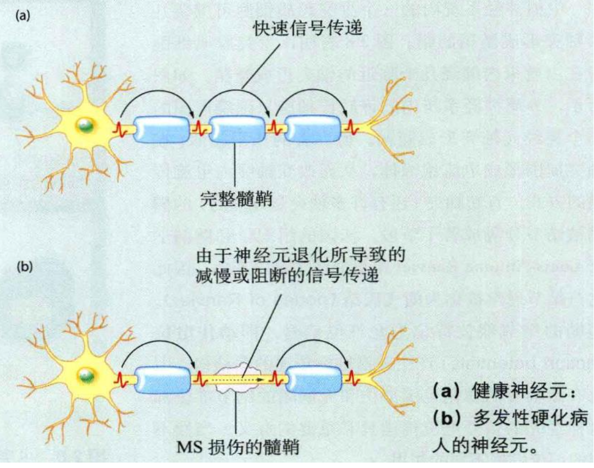
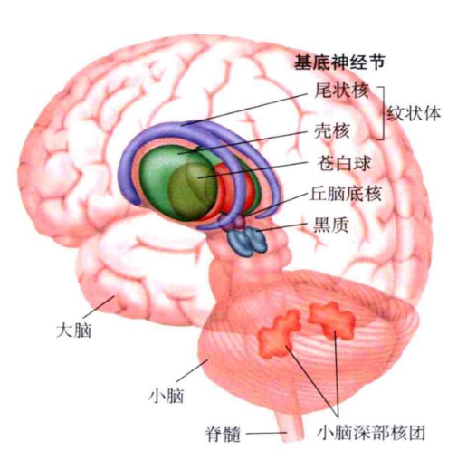

# 脑与认知科学 Brain and Congition
尽管特定的大脑区域负责某项独立的功能，但这些区域组成的网络以及它们之间的连接才是人类表现出的整体行为的原因

**人工智能中的联结主义(connectionist)**：
通过模拟人类大脑中神经元的网络来处理信号，信号通过类似于
神经元间的连接方式从一个节点传递到另一个节点

# 一、脑科学基础与神经系统概述

## 1. 脑科学发展史
- ### 脑科学的诞生
  - Thomas Willis是临床神经科学创始人之一（1650年）
  - 脑科学发展早期的重要研究历史回顾

- ### 脑科学的历史争论
  - **定位主义**：大脑的特定功能由特定脑区负责
    - 颅相学（19世纪）代表思想
    - Broca语言区和Wernicke感觉语言中枢的发现
    - Brodmann脑区划分系统的建立
  - **整体主义**：大脑作为一个整体参与行为
    - 聚集场理论
    - 实验证据：切除大脑半球的鸽子实验

- ### 神经元研究的里程碑
  - Camillo Golgi和Santiago Ramon Cajal的贡献
  - 两人因对神经系统构造的研究共同获得1906年诺贝尔生理医学奖
  - 神经元学说的确立

- ### 现代脑科学的整合观点
  - "特定大脑区域负责特定功能，但区域间的网络和连接才是整体行为的基础"
  - 与人工智能中的联结主义(connectionism)关系
    - 通过模拟神经元网络处理信号
    - 信号通过类似神经元连接方式传递

## 2. 神经系统的细胞构成
- ### 神经元(Neuron)
  - **功能**：基本的信息传递和处理单位
  - **特性**：具有独特形态和生理学特性，专门进行信息传递和加工

- ### 神经胶质细胞(Neuroglial Cell)
  - **功能**：非神经元细胞，承担多种辅助功能
    - 为神经元**提供结构支持**
    - 保证神经元间信息传递效率
  - **类型**：
    - 星形胶质细胞：构成血脑屏障，保护中枢神经系统
    - 小胶质细胞：在脑组织损伤时发挥作用
    - 少突胶质细胞和许旺氏细胞：形成髓鞘，改变神经元内信息传递方式

- ### 髓鞘与神经疾病

## 3. 神经元的结构与形态
- ### 神经元的基本结构

  - **细胞体**：包含维持神经元新陈代谢的细胞器
  - **树突(Dendrite)**：
    - 接收其他神经元的传入信息
    - 接收部位是突触(Synapse)，被称为突触后(Post-synaptic)
  - **轴突(Axon)**：
    - 远离细胞体，将信息传出神经元
    - 被称为突触前(Pre-synaptic)

- ### 树突的特殊结构
  - **棘(Spine)**：树突表面的球状突起
    - 突触通常位于这些棘上
    - 也存在于细胞体等其他部位

**树突和轴突的形态关系**：

突触并非随机地、均匀地分布在树突的各个部位，而是遵循特定的模式和规律。

- ### 神经元的分类与形态
  - **根据树突和轴突形态分类**：
    - 单极神经元：只有一个远离细胞体的突起，该突起能分支形成树突和轴突，常见于无脊椎动物的神经系统。
    - 双极神经元：通过树突接收来自一端的信息，并通过轴突传至另一端，多参与感觉信息传递与加工。
    - 假单极神经元：树突和轴突融合的双极神经元，将躯体感觉信息传递到中枢神经系统。
    - 多极神经元：参与运动和感觉信息传递与加工，在于神经系统的多个区域，如人脑内的神经元

  - **形态与功能关系**：
    - **形态学相似的神经元倾向于集中在神经系统的某一特定区域**。
    - 具有相似功能的神经元通常形态相似

## 4. 神经元的信息传递
神经元是神经系统传递信息的功能单位，通过对信息的接收和加工，并将其传递给其他神经元，构成了局部或长程的**神经回路(circuit)**。

- ### 信息传递的基本过程
  1. **信息接收**：
     - 化学信号：神经递质(多巴胺、乙酰胆碱等)、环境化学成分
     - 物理信号：触觉/视觉信号等
  2. **动作电位产生**：
     - 传入信号引起突触后神经元细胞膜去极化
     - 在**轴突起始段**产生动作电位(锋电位)
  3. **动作电位传递**：
     - 沿轴突下行传播到轴突末梢
  4. **神经递质释放**：
     - 突触释放神经递质，将信息传递到其他神经元

- ### 动作电位的研究
  - Alan Hodgkin和Andrew Huxley的研究
  - 1963年诺贝尔医学生理学奖得主
  - 电压钳技术的应用

- ### 神经元信息编码与人工智能
  - 神经元的发放率编码方式具有**稀疏性**特点：当外界刺激输入时，只有极少数与该刺激高度相关的神经元会以较高的发放率激活，而绝大多数神经元发放率极低甚至完全不发放，呈现 “少部分活跃，大部分静息” 的分布状态 —— 这就是 “稀疏性”。
  - 对人工神经网络激活函数的启示：
    - ReLU激活函数模仿神经元的稀疏性
    - 解决sigmoid函数在深层网络中的梯度消失问题

## 5. 神经元间的信息传递
- ### 突触的类型
  - **化学突触**：通过神经递质传递信息
  - **电突触**：通过缝隙连接直接传递电信号

- ### 化学突触的信息传递过程
  1. 动作电位到达轴突末梢
  2. 引起末梢去极化，导致Ca²⁺流入末梢
  3. 信息编码为不同类型的神经递质分子(>100种)，释放至突触间隙
  4. 神经递质扩散至突触后膜，引起突触后神经元的去极化或超极化

- ### 电突触的特点
  - 适用于快速传导信息的情况
  - 通过缝隙连接(gap junction)形成穿膜孔道
  - 缺点：**不能传递抑制性信息，也不能放大信号**

## 6. 神经回路
- ### 神经回路的基本概念
  - **定义**：相互连接、共同实现某一特定功能的神经元集合
  - **神经元类型**：
    - 兴奋性神经元：引起突触后神经元更容易产生动作电位
    - 抑制性神经元：引起突触后神经元更难产生动作电位

- ### 神经回路的实例：膝跳反射
  - **基本回路**：
    - 感觉神经元将力学刺激转化为电信号
    - 感觉神经元与运动神经元形成突触连接
    - 运动神经元引起伸肌收缩
  - **协调机制**：
    - 感觉神经元激活抑制性中间神经元
    - 抑制性神经元抑制支配屈肌的运动神经元
    - 伸肌收缩与屈肌放松相互协调

- ### 神经回路的复杂性
  - 感觉信息可上行至大脑皮质多个区域
  - 如初级躯体感觉皮质区和初级运动皮质
  - 脊髓反射与大脑控制共同作用

## 7. 神经回路的基本模式
- ### 仅含兴奋性神经元的回路模体
  - **收敛式兴奋(Convergent Excitation)**：
    - 多个突触前神经元与同一个突触后神经元形成突触
    - 接收、整合多个神经元的输入信息
  - **发散式兴奋(Divergent Excitation)**：
    - 一个突触前神经元与多个突触后神经元形成突触
    - 同时向多个神经元传递信息

  

  - **前馈兴奋(Feedforward Excitation)**：
    - 由连续连接的一组神经元构成
    - 跨多个脑区进行信息传递
  - **反馈兴奋(Feedback Excitation)**：
    - 突触后神经元与突触前神经元建立反向突触连接
  - **复发性兴奋(侧兴奋)回路**：
    - 并行传递同一信息的神经元之间相互激活
  
  

- ### 含兴奋性和抑制性神经元的回路模体
  - **前馈抑制(Feedforward Inhibition)**：
    - 一个兴奋性神经元同时与一个兴奋性和一个抑制性神经元形成突触
    - 抑制性神经元将输出传递到突触后兴奋性神经元
  - **反馈抑制回路**：
    - 突触后兴奋性神经元激活一个抑制性神经元
    - 抑制性神经元将抑制信号作用于前者

  

  - **复发性/交叉抑制(Recurrent/Cross Inhibition)**：
    - 两条兴奋性并行通路通过抑制性神经元相互抑制
  - **侧抑制(Lateral Inhibition)**：
    - 常见于感觉信息处理
    - 一个抑制性神经元接收并行兴奋性通路的输入，抑制这些通路的突触后神经元
  - **去抑制(Disinhibition)**：
    - 一个抑制性神经元将信号输出至另一个抑制性神经元
    - 降低后者抑制目标的能力
  
  

## 8. 神经回路中的信号处理机制
- ### 输入突触的空间分布
  - **兴奋性神经元**：输入突触主要位于树突棘上
  - **抑制性神经元**：输入突触位于树突棘、树突轴、细胞体和轴突起始段
  - **调节性神经元**：输入突触分别位于树突、细胞体及突触前末梢

- ### 突触输入的空间特性
  - 细胞体上的突触输入产生最大的兴奋性突触后电压
  - 距离细胞体越远，突触后电压越小，上升和衰减速度越慢

- ### 突触输入信号整合方式
  - **空间整合(Spatial Integration)**：
    - 同一神经元两个不同树突几乎同时接收两个突触输入
    - 在传递过程中进行整合
  - **时间整合(Temporal Integration)**：
    - 同一突触先后两次接收到两个输入
    - 在传递过程中进行整合

## 总结与作业 1
- ### 总结
  - 每个神经元是复杂的集成元件，接收多种输入信号
  - 神经元通过**动作电位的发放频率和时间**编码信息
  - **神经元**作为复杂网络的元件，实现感知和行为控制等功能

- ### 作业
  - **题目1**：分析神经元与感知机模型的异同
    - 参考资料：《机器学习》第五章"神经网络"，周志华著
  - **题目2**：分析深度神经网络中存在的神经回路模体
    - 参考资料同上

# 二、人脑的基本结构和功能

## 1. 大脑结构与功能研究
- ### 研究意义与视角
  - **不适定问题**：人脑与电脑的异同
  - **案例分析**：爱因斯坦大脑的研究
    - 1985年研究发现左脑39区角回处神经胶质细胞与神经元比高出73%
    - 1996年研究发现右侧前额叶皮质较薄，神经元密度更大
    - 1999年研究发现顶叶(负责数学能力和空间推理区域)比普通人大15%

- ### 研究层面
  - **微观层面**：精细解剖学
    - 研究神经元甚至亚细胞结构之间的组织关联
  - **宏观层面**：大体解剖学
    - 用肉眼可区分的整体结构及其关联

## 2. 神经系统的基本构成
- ### 中枢神经系统
  - **组成**：脑和脊髓
  - **功能**：神经系统中进行命令和控制的部分

- ### 周围神经系统
  - **功能**：负责传递信息的神经系统其余部分

- ### 人脑的解剖学定位术语
  - 标准化的解剖学定位描述系统（嘴侧，尾侧，背侧，腹侧）

## 3. 大脑的解剖学分区
- ### 脑叶划分
  - **额叶(Frontal Lobe)**：与运动控制、决策和规划相关
  - **顶叶(Parietal Lobe)**：与躯体感觉、空间感知相关
  - **颞叶(Temporal Lobe)**：与听觉、语言处理和部分记忆相关
  - **枕叶(Occipital Lobe)**：与视觉处理相关
  - **胼胝体(Corpus Callosum)**：连接左右大脑半球的神经束

- **Brodmann分区**：
  - 按细胞形态和组织结构划分
  - 与功能分区不完全重合(如第17区与初级视皮层V1区重合，第18区与V2区不重合)

## 4. 大脑皮质的结构与功能
- ### 大脑皮质的基本特征
  - **沟回结构**：增加皮质总面积，便于形成紧密的三维联系
  - **灰质与白质**：
    - 灰质：皮质部分，含神经元细胞体、树突和部分轴突
    - 白质：皮质下的神经束，主要由轴突构成

- ### 大脑皮质的规模与连接
  - 包含约300亿个神经元
  - 每个神经元产生约1万个突触
  - 总连接数可达3×10¹⁴个
  - 微观结构模式相对统一，可能采用通用计算模式

- ### 大脑皮质的分层模式
  - **新皮质(Neocortex)**：
    - 占大脑皮质的90%
    - 由6层细胞构成，包括感觉皮质、运动皮质和联合皮质
  - **中间皮质**：
    - 也由6层神经元构成
    - 包括扣带回、海马旁回等边缘系统中的皮质
  - **异质皮质**：
    - 仅含1-4层神经元
    - 包括海马、初级嗅皮质等

## 5. 大脑皮质的功能系统
- ### 感觉和运动皮质
  - **额叶中的运动区**：
    - 初级运动皮质位于额叶后部
    - 前侧和腹侧是次级运动皮质(运动前区、辅助运动区、Broca区)
  

  - **顶叶中的躯体感觉区**：
    - 接受来自丘脑的躯体感觉输入
    - 处理触觉、痛觉、温度和本体感觉
  - **枕叶中的视觉加工区**：
    - 初级视觉皮质(V1区)位于大脑半球内侧
    - 处理颜色、亮度、空间频率、朝向及运动等信息
  - **颞叶中的听觉加工区**：
    - 听觉信号经丘脑内侧膝状体到达颞叶上部听觉皮质
  - **感觉和运动皮质的拓扑图**：
    - 身体和大脑皮质之间存在空间拓扑关系
  

- ### 联合皮质
  - **定义**：新皮质中不能单纯划分为感觉或运动的部分
  - **特点**：接收多个皮质区域的输入信息，神经元被多种感觉信息激活
  - **进化特点**：哺乳动物从鼠到猫、猴和人的进化过程中，脑特别是新皮质的面积增加，其中联合皮质的占比在所有哺乳动物中最大。
  - **前额叶皮质**：
    - 属于联合皮质，占额叶皮质的一半
    - 与几乎所有大脑皮质存在直接或间接联结
    - **在目标计划、执行和记忆等认知过程中发挥重要作用**
    - 中国科大研究发现：内侧前额叶的CRF神经元决定"战斗或逃跑"反应，内侧前额叶的促肾上腺皮质激素释放激素（CRF）神经元是决定选择“战斗或逃跑”的关键，CRF神经元为一种抑制性的中间神经元，并与椎体神经元构成神经回路，CRF神经元的激活则促进主动应对的“战斗”行为，个体抗压能力增强。CRF神经元的失活则促进被动应对的“逃跑”行为，个体抗压能力减弱。

## 6. 边缘系统
边缘系统(limbic system)也称边缘叶，包括以下区域：扣带回(cingulate gyrus)，海马(hippocampus)，海马旁回(parahippocampalgyrus)，丘脑(thalamus)，下丘脑(hypothalamus)，杏仁核(amygdala)。

- ### 组成结构
  - **扣带回(Cingulate Gyrus)**
  - **海马(Hippocampus)**：在记忆和学习方面有重要作用
    - 位于颞叶腹内侧，属于异质皮质，仅由3-4层
神经元构成
    - 可分为CA1-CA4区
  - **海马旁回(Parahippocampal Gyrus)**
  - **丘脑(Thalamus)**：丘脑(thalamus) 包括外侧膝状体、内侧膝状体、腹后侧核团等。丘脑被称为“皮质的关口”，除了嗅觉输入以外，其余感觉通道的信息都需要经过丘脑中的相应区域后到达初级感觉皮质。

  - 视觉：视网膜神经元→外侧膝状体→初级视皮质。听觉：内耳听觉神经元→内侧膝状体→初级。听皮质躯体感觉：躯体感觉：神经元→腹后侧核团→初级躯体感觉皮质
  - 丘脑不仅是感觉信息输入大脑的中继站，还接收大量来自**相同皮质区域的输入信息皮质的关口**
    - 除嗅觉外，其余感觉信息需经丘脑到达初级感觉皮质
    - 是感觉信息中继站，也接收来自皮质的反馈信息

  - **下丘脑(Hypothalamus)**：
    - 调节神经系统和内分泌系统
    - 参与情绪过程并控制垂体
    - 调节生理周期节律，通过激素释放进行远距离神经调控
  - **杏仁核(Amygdala)**：参与情绪处理

- ### 功能
  - 参与情绪、学习和记忆的加工

## 7. 其他重要脑区
- ### 基底神经节
  - **组成**：皮质下多个神经组织的集合
  - **功能**：在运动控制中起重要作用
  - **特点**：不直接控制运动，而是参与监控运动活动进程
  
- ### 脑干
  - **组成**：中脑(Midbrain)、脑桥(Pons)和延髓(Medulla)
  - **功能**：控制呼吸、睡眠和觉醒等基本生命活动
  - **特点**：损伤大多致命，而皮质损伤相对影响较小

- ### 小脑
  - **位置**：覆盖于脑干上部，处于脑桥水平位置
  - **规模**：约110亿神经元，与中枢神经系统其余部分相当
  - **功能**：
    - 参与运动和感觉信息加工
    - 整合身体和运动信息并调整运动
    - 维持姿态、行走以及协调运动，使其变得流畅而协调
  

- ### 脊髓
  - **组成**：
    - 后角内的感觉神经元：从外周感受器接收感觉信息并传导到大脑皮质
    - 前角内的运动神经元：将大脑产生的运动控制信息传递到相应的肌肉组织
  - 

## 8. 神经系统的运动控制
- ### 运动控制系统
  - **运动系统**：控制骨骼肌实现人体运动(如伸手抓握、行走、说话)
  - **自主神经系统**：控制平滑肌和心肌收缩，调控内脏功能
  - **神经内分泌系统**：分泌激素调节生理和行为(如对食物及光线周期的反应)

- ### 运动控制的分层组织
  - **最高层**：大脑皮质(运动相关区域)
    - 处理感觉输入信息
    - 计划和执行运动目标
  - **中间层**：小脑和基底神经节
    - 辅助运动皮质和脑干
  - **底层**：脊髓
    - 包含神经回路(如膝跳反射)
    - 感觉和运动神经元
    - 在骨骼肌内的神经末梢

- ### 信息流动特点
  - **分布式控制**：跨越不同层级的控制系统
  - **层级化结构**：
    - 高层神经系统不关心运动细节，控制低层级神经系统
    - 低层级将运动控制信息转变成具体动作
  - **灵活性**：同一感觉输入可产生多种不同运动方式

- ## 作业2
  - **题目1**：分析司机遇到动物挡路时神经系统的工作过程
    - 信息流动顺序
    - 相关信息处理加工的神经系统组织结构
  - **题目2**：设计无人驾驶车辆人工智能系统的层级化基本功能结构

# 三、大脑半球特异化

## 1. 大脑半球功能特异化现象概述
- ### 基本特征
  - 左右大脑半球在整体结构和功能上高度相似
  - 在少数特定功能上存在明显特异性

- ### 利手现象
  - 惯用右手：左侧大脑半球控制（人群中占大多数）
  - 惯用左手：右侧大脑半球控制（人群中占比7%-8%）
  - 左撇子与右撇子的智力比较无显著差异

- ### 语言处理的优势半球
  - 左侧大脑半球在语言信息处理中占据主导地位
  - Broca将语言机制定位在左侧大脑半球
  - 现代研究数据：
    - 约96%的右利手者主要依靠左侧大脑半球进行语言处理
    - 约60%的左利手者也主要依靠左侧大脑半球进行语言处理

## 2. 大脑半球的结构差异
- ### 宏观结构差异
  - 右利手者的左侧大脑半球颞叶Wernicke区面积相对右侧较大
  - 微观结构差异：左侧颞叶Wernicke区皮质柱间距相对较大，可能导致局部信息流更具独立性

## 3. 裂脑人研究与半球功能特异化
- ### 胼胝体的结构与功能
  - **结构**：连接左右大脑半球皮质，包含超过2亿条神经纤维
  - **连接模式**：
    - 多数神经纤维连接左右半球等位区域
    - 少数神经纤维连接左右半球异位区域
  - **功能假说**：
    - 抑制性：两侧大脑半球通过胼胝体相互抑制，竞争信息处理控制权
    - 激活性：两侧大脑半球通过胼胝体整合不同输入信息，促进信息处理

- ### 裂脑人实验
  - **历史背景**：癫痫治疗中胼胝体切断手术，形成"裂脑人"
  - **斯佩里的研究**：20世纪60年代开始，获1981年诺贝尔医学与生理学奖
  - **实验设计**：控制感知范围，使单侧大脑半球获得感觉信息输入
  - **关键发现**：
    - 现象1：裂脑人可以用语言确认右眼输入的视觉信息（进入左脑）
    - 现象2：裂脑人无法用语言确认左眼输入的视觉信息（进入右脑）
    - 现象3：裂脑人可以通过左手动作确认左眼输入的视觉信息（右脑具有物体辨识能力）

- ### 胼胝体功能的精确研究
  - 胼胝体后部切断：无法传递感觉信息
  - 胼胝体前部完整：可传递高级语义信息
  - 胼胝体前部切断：无法传递高级语义信息
  - 胼胝体完整：可传递感觉信息

## 4. 左右大脑半球的特异化能力
- ### 左侧大脑半球的特异化能力
  - 语言信息处理能力
  - 逻辑推理能力
  - 证据：
    - 双耳分听实验：报告听到的单词中，绝大部分都是右耳听到的
    - 右脑并非完全不具备语言能力，少数裂脑人的右脑存在一定语言能力

- ### 右侧大脑半球的特异化能力
  - 空间信息的处理能力
  - 对陌生人脸的识别能力
  - 语言中的情绪信息处理
  - 证据：
    - 坐标空间关系判断：右脑更擅长精确、定量的空间关系
    - 范畴空间关系判断：左脑更擅长抽象、定性的空间关系
    - 脑损伤研究：右脑损伤病人在坐标空间关系判断中更容易出错

## 5. 左右脑分工理论
- ### 斯佩里的左脑右脑分工理论
  - 左脑：擅长语言、逻辑、计算和分析
  - 右脑：擅长空间、音乐、直觉
  - 应用解释：
    - 右脑在探测物体时空关系的因果感知方面有优势
    - 左脑在利用逻辑规则和概念知识进行因果推理方面有优势

## 6. 大脑半球特异化的原因
- ### 胼胝体功能假说
  - 抑制性假说：两侧大脑半球通过胼胝体相互抑制
  - 激活性假说：两侧大脑半球通过胼胝体整合信息

- ### 大脑半球相互激活面临的问题
  - **信息处理一致性**：
    - 两侧大脑半球的输入信息随时间变化具有独立性
    - 跨半球信息整合困难
    - 神经元信息处理速度较慢，跨半球传递时间约30毫秒
    - 语言交流、快速动作等时间敏感性任务难以采用跨半球处理方式
  - **输出控制一致性**：
    - 不能允许两个半球分别控制不同行为
    - 将输出功能集中于某一侧半球可实现输出一致性
  - **利手与语言同侧优势的原因**：
    - 左侧大脑半球擅长对发声韧带、舌头等发音器官的连续动作控制
    - 左侧大脑半球更擅长对左右单手连续动作的控制

- ### 生成装配器(GAD)假说
  - 大脑中某个单侧半球（大多数情况下在左侧）进化出从基本元素中产生复杂连续表征的装置
  - 实现以生成式认知为主的行为和思考模式

## 7. 大脑半球在其他功能上的特异化
- ### 视觉信息处理特异化
  - **层级化表征**：视觉信息在大脑中被层级化表征
  - **特异化能力**：
    - 左脑：更擅长提取局部视觉信息
    - 右脑：更擅长提取整体视觉信息
  - **空间频率假说**：
    - 视觉系统由空间滤波器构成
    - 右脑：低通滤波器优势，擅长提取整体信息
    - 左脑：高通滤波器优势，擅长提取局部信息
  - **应用实例**：
    - 右脑对基于视觉的性别判断有优势（低频整体信息）
    - 左脑对基于视觉的熟悉人脸识别有优势（高频细节信息）

- ### 记忆表征特异化
  - **两种记忆表征方式**：
    - 抽象、范畴化的原型记忆
    - 具体、特例化的样例记忆
  - **半球特异化**：
    - 左脑：更擅长抽象、范畴化的原型记忆
    - 右脑：更擅长具体、特例化的样例记忆
  - **实验证据**：左脑更快识别出原型，右脑更快识别出学习过的样例

- ### 情感信息处理特异化
  - **前额叶皮质的特异化**：
    - 左侧前额叶：更擅长处理积极情感
    - 右侧前额叶：更擅长处理消极情感
  - **损伤后果**：
    - 左脑损伤可能导致抑郁
    - 右脑损伤可能导致狂躁
  - **社交行为差异**：
    - 左脑：社交场合的主动接近
    - 右脑：社交场合的被动逃避

- ### 概率决策特异化
  - **决策策略差异**：
    - 左脑：频率匹配策略
    - 右脑：期望最大化策略
  - **赌徒谬论**：左脑更容易出现"赌徒谬误"
  - **解释器(Interpreter)假说**：
    - 左脑中存在特殊认知系统，尝试为观察现象寻找解释
    - 负责建构理论，试图解释现象以更有效处理，但可能对决策产生负面影响
    - 右脑不参与此过程，对简单现象决策可能更准确
  - **联合决策**：两侧半球通过胼胝体整合信息形成更鲁棒的决策

## 8. 人工智能技术中的生成模型
- ### 生成模型概述
  - **应用领域**：自然语言处理、语音合成、图像合成、服务型机器人等
  - **模型类型**：
    - 隐Markov模型(HMM)
    - 循环神经网络(RNN)/长短时记忆网络(LSTM)
    - 生成式对抗网络(GAN)
  - **核心理念**："What I cannot create, I do not understand" – 费曼

- ### 循环神经网络(RNN)特点
  - 隐藏层之间的节点存在连接
  - 隐藏层的输入包括输入层的输入和上一时刻隐藏层的输出
  - 网络对以前信息进行记忆并应用于当前输出计算

- **人类语言的生成能力**：
  - 左脑生成的复杂语言示例：
    - "今天下雨，我骑车差点摔倒，好在我一把把把把住了！"
    - "用毒毒毒蛇毒蛇会不会被毒毒死?"
    - "多亏跑了两步，差点没上上上上海的车!"
    - "校长说：校服上除了校徽别别别的，让你们别别别的别别别的你非别别的！"
    - "来到杨过曾经生活的地方，小龙女动情地说：我也想过过过儿过过的生活!"

## 9. 总结与反思
- ### 大脑半球特异化的基本特征
  - 左右半球在整体结构和功能高度相似
  - 在特定功能上存在明显特异化

- **半球协作与分工模式**：
  - 对于大多数任务，左右半球都能完成相应信息处理（方式可能特异化）
  - 通过胼胝体对信息进行整合
  - 对于语言等时间敏感性任务，由单侧大脑半球独立完成

- **科学认识大脑半球差异**：
  - 将大脑半球差异绝对化的观点（如"左脑语言、右脑空间"，"左脑分析、右脑整体"）是不科学的
  - 大脑半球特异化是复杂的神经科学现象，需要全面、辩证地理解

# 四、感觉和知觉

## 1. 知觉的概念与基本特征
- ### 知觉的定义
  - 知觉是一系列组织并解释外界事物的感觉信息加工过程
  - 包括视觉、听觉、躯体感觉、嗅觉和味觉五种感觉

- ### 感觉与知觉的联系与区别
  - **联系**：
    - 都由事物作用于感觉器官产生
    - 知觉的产生以感觉信息为前提
    - 与感觉同时进行，一种感觉信息可引起对物体的知觉
  - **区别**：
    - 感觉是对客观事物个别属性的认识
    - 知觉是对事物整体的认识，通过多种感觉结合形成
    - 感觉不依赖个人知识和经验，知觉受个人知识经验影响

- ### 感觉与知觉在认知过程中的地位
  - 是人类认识世界的初级形式
  - 需在感觉、知觉基础上进行更复杂的心理活动（记忆、想象、思维等）

## 2. 嗅觉系统与处理
- ### 嗅觉的基本特征
  - 最古老的感觉信息，占人体全部编码基因的3%
  - 基本功能：闻到食物、感受环境状况、感知危险
  - 嗅觉皮质与情绪、恐惧、记忆、快乐等情感皮质区域相同
  - 在社交能力方面扮演重要作用

- ### 嗅觉的神经通路
  - **感受器**：鼻粘膜中有超过1000种感受器（双极神经元）
  - **信息传递**：嗅感受器→嗅球中的嗅小体→初级嗅皮质→次级嗅皮质
  - **功能特异化**：
    - 初级嗅皮质与探测气味变化相关
    - 次级嗅皮质与分辨气味类型相关

- ### 嗅觉信息的神经回路
  - **三种可能结构**：
    1. 同种气味感受器的细胞体在鼻腔内空间聚集，轴突发送到同一嗅小体
    2. 同种气味感受器的细胞体在鼻腔内空间分散，但轴突发送到同一嗅小体
    3. 同种气味感受器的细胞体在鼻腔内空间分散，轴突发送到多个嗅小体
  - **侧抑制神经回路**：
    - 由兴奋性神经元和抑制性神经元构成
    - 功能：提高气体分辨率、增益控制、控制动作电位时间间隔

  

- ### 嗅觉处理的特异化现象
  - 左右鼻孔大小随时间交替变化
  - 高流速鼻孔对高吸收率气味分子更敏感
  - 低流速鼻孔对低吸收率气味分子更敏感
  - 具有不同气流速度的感受系统可同时感知不同吸收率的气味分子

- ### 气味与记忆的关系
  - 原因：嗅皮质与边缘系统直接连接
  - 边缘系统是记忆和情绪的主要区域
  - 海马损伤病人的气味识别能力严重受损

## 3. 味觉系统
- ### 味觉的基本特征
  - 人口腔中有约10000个味蕾，大部分位于舌头
  - 基本味觉信息：
    - 咸：矿物质/电解质与水的平衡信息
    - 甜：碳水化合物（能量）
    - 鲜：蛋白质
    - 苦/酸：进化产生的警告信号
    - 辣味不是味觉，而是痛觉信息

- ### 味觉信息的神经通路
  - 味觉神经元→丘脑中的腹后内侧核→初级味觉皮质→次级味觉皮质（眶额皮质）

## 4. 躯体感觉系统
- ### 躯体感觉的类型与感受器
  - **触觉信息**：
    - 一般触觉：梅克尔小体
    - 轻微触觉：迈斯纳小体
    - 深部压力：环层小体
  - **温度信息**：鲁菲尼小体
  - **痛觉信息**：疼痛感受器（有髓鞘：快速反应；无髓鞘：持续疼痛）
  - **本体感觉信息**：肌肉-肌腱连接处的特化神经元

- ### 躯体感觉的神经通路
  - 感受器→脊髓→脑干→对侧丘脑→初级躯体感觉皮质（S1）→次级躯体感觉皮质（S2）→小脑

- ### 躯体感觉皮质的特征
  - 初级躯体感觉皮质的面积取决于相应感觉信息的重要性
  - 次级躯体感觉皮质可编码更复杂的物体纹理和大小信息

## 5. 听觉系统
- ### 听觉的基本功能
  - 对环境的感知
  - 同类间的识别交流
  
  
- ### 听觉的物理与神经转换
  - 声波→耳鼓振动→内耳液体振荡→耳蜗毛细胞（机械信号转换为动作电位）
  - 听觉信息→听神经→丘脑内侧膝状体→初级听觉皮质

- ### 听觉信号的频率编码
  - **人类听觉范围**：20Hz-20000Hz，对1000Hz-4000Hz最为敏感
  - **编码机制**：
    - 低频信号：动作电位在每个周期都发放
    - 高频信号：单个神经元仅在部分周期内发放
  - **联合编码**：依赖多个神经元的联合编码
  - **频率激活空间模式**：听觉区具有特定的频率激活空间模式

- ### 基于听觉的空间定位
  - **双耳信息整合**：
    - 耳间时差：声音到达两耳的先后顺序和间隔时间
    - 耳间强差：声音在两耳分别产生的信号强度不同

- ### 听觉定位的神经编码模型
  - **耳间时差检测**（水平方向）：
    - 时间同步编码
    - 存在同步检测器神经元，只有两耳信号同时输入才能被激活
    - 声源位于正前方时，正中的同步检测器被激活
    - 声源位于一侧时，偏离中心的同步检测器被激活
  - **耳间强度检测**（垂直方向）：
    - 信号强度编码
    - 强度由神经元发放频率编码
    - 下游神经元结合双耳信号的发放频率差异，确定竖直位置
  - **特点**：
    - 空间信息编码：水平方向为时间同步编码，垂直方向为信号强度编码
    - 分布式处理：分别处理时差和强差信息再进行整合
    - 定位系统位于脑干中，仅解决"在哪里"问题

## 6. 视觉系统
- ### 视觉的基本功能
  - 从背景中分辨物体
  - 定位感兴趣的对象
  - 检测运动以及在环境中定向

- ### 视网膜上的感光神经元
  - **视杆细胞**：
    - 分布在整个视网膜上
    - 感受低光刺激，夜间工作
    - 无法区分颜色，产生低精度视觉，响应慢
  - **视锥细胞**：
    - 集中在中央凹
    - 感受强光刺激，白天工作
    - 对不同颜色敏感，产生高精度视觉，响应快
  - **视锥细胞类型**：
    - 蓝色、绿色和红色三种视锥细胞
    - 人类视觉对长波光更敏锐，绿色和红色视锥细胞占绝大多数
    - 蓝色视锥细胞占比较小
    - 红色或绿色视锥细胞功能异常导致色盲

- ### 视网膜上的视觉信息处理
  - 感光细胞将光信号转化为电信号
  - 需要提取有效特征（运动、深度、形状、大小、颜色等）
  - 系统选择保留有价值信息，删除不相关信息

- ### 视网膜神经元的感受野
  - **感受野定义**：视觉神经元仅对有限空间区域的光信号产生反应的区域
  - **中心-外周类型感受野**：
    - 可被光斑信号激活
    - 分为：
      - 中心兴奋-外周抑制型
      - 中心抑制-外周兴奋型
  - **侧抑制神经回路**：
    - 放大激活和未激活感光细胞间的兴奋性差异
    - 提升平行输入信号间的差异，提高信噪比
  - **视觉意义**：
    - 可感知局部区域中的明暗对比，确定光信号的空间信息
    - 解释视错觉现象（赫曼方格、马赫带等）

- ### 视网膜神经元的多样性
  - 除中心-外周感受野神经元外，还有大量其他类型神经元
  - 形成复杂神经回路，处理对比度、大小、运动状态和颜色等信息
  - 方向选择性神经元对特定方向的刺激有更强响应

- ### 视觉信息传递的视神经通路
  - **视交叉**：视神经颞侧分支同侧传递，鼻侧分支交叉到对侧
  - **两条主要通路**：
    - 主要通路（~90%）：视网膜→丘脑外侧膝状体→初级视皮质
    - 次要通路（~10%）：视网膜→皮质下结构（丘脑枕核、中脑上丘等）
  - **功能特异化**：
    - P通路（小细胞层）：传递高敏锐度和色觉信息
    - M通路（大细胞层）：传递亮度信息，具有良好对比和时间分辨率

- ### 初级视皮层神经元的感受野
  - **简单细胞**：
    - 具有中心兴奋-外周抑制的条状感受野
    - 可被特定方向的光条激活
    - 功能：检测图像中的线条和轮廓
  - **复杂细胞**：
    - 感受野更大、更复杂，无具体激活-抑制区域
    - 可被任何位置上特定方向的光条激活
    - 功能：进一步整合空间信息，识别感受野中所有线条/轮廓

- ### 视觉信息处理的层级模型
  - **前馈模型假说**：
    - 外侧膝状体神经元感受野线性排列组成简单细胞感受野
    - 相邻区域同向排列的简单细胞感受野组合形成复杂细胞感受野
    - 视觉通路由层级化的前馈计算模型构成，提取重要视觉信息

- ### 初级视皮质柱内的神经回路
  - **两个组织原则**：
    - 视网膜拓扑学映射：视皮质特定部位接收来自视网膜对应部位的信息
    - 功能架构：具有相同特性的神经元排在垂直于皮质表面的轴上
  - **皮质柱结构**：
    - 视皮质分为6层，皮质柱内神经环路大致为LGN→L4→L2/3→L5→L6
    - 同一皮质柱内神经元具有相似功能特性
  

## 7. 视觉信息的分布式处理
- ### 视觉信息分布式处理假说
  - 大脑对视觉信息处理具有分布式特点
  - 不同视皮质区域分别形成颜色、运动等知觉，再整合形成全面感知
  - **功能特化的视觉区域**：
    - V1（初级视皮质）：简单视觉处理
    - V2：图形与物体形状处理
    - V3：视觉信息传递
    - V4：颜色和形状知觉
    - MT（中颞区，V5）：运动知觉
- 

- ### MT区与运动知觉
  - **MT区神经元特点**：
    - 被运动信号激活，对颜色不敏感
    - 朝向特定方向运动时兴奋性最强
    - 神经元兴奋性与运动速度有关
  - **MT区损伤的影响**：
    - 单侧MT区损伤对运动知觉影响较小
    - 双侧MT区损伤导致运动知觉丧失

- ### V4区与颜色知觉
  - **脑功能成像研究**：
    - 运动视觉信息导致MT区激活
    - 颜色视觉信息导致V4区激活
  - **全色盲**：
    - 由中枢神经系统（V4区为主）损伤引起
    - 症状为对所有颜色均无法形成知觉
    - 对深度和纹理知觉保持正常

- ### V4区与形状知觉
  - **颜色与形状的关系**：
    - 颜色可提供物体形状的重要信息
    - V4区参与形状知觉，使用颜色信息确定物体形状
  - **艺术家与视觉处理**：
    - 毕加索作品有明显阴影和轮廓
    - 莫奈作品缺少明显阴影和轮廓，依赖颜色表现形状
  - **形状盲**：
    - 由于形状知觉来源于多种视觉信息
    - 完全丧失形状知觉的"形状盲"现象极为罕见

- ### 深度知觉
  - **信息来源**：
    - 双眼视差
    - 运动遮挡
    - 物体在视网膜上成像的大小
  - **深度盲**：由于深度知觉存在多种信息来源，完全丧失的"深度盲"现象极为罕见

- ### 视觉信息处理的皮质通路
  - **背侧通路/空间通路（where pathway）**：
    - 功能：处理运动和深度信息
    - 输入：视神经M通路
    - 途径：V1→V2→V3→MT→顶叶皮质
  - **腹侧通路/内容通路（what pathway）**：
    - 功能：处理形态和颜色信息
    - 输入：视神经M和P通路
    - 途径：V1→V2→V4→颞下皮质
  - **实际复杂性**：
    - 有30多个皮质区域参与视觉信息处理
    - 形成包含300多个连接的高度复杂层级化网络

## 8. 多种感觉信息的整合
- ### 多感觉整合的意义
  - 形成对外界事物统一的多感觉表征
  - 使知觉更加准确、高效

- ### 多感觉整合的实例
  - 联合视觉、听觉和躯体感觉信息，使神经元兴奋性明显增强
  - 在嘈杂环境中交流时，注视对方面部动作可加强语言理解

- ### 多感觉整合的脑区
  - 颞叶、顶叶、额叶、海马等很多皮质区域均参与多种感觉信息的整合

## 9. 作业 3
- ### 题目1
  - 分析侧抑制产生的视网膜神经元中心-外周感受野原理
  - 解释马赫带视错觉现象的产生原因

- ### 题目2
  - 分析仿人机器人应模仿的至少两种人类感觉
  - 给出理由说明为什么这些感觉的模仿最为重要
  - 参考资料：《机器人时代》https://www.bilibili.com/bangumi/play/ss21850/

